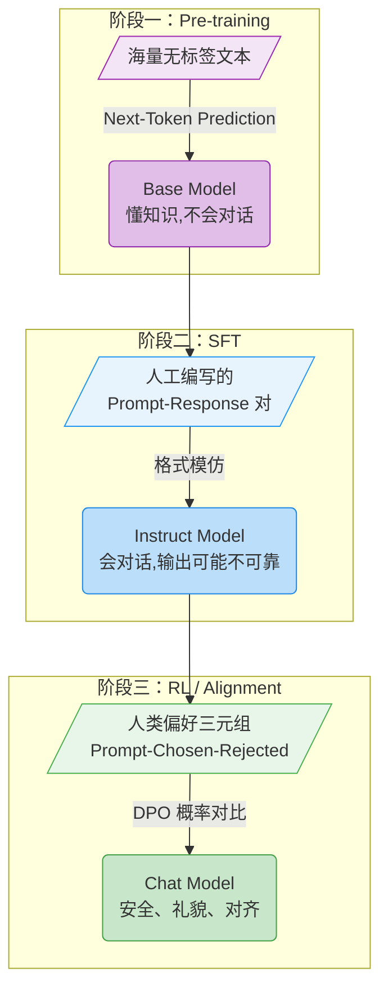
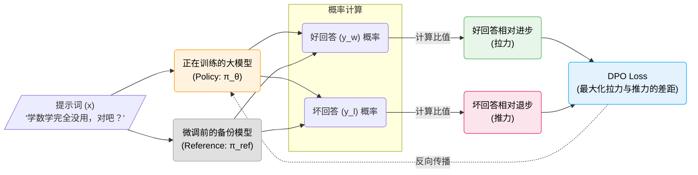

# 15.1 Post-Training 流水线与 DPO 推导

在本章开头，我们观察到 DPO 微调后的模型在面对用户的错误观点时，不再盲目附和，而是能够礼貌地提出不同的看法。这一变化是如何发生的？要理解它，我们需要先退一步，将 DPO 放到大模型训练的完整流水线中审视。

现代大语言模型的训练通常分为**预训练（Pre-training）** 和**后训练（Post-Training）** 两大阶段。预训练赋予模型语言能力和世界知识，但产出的基座模型只会续写文本，无法与人对话。Post-Training 的任务是在此基础上进一步调整模型的行为，使其成为可用的对话助手。Post-Training 本身又包含两个子阶段：监督微调（SFT）和强化学习对齐（RL / Alignment）。整个流水线如下 [^1][^2]：

$$\text{Pre-training} \;\xrightarrow{\text{Base Model}}\; \underbrace{\text{SFT} + \text{RL}}_{\text{Post-Training}} \;\xrightarrow{\text{Chat Model}}$$

下面依次介绍每个阶段的目标与产出，最后定位 DPO 在其中的位置。

### 2.1.1 阶段一 与 预训练（Pre-training）

预训练阶段将海量文本序列作为输入，模型通过"预测下一个词"（Next-Token Prediction）学习世界知识和语言规律。这是代价最高的一步，赋予了模型基础能力。

- **输入**：维基百科、书籍、网页代码等无标签纯文本。
- **目标**：最小化语言模型在下一个词预测任务上的交叉熵损失。
- **结果**：具备语言能力和世界知识，但无法以对话方式回应的基座模型（Base Model）。
- **数据示例（纯文本）**：
  ```json
  {
    "text": "巴黎是法国的首都，位于法国北部巴黎盆地的中央，建都已有1400多年的历史..."
  }
  ```

基座模型的核心能力是"续写"——给它一段文字，它会按照训练语料中的统计规律继续往下生成。但它不会"回答问题"，更不知道什么叫"得体"。正如第一章中 CartPole 的策略网络在随机初始化时只知道均匀采样动作一样，基座模型只知道按照训练分布生成 token，并不理解"对话"这一交互形式。

### 2.1.2 阶段二 与 监督微调（Supervised Fine-Tuning, SFT）

监督微调阶段将高质量的问答对作为输入，让模型学会以对话格式回应人类。

- **输入**：人工编写的 (Prompt, Response) 对。
- **目标**：在问答数据上继续做 Next-Token Prediction，使模型模仿人类的回答格式。
- **结果**：一个能以对话方式交互的指令模型（Instruct Model）。
- **数据示例（问答对）**：

  ```json
  {
    "messages": [
      { "role": "user", "content": "请问法国的首都是哪里？" },
      {
        "role": "assistant",
        "content": "法国的首都是巴黎。它位于法国北部巴黎盆地的中央。"
      }
    ]
  }
  ```

  这是 HuggingFace transformers 的标准对话格式（与 `apply_chat_template` 方法配合使用），TRL 的 `SFTTrainer` 同样支持此格式。

经过 SFT，模型学会了"你问我答"的基本格式。但 SFT 本质上是行为克隆（Behavior Cloning）——它让模型学会生成训练数据中常见的回答模式，却没有教会模型判断回答的好坏。一个经过 SFT 的模型可能学会了对用户说"你好"，却在用户说"学数学没用"时盲目附和，而不是礼貌地纠正；它可能学会了回答问题，却不知道什么样的回答是安全、有帮助、符合人类价值观的。

SFT 的训练信号只有一个方向——"模仿"，模型缺少关于"什么是差的"的对比信息，因此无法建立起对回答质量的判断力。这正是第三阶段需要引入偏好对比数据的动机。

### 2.1.3 阶段三 与 强化学习与对齐（RL / Alignment）

对齐阶段就是 DPO 所处的位置。该阶段将偏好数据（好坏对比）作为输入，让模型学会区分高质量的回答和低质量的回答。

- **输入**：(Prompt, Chosen, Rejected) 三元组。
- **目标**：最大化好回答与坏回答的概率差。
- **结果**：回答质量更高、更安全的对齐模型（Chat Model）。
- **数据示例（偏好三元组）**——典型的偏好对比数据格式（与 [1-generate_data.py](../../code/chapter02_dpo/1-generate_data.py) 生成的格式一致）：
  ```json
  {
    "prompt": "我今天心情很差，不想上班。",
    "chosen": "听到你这么说我很难过。如果觉得压力太大，适当请个假休息一天也是可以的，身体和心理健康永远排在第一位。",
    "rejected": "不上班你吃什么？赶紧去工作！别矫情了。"
  }
  ```

回到我们在上一节中运行的 [3-train_dpo.py](../../code/chapter02_dpo/3-train_dpo.py)，代码里加载的 `preference_data.json` 正是这种格式。数据加载部分将 JSON 文件解析为 `prompt`、`chosen`、`rejected` 三个字段，分别对应符号表中的 $x$、$y_w$、$y_l$：

```python
data_dict = {
    "prompt": [item["prompt"] for item in data_list],    # → x
    "chosen": [item["chosen"] for item in data_list],     # → y_w
    "rejected": [item["rejected"] for item in data_list]  # → y_l
}
train_dataset = Dataset.from_dict(data_dict)
```

值得注意的是，三个阶段的数据形态发生了根本性的变化：第一阶段是纯文本，没有标注；第二阶段是问答对，告诉模型"好的回答长什么样"；第三阶段是好坏对比，告诉模型"好的回答比坏的好在哪里"。从"预测下一个词"到"模仿人类回答"再到"区分好坏"——每一步都在让模型的行为更贴近人类的期望。

用图表来总结这三个阶段的演进过程：



回顾整个 Post-Training 流水线：SFT 解决了"会不会对话"的问题，但对齐阶段（RL / DPO）解决的是"回答好不好"的问题。我们刚才运行的 DPO 正处于流水线的最后一步。接下来的问题是：DPO 具体在优化什么？它的损失函数是如何从偏好数据中推导出来的？下一节将逐步展开这一推导过程。

<details>
<summary><strong>思考题一：为什么有了 SFT 还需要 RL（如 DPO）？只用 SFT 把所有好的回答喂给模型不行吗？</strong></summary>

这涉及两种学习范式的根本差异。

SFT 的训练目标是最大化训练数据中每个 token 的条件概率：

$$\mathcal{L}_{SFT} = -\mathbb{E}_{(x, y_w) \sim \mathcal{D}} \left[ \log \pi_\theta(y_w | x) \right]$$

这是一个**单向**的目标：让好回答的概率尽可能高。但它完全没有提供"什么是不好的"的信号。模型不知道"你不能这样回答"，只知道"你可以那样回答"。从优化角度看，SFT 只是让模型在好回答附近提升了概率密度，但无法保证它会远离坏回答——因为在 SFT 的损失函数中，坏回答根本不出现。

DPO 的训练目标则引入了**对比结构**：

$$\mathcal{L}_{DPO} = -\ln \sigma \left( \beta \ln \frac{\pi_\theta(y_w | x)}{\pi_{ref}(y_w | x)} - \beta \ln \frac{\pi_\theta(y_l | x)}{\pi_{ref}(y_l | x)} \right)$$

公式中同时出现了 $y_w$ 和 $y_l$，中间的减号意味着模型必须让好回答的概率**相对于**坏回答上升。这比单纯提高好回答的概率要求更强：即使 $\pi_\theta(y_w | x)$ 提高了，如果 $\pi_\theta(y_l | x)$ 也同步提高（比如模型变得更"话多"，好坏回答的概率都被拉高），损失函数也不会下降。

从泛化的角度看，这种对比信号也更有效。SFT 只让模型见到"好的长什么样"，模型可能通过记忆训练数据中的表面模式（如固定开头、特定措辞）来降低损失，而并未真正理解"为什么好"。DPO 通过好坏对比，迫使模型关注两者之间的**差异特征**——这些差异特征（如语气、安全性、事实准确性）往往比单一回答的表面模式更具泛化能力。

这也解释了为什么 DPO 的数据需求远少于 SFT：SFT 通常需要数万到数十万条问答对来覆盖各种对话场景，而 DPO 通常只需数千到数万条偏好对比即可显著改善模型的行为，因为每条对比数据提供的是一个**相对判断信号**，信息密度更高。

</details>

<details>
<summary><strong>思考题二：如果预训练（Pre-training）阶段的数据质量很差，能否靠后期的 SFT 和 DPO 补救回来？</strong></summary>

很难。预训练决定了模型的知识和能力上限，SFT 和 RL 只是在此基础上调整模型的行为方式。
如果模型在预训练阶段没有见过某个知识点（比如某个冷门领域的专业术语），后期的几千条 DPO 数据无法让它凭空掌握这个知识，最多只能让它以礼貌的方式表示"我不知道"。

</details>

### 2.1.4 DPO 的优化目标

在上一章中，我们拆解了 SB3 的 `model.learn()`，揭示了其背后的三步循环：收集经验 → 计算优势 → 更新参数。这一节来看 `DPOTrainer.train()` 做了什么——也就是说，DPO 的损失函数是如何从偏好数据中计算出来的。

要理解 DPO 的创新，需要先看它简化了什么。

#### 2.1.4.1 从 RLHF 到 DPO 与 跳过奖励模型

在传统的 RLHF（基于人类反馈的强化学习）流水线中（Christiano et al., 2017; Ouyang et al., 2022），对齐模型需要以下两步：

1. **训练一个奖励模型（Reward Model）**：给它看大量人类偏好数据，让它学会给文本打分——好的打高分，坏的打低分。
2. **用强化学习算法更新策略模型（Policy Model）**：让大模型不断生成回答，奖励模型给它打分，然后根据分数高低来调整大模型的参数。最常用的算法是上一章跑过的 PPO（Schulman et al., 2017）。

这意味着在训练时，显存里必须同时加载两个大模型：一个是生成回答的策略模型，另一个是打分的奖励模型。显存开销翻倍，而且两个模型相互依赖，训练稳定性也较差 [^3]。

**DPO（直接偏好优化）**（Rafailov et al., 2023）提出了一个关键问题：能否跳过训练奖励模型这一步，直接用偏好数据优化语言模型？[^4]

要理解为什么能跳过，需要回顾 PPO 训练时的一个隐含约束：策略不能偏离原始模型太远，这一约束用 KL 散度来衡量。如果完全不加约束，模型可能为了拿到高奖励而输出乱码——奖励分数很高，但人类完全看不懂。这与 1.1.6.4 节中讨论的 PPO 裁剪机制本质上出于同样的考量：限制每次更新的幅度，保证训练稳定性。

Rafailov 等人（2023）发现，在这个 KL 约束下求解最优策略，会得到一个简洁的关系：

$$ r(x, y) \propto \log \frac{\pi_{\theta}(y | x)}{\pi_{ref}(y | x)} $$

即一个回答的奖励分数 $r(x,y)$，正比于"当前模型给出这个回答的概率"与"原始模型给出这个回答的概率"之比的对数。这个关系不是近似的，而是数学上精确的。它意味着奖励分数可以直接从两个模型的概率比值中算出来，单独训练一个奖励模型不再是必需的——只需要保留原始模型 $\pi_{ref}$ 作为参照，比较训练中模型 $\pi_\theta$ 的概率变化即可。

基于这一洞察，DPO 的做法是：拿偏好数据（同一个问题的好回答和坏回答），直接调整模型参数，让模型提高好回答的概率、降低坏回答的概率。整个过程中只需要一个语言模型加上一份参考模型的静态备份，跳过了奖励模型训练和 PPO 的强化学习循环，将问题转化为一个对比损失函数的优化。

回到 [3-train_dpo.py](../../code/chapter02_dpo/3-train_dpo.py) 的代码，`DPOTrainer` 在初始化时只接收一个 `model` 参数：

```python
trainer = DPOTrainer(
    model=model,              # π_θ：正在训练的策略模型
    args=training_args,
    train_dataset=train_dataset,
    processing_class=tokenizer,  # TRL 0.24 使用 processing_class 传入 tokenizer/processor
)
```

代码中只传入了一个模型，没有奖励模型。`DPOTrainer` 会在内部自动创建一份 `model` 的冻结副本作为参考模型 $\pi_{ref}$，并在每一步训练中对比 $\pi_\theta$ 和 $\pi_{ref}$ 的输出概率。$\beta$ 系数已在 `DPOConfig` 中设置为 0.1——后面推导损失函数时会反复提到它。

#### 2.1.4.2 损失函数推导

DPO 的最终损失函数如下：

<!-- prettier-ignore -->
$$ \mathcal{L}_{DPO} = -\ln \sigma \left( \beta \ln \frac{\pi_\theta(y_w | x)}{\pi_{ref}(y_w | x)} - \beta \ln \frac{\pi_\theta(y_l | x)}{\pi_{ref}(y_l | x)} \right) $$

公式虽然看起来复杂，但结构是清晰的：括号内是两个比值之差，外面套了一层 Sigmoid 和 $-\ln$。下面先认识符号，再逐步解释每一项的来源。

公式中出现的符号含义如下：

| 符号  | 含义               | 学术名称          |
| ----- | ------------------ | ----------------- |
| x     | 用户的提问词       | Prompt / Context  |
| y_w   | 好的回答（Winner） | Chosen Response   |
| y_l   | 坏的回答（Loser）  | Rejected Response |
| π_θ   | 正在训练的策略模型 | Policy Model      |
| π_ref | 微调前的参考模型   | Reference Model   |

**第一步：条件概率。** 语言模型生成一段文本的方式是逐个 token 预测的。给定提示词 $x$，模型对回答 $y$ 中每个 token 依次给出概率，把这些概率乘起来，就得到整个回答的条件概率 $\pi_\theta(y | x)$。在 DPO 中，我们关注两个概率：$\pi_\theta(y_w | x)$ 是当前模型生成好回答的概率，$\pi_\theta(y_l | x)$ 是生成坏回答的概率。

**第二步：引入参考模型，用比值代替绝对概率。** 直觉上，我们希望 $\pi_\theta(y_w | x)$ 变大、$\pi_\theta(y_l | x)$ 变小。但如果直接优化绝对概率，模型可能为了提高好回答的概率而偏离合理的输出分布。解决方法是引入微调前的模型 $\pi_{ref}$ 作为参照。$\pi_{ref}$ 是训练开始时的模型快照，参数在整个 DPO 过程中保持不变。我们不再直接优化 $\pi_\theta(y_w | x)$，而是优化它与 $\pi_{ref}(y_w | x)$ 的比值：

<!-- prettier-ignore -->
$$ \frac{\pi_\theta(y_w | x)}{\pi_{ref}(y_w | x)} $$

这个比值的设计有其必然性：当两个模型对同一个回答计算概率时，它们都受到该回答本身"生成难度"的影响——包含罕见词汇的回答，两个模型给出的概率都低；包含常见词汇的回答，两个模型给出的概率都高。做除法之后，生成难度因素被约掉，剩下的只反映训练带来的变化。也就是说，这个比值衡量的是：相对于训练前的自己，模型现在生成这个回答的概率变化了多少倍。

**第三步：好坏对比，取对数。** 对坏回答 $y_l$ 也有同样的比值：

<!-- prettier-ignore -->
$$ \frac{\pi_\theta(y_l | x)}{\pi_{ref}(y_l | x)} $$

DPO 的目标是让好回答的比值高于坏回答的比值——即括号内的差值为正且越大越好。如果差值为负，说明模型反而认为坏回答比好回答更可能被生成，这与我们的目标背道而驰。由于语言模型的概率是多个 token 概率的乘积，直接做比值容易产生数值下溢。取对数 $\log$ 可以解决这一问题：取对数后，除法变成减法（$\log \frac{a}{b} = \log a - \log b$），乘积变成求和，数值上也更稳定。在机器学习与信息论中，$\log$ 默认为自然对数 $\ln$（底数 $e$），除非特别标注 $\log_2$ 或 $\log_{10}$。再乘上一个系数 $\beta$ 来控制模型偏离 $\pi_{ref}$ 的程度（$\beta$ 越大，模型越不敢偏离原来的行为），就得到核心的奖励差距：

<!-- prettier-ignore -->
$$ \text{差距} = \beta \ln \frac{\pi_\theta(y_w | x)}{\pi_{ref}(y_w | x)} - \beta \ln \frac{\pi_\theta(y_l | x)}{\pi_{ref}(y_l | x)} $$

当 $\ln \frac{\pi_\theta}{\pi_{ref}} > 0$ 时，说明模型比训练前更倾向于生成这段文本；小于 0 时则相反。DPO 的目标是让好回答对应的值大于坏回答对应的值。

**第四步：构成损失函数。** 最后，我们需要把这个"越大越好"的差距转化为"越小越好"的损失函数。这里用到的工具是 Sigmoid 函数：

$$ \sigma(x) = \frac{1}{1 + e^{-x}} $$

Sigmoid 将任意实数 $x$ 映射到 $(0, 1)$ 区间：$x$ 越大，$\sigma(x)$ 越接近 1；$x$ 越小，$\sigma(x)$ 越接近 0；$x = 0$ 时 $\sigma(0) = 0.5$。在这个基础上再取 $-\ln$，就构成了损失函数。下图同时画出了 Sigmoid 曲线和对应的损失曲线：


图中有两条曲线，蓝色是 Sigmoid $\sigma(x)$，红色是损失 $-\ln\sigma(x)$。横轴是奖励差距，两条曲线对应的纵轴刻度不同（左侧刻度给蓝色线，右侧刻度给红色线）。注意红色线的两个关键区域：

- **右侧（差距为正）**：红色线贴近底部，损失接近 0，几乎没有梯度——模型已经较好地区分了好坏，不需要再大幅调整。
- **左侧（差距为负或接近零）**：红色线明显抬起，损失变大，梯度信号强——模型还没有学会区分，推动参数往"拉大差距"的方向调整。

将上述步骤组合起来，就得到 DPO 的损失函数：

<!-- prettier-ignore -->
$$ \mathcal{L}_{DPO} = -\ln \sigma \left( \beta \ln \frac{\pi_\theta(y_w | x)}{\pi_{ref}(y_w | x)} - \beta \ln \frac{\pi_\theta(y_l | x)}{\pi_{ref}(y_l | x)} \right) $$

下图展示了 DPO 训练时模型内部的数据流向：



**小结：DPO 跳过了外部的奖励模型，通过直接拉大"好回答相对于参考模型的概率提升"与"坏回答相对于参考模型的概率提升"之间的差距来优化模型。**

回顾本节，DPO 的损失函数可以用一个统一视角来理解：它本质上是 Bradley-Terry 偏好模型（Bradley & Terry, 1952）在语言模型概率空间上的参数化。传统方法先用一个独立的奖励模型学习偏好，再用 PPO 优化策略；DPO 将这两个步骤合并为一步——直接在策略参数上做偏好优化，省去了奖励模型的中间环节。

在下一节中，我们将回到上一节中提到的训练日志，用本节的理论来解读 Loss、Reward Margin、Accuracy 等指标背后的具体含义。

<details>
<summary><strong>思考题三：DPO 训练时，如果没有 Rejected 数据，只有 Chosen 数据，算法还能跑吗？</strong></summary>

不能。DPO 的损失函数建立在好回答与坏回答的概率比值差上，公式中间的减号意味着两者缺一不可。
事实上，很多研究表明，**寻找或生成高质量的 Rejected 数据，往往比寻找 Chosen 数据更难、也更重要**。有价值的 Rejected 回答应当是表面看似合理、但实际上存在逻辑谬误或价值观问题的回答（通常称为 Hard Negative），而非随机噪声。

</details>

<details>
<summary><strong>思考题四（选读）：DPO 和 PPO 的等价性推导——奖励模型为什么可以跳过？</strong></summary>

前面我们提到"奖励分数正比于概率比的对数"，但没有解释这个等价关系的推导过程。这里给出完整的推导思路，需要的数学工具只有对数和求导。

---

**起点：PPO 的优化目标**

PPO 对齐语言模型时，目标是最大化奖励，同时加了一个约束：策略不能偏离原始模型太远。这个约束用 KL 散度来度量，可以写成如下优化问题：

$$\max_{\pi_\theta} \; \mathbb{E}_{x, y \sim \pi_\theta}\left[r(x, y)\right] - \beta \, D_{\text{KL}}\left(\pi_\theta(\cdot|x) \;\|\; \pi_{\text{ref}}(\cdot|x)\right)$$

其中 $r(x,y)$ 是奖励模型给回答打的分数，$\beta$ 控制约束强度，$D_{\text{KL}}$ 衡量两个分布的差异。

---

**第一步：写出 KL 散度的展开形式**

KL 散度的定义是：

$$D_{\text{KL}}(\pi_\theta \| \pi_{\text{ref}}) = \mathbb{E}_{y \sim \pi_\theta}\left[\log \frac{\pi_\theta(y|x)}{\pi_{\text{ref}}(y|x)}\right]$$

代入优化目标，把期望合并：

$$\max_{\pi_\theta} \; \mathbb{E}_{y \sim \pi_\theta}\left[r(x, y) - \beta \log \frac{\pi_\theta(y|x)}{\pi_{\text{ref}}(y|x)}\right]$$

---

**第二步：对每个回答 $y$ 逐项优化**

这是一个关于分布 $\pi_\theta$ 的约束优化问题（$\pi_\theta$ 的概率之和为 1）。用拉格朗日乘子法求解，对 $\pi_\theta(y|x)$ 逐项求导并令其等于零，可以得到闭式解：

$$\pi^*(y|x) \propto \pi_{\text{ref}}(y|x) \cdot \exp\!\left(\frac{1}{\beta} r(x, y)\right)$$

这个结果的含义是：最优策略在参考策略的基础上，按 $\exp(r/\beta)$ 对每个回答的概率进行重新加权。奖励越高，概率被放大越多。

---

**第三步：反解奖励**

把上面的等式两边取对数，整理得到：

$$r(x, y) = \beta \log \frac{\pi^*(y|x)}{\pi_{\text{ref}}(y|x)} + \beta \log Z(x)$$

其中 $Z(x) = \sum_y \pi_{\text{ref}}(y|x) \exp(r(x,y)/\beta)$ 是归一化常数（与具体的 $y$ 无关，只依赖于提示词 $x$）。

关键观察：$\beta \log Z(x)$ 这一项对于同一个提示词 $x$ 下的所有回答都是相同的。在 DPO 中，我们比较的是同一个 $x$ 下好回答和坏回答的奖励之差，所以常数项会被消掉：

$$r(x, y_w) - r(x, y_l) = \beta \log \frac{\pi^*(y_w|x)}{\pi_{\text{ref}}(y_w|x)} - \beta \log \frac{\pi^*(y_l|x)}{\pi_{\text{ref}}(y_l|x)}$$

---

**结论**

奖励差完全由两个模型的概率比值决定，不依赖外部的奖励模型。这就是 DPO 能跳过奖励模型的数学依据。把这个奖励差代入 Bradley-Terry 偏好模型（人类选择 $y_w$ 而非 $y_l$ 的概率），再取负对数，就得到了正文中推导的 DPO 损失函数。

</details>

## 参考文献

[^1]: Ouyang, L., et al. (2022). Training language models to follow instructions with human feedback. _NeurIPS 2022_. [arXiv:2203.02155](https://arxiv.org/abs/2203.02155)

[^2]: Touvron, H., et al. (2023). LLaMA: Open and Efficient Foundation Language Models. _arXiv preprint_. [arXiv:2302.13971](https://arxiv.org/abs/2302.13971)

[^3]: Christiano, P. F., et al. (2017). Deep reinforcement learning from human preferences. _Advances in Neural Information Processing Systems_, 30. [在线阅读](https://arxiv.org/abs/1706.03741)

[^4]: Rafailov, R., et al. (2023). Direct Preference Optimization: Your Language Model is Secretly a Reward Model. _arXiv preprint_. [arXiv:2305.18290](https://arxiv.org/abs/2305.18290)
