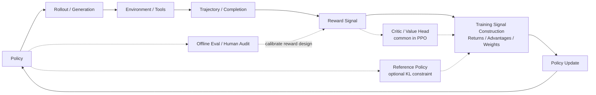

# A.1 Training Debugging Guide

You have already written DQN, Actor-Critic, and PPO, and you have seen the training pipelines for RLHF, GRPO, and Agentic RL. At this point, a natural question comes up:

> Why does the same algorithm run fine in the paper, run fine in someone else's code, and then become unstable the moment you swap in your own environment, change the reward, or scale up the model?

You are not alone in this. The hard part of reinforcement learning was never just "can you derive the formulas." Training itself is a closed loop that keeps changing the data distribution it's fed by: the policy is moving, the sampled data is moving with it, the reward model may be biased, and the value function is chasing a moving target. In supervised learning, a bad batch usually only costs you one gradient step. In RL, a bad policy collects bad data, and that bad data trains an even worse policy.

So this appendix is not a catalog of common error messages, and it doesn't stop at four failure modes. It's a debugging lecture: we first build a mental model, then walk through the different kinds of training anomalies using that model.

By the end of this section you should be able to answer three questions:

1. When a training curve goes wrong, which part of the pipeline should you suspect first?
2. What is the relationship between reward, loss, KL, entropy, value loss, GPU memory, and eval scores?
3. Facing an unstable RL experiment, how do you narrow it down step by step instead of tweaking hyperparameters by feel?

## Looking at Training as a Closed Loop

Let's start by drawing an abstract loop. This is not a diagram of any specific framework's implementation, and it doesn't claim that every modern LLM RL pipeline must look exactly like this. It's here to help you see the shape clearly: one round of RL training generally goes through "generate behavior → score it → construct a training signal → update the policy."



Any link in this loop can break, and the symptom on the surface is almost always the same: "reward isn't going up." But the fix is completely different depending on which link failed.

Three things need to be kept separate here.

**Reward signal** is the score actually computed during training. It might come from the environment itself, a hand-written reward function, a reward model, a verifier, or a weighted combination of several rules.

**Training signal construction** is the step that turns reward into "what should this update actually encourage, and what should it suppress." In PPO / Actor-Critic, this usually shows up as return, value target, and advantage; you can loosely read advantage as "how much better was this action or response than what was already expected." If the actual return turns out higher than what the Critic predicted, the advantage is positive and the policy leans toward repeating that behavior; otherwise it gets suppressed. In GRPO / RLVR, the common approach is not to train a Critic at all — instead you sample several responses for the same prompt and build advantage-like training weights from the relative reward within that group. TRL's GRPO documentation also splits the pipeline into generation, advantage computation, KL estimation, and loss computation, but there the advantage comes from normalizing reward within the group, not from a Critic's prediction[^trlgrpo].

**Evaluation and human audit** is side-channel supervision. It's used to pick checkpoints, catch reward hacking, and decide whether to roll back — under normal circumstances it doesn't feed into the gradient update directly. Eval results can tell you "the reward design is wrong," but they are not the same signal that drove training.

So this diagram is best read as a unified debugging map, not as "the one true pipeline for modern Agentic RL." PPO-RLHF looks more like the Critic + KL version of this diagram; GRPO/RLVR looks more like the "multiple generations + reward/verifier + within-group relative advantage" version; Agentic RL expands a single response into a multi-step tool trajectory, with reward possibly coming from the final environment state, a rule-based verifier, or human/model review. If the environment is wired up wrong, tuning the learning rate won't help. If the reward function can be gamed, continuing to train just makes the model better at cheating. If the Critic can't learn, PPO's advantage becomes noise. If KL spikes, the policy has already left the trust region. If the eval protocol is contaminated, every pretty curve might just be an illusion.

::: tip One sentence to remember
The first principle of RL debugging is not "tune the hyperparameters" — it's "locate which link in the loop broke first."
:::

## First-Pass Diagnosis for Training Anomalies

When training goes wrong, the most common reaction is to immediately adjust hyperparameters — lower the learning rate, increase the batch size, raise the KL coefficient, or just train for more steps. This looks proactive, but it introduces new variables and makes the original problem harder to pin down.

This section walks through a first-pass diagnostic flow better suited to course experiments and research reproduction. The goal isn't to fix training immediately — it's to figure out first which part of the pipeline the anomaly is coming from: experiment configuration, evaluation protocol, reward signal, model output, or the optimization process itself.

### Record the Experiment Context

Start by recording the basic context of the run: config file, random seed, code version, checkpoint, training logs, and eval command. RL experiments are extremely sensitive to random seeds and implementation details — the same algorithm setup can show noticeably different behavior across different seeds[^drltm]. If this information isn't saved, it becomes very hard later to tell "the algorithm really is unstable" apart from "the experimental conditions changed."

### Separate Training Metrics from Evaluation Metrics

Training reward only tells you the model is optimizing some reward signal — it does not by itself tell you task capability has improved. A more reliable way to look at things is to keep three categories of information separate:

- **Training metrics**: training reward, policy loss, KL, entropy, and so on — used to check whether the optimization process is stable.
- **Evaluation metrics**: held-out benchmarks, private test sets, task success rate — used to judge whether capability has actually improved.
- **Behavior samples**: the model's or agent's actual outputs — used to judge whether it has learned the wrong pattern.

For example, in RLHF training, if reward keeps rising while the eval score stays flat and response length keeps growing, the right read usually isn't "training hasn't run long enough." You should suspect a length preference baked into the reward signal.

### Inspect Model Output Samples

Curves are a compressed summary of the training process; samples expose the actual behavior. At minimum, check three kinds of samples during diagnosis: high-reward samples, low-reward samples, and random samples from the latest checkpoint.

In language model training, reward hacking tends to show up first as a shift in writing style: responses get longer, more elaborately formatted, more full of polite filler — while information density drops. In Agentic RL, it can also show up as an increase in tool-call count without the final environment state actually reflecting task completion.

### Build a Minimal Reproduction

Once you've checked the logs and samples, shrink the experiment down to something that runs fast: a smaller model, a smaller batch, fewer prompts, fewer training steps. The minimal reproduction isn't trying to hit a final score — it's answering basic questions:

- Can the implementation learn at all under a simple setup?
- Does the reward actually discriminate between good and bad behavior?
- Is the eval protocol stable?
- If you're using PPO/Actor-Critic, can the value function fit a fixed set of rollouts?
- If you're using GRPO/RLVR, is the reward ranking across multiple responses to the same prompt sensible?

Many RL bugs don't crash the program. A `done` mask written wrong, a flipped reward sign, padding tokens leaking into the loss, an eval temperature that quietly changed — all of these can let training finish normally while the model ends up learning the wrong behavior. That's why completing a minimal reproduction before scaling up is such an important step in the debugging workflow.

## Diagnostic Order

The sections that follow each cover a different class of training problem. In practice, work through them outside-in.

Start by checking the environment and data. Is the state the agent sees actually correct? Is the action being executed correctly by the environment? Is the termination signal handled correctly? Does the reward sign match what you expect? If something is wrong at this layer, every algorithm update downstream is just optimizing on top of bad data.

Next, check the evaluation protocol. If sampling temperature, max output length, tool permissions, or test-set splits have changed, eval results are no longer directly comparable. A public test set that gets reused repeatedly for tuning also gradually loses its meaning as an evaluation.

After that, check the reward signal. Is the reward too sparse? Are there extreme outlier scores? Does it agree with human judgment or an independent evaluation? If the reward signal can't be trusted, then the more thoroughly you train, the more likely the model is optimizing in the wrong direction.

Only after all of that do you go inside the algorithm. For PPO, check whether the policy update is too large. For methods with a Critic, check whether the value function is actually working. For GRPO/RLVR, check whether the within-group reward comparison makes sense. For Agentic RL, check whether the tool trajectory is consistent with the final environment state.

This order keeps you from suspecting every module at once. First figure out roughly which layer the anomaly belongs to, then go into the matching section below for a finer-grained check.

## Environment and Data: Confirm the World Is Real First

The bugs most easily overlooked in reinforcement learning tend to live upstream of the algorithm.

CartPole's action space is discrete — 0 or 1 — but you fed in a continuous action. MuJoCo's action range is `[-1, 1]`, but the policy's output never went through a tanh. In dialogue training, padding tokens weren't masked out, so the model is "learning" to fill in padding positions. In an agent task, a tool call failed, but it got recorded as a successful trajectory anyway.

What these problems have in common: training runs, and the curves move. The curves just don't mean anything.

### A Minimal Unit Test

Before starting real training, run at least four checks:

```python
def sanity_check_env(env, policy):
    obs, info = env.reset(seed=0)
    assert obs is not None

    action = policy.sample(obs)
    next_obs, reward, terminated, truncated, info = env.step(action)

    assert next_obs is not None
    assert isinstance(float(reward), float)
    assert isinstance(terminated, bool)
    assert isinstance(truncated, bool)

    return {
        "reward": reward,
        "done": terminated or truncated,
        "info_keys": list(info.keys()),
    }
```

Then run a cruder but effective test: run 100 trajectories with a random policy and plot the reward distribution. Then run 100 trajectories with a hand-written "weak expert" policy. If the expert policy and the random policy don't look meaningfully different, don't start training the model yet — go check the environment and the reward first.

::: warning Common wiring mistakes
Most non-convergent training isn't actually an algorithm problem. It's a flipped reward sign, an unhandled terminal state, a mismatched action scale, missing observation normalization, or a chosen/rejected pair swapped in the dataset.
:::

## Don't Let Your Test Set Turn Into Your Training Set

RL projects are prone to "eval contamination." You may never have put the test set into your training data, but if you keep using it to tune prompts, tune reward, tune the KL coefficient, and pick checkpoints, it's already participating in training decisions.

This is especially bad in post-training and Agentic RL. The model may not actually be getting stronger — it may just be adapting to a specific public benchmark, a specific judge, or a specific output format.

Here's a rule of thumb worth writing down:

| Set             | Purpose                           | How often to look    |
| --------------- | --------------------------------- | -------------------- |
| Smoke set       | Quickly catch implementation bugs | Freely               |
| Dev set         | Tune hyperparameters, tune reward | Freely, but log it   |
| Public test     | Watch the trend                   | Rarely               |
| Private test    | Release gate                      | Avoid looking        |
| Human audit set | Calibrate reward and judge        | Periodic spot checks |

The evaluation protocol needs to be fixed too: temperature, top_p, max_tokens, prompt template, tool permissions, timeout rules, pass@1/pass@k — all of it should be written down explicitly. Research on the ALE evaluation protocol makes the same point: variation in environment randomness, starting states, and evaluation procedure can significantly change RL conclusions[^ale].

## Having a Reward Doesn't Mean the Model Can Learn From It

The "reward" here isn't the act of designing a reward — it's the actual score each transition, response, or trajectory receives during training. That signal has to satisfy two conditions at once: pointing the right way, and dense enough.

Pointing the right way means the reward genuinely encourages the behavior you want. Dense enough means the model can pick up some difference in the reward even early in training. If 99.9% of trajectories get a reward of 0, the policy gradient is looking at silence.

### Look at the Reward Distribution

Plot a reward histogram before training, not after.

| Distribution shape                 | Likely problem                      | What to do                                                      |
| ---------------------------------- | ----------------------------------- | --------------------------------------------------------------- |
| Almost all 0                       | Reward too sparse                   | Add intermediate rewards, curriculum learning, more exploration |
| Almost all 1                       | Reward too lenient                  | Raise task difficulty, split into separate scoring dimensions   |
| Extreme long tail                  | A few samples dominate the gradient | Reward clipping / normalization                                 |
| Signs are inconsistent             | Reward definition is unclear        | Go back and inspect samples one by one                          |
| Low correlation with human ratings | The proxy can't be trusted          | Rewrite the reward or add human calibration                     |

In PPO, reward scale also affects the advantage. If the reward scale is too large, the advantage becomes a very spiky gradient signal, and the policy update can shoot straight out of the trust region. Most high-quality implementations do reward normalization, advantage normalization, and gradient clipping — and these implementation details by themselves change algorithm behavior[^implementation][^whatmatters].

## The Model Learned Test-Taking Tricks

Reward hacking isn't the model "misbehaving." It's the opposite — the model is optimizing your stated metric extremely well. The AI safety literature calls this specification gaming: the system satisfies the formal objective while violating the designer's actual intent[^concrete][^weng].

The classic language-model version: the reward model prefers detailed responses, so the model starts writing longer, more polite, more hollow responses. Reward climbs steadily while human spot checks get worse. Research on reward model overoptimization shows the same pattern — the proxy reward can keep improving while true preference starts declining past a certain point[^overopt].

### The Three-Symptom Syndrome

Reward hacking usually shows up as three signals appearing together:

1. **Reward is climbing**: the training dashboard looks great.
2. **Side metrics look off**: systematic shifts in length, repetition rate, format templates, refusal rate, or tool-call count.
3. **Real evaluation is declining**: human spot checks, the private set, and task success rate aren't improving in step.

```python
def audit_reward_hacking(samples):
    suspicious = []
    for item in samples:
        if item["reward"] > 0.9 and item["human_score"] < 0.4:
            suspicious.append(("reward-human mismatch", item["id"]))
        if item["response_len"] > item["baseline_len"] * 2:
            suspicious.append(("length inflation", item["id"]))
        if item["repeat_ratio"] > 0.2:
            suspicious.append(("repetition", item["id"]))
    return suspicious
```

Fixing this isn't a matter of bolting on one penalty term and calling it done. The more durable fix is to break reward apart into separate logged components: correctness, constraint satisfaction, safety, conciseness, formatting, tool-result quality, scored individually. Work like RewardBench makes a related point: a reward model needs to be evaluated in its own right — you can't just assume it always represents human preference[^rewardbench].

## PPO's Seatbelt Can Fail Too

PPO's core intuition is "small updates." TRPO enforces this explicitly with a KL constraint; PPO approximates the same goal with a clipped surrogate objective[^trpo][^ppo][^spinningup]. But the clip is not a magic shield.

If the learning rate is too high, there are too many PPO epochs, the batch is too small, or the advantage scale is off, the policy can still take a step that's too large.

### Watch Three Metrics

| Metric        | What to look at                                              | What an anomaly means                          |
| ------------- | ------------------------------------------------------------ | ---------------------------------------------- |
| KL divergence | distance between the new policy and the old/reference policy | policy is drifting too fast                    |
| Clip fraction | how many samples are getting clipped                         | PPO is hitting the brakes frequently           |
| Entropy       | how much randomness the policy still has                     | premature convergence or degenerate randomness |

Policy collapse usually doesn't start with reward — it starts with KL, clip fraction, and entropy. Reward is the symptom that shows up afterward.

```python
def ppo_guardrail(metrics):
    if metrics["kl"] > metrics["target_kl"] * 2:
        return "stop update: KL too high"
    if metrics["clip_fraction"] > 0.4:
        return "reduce lr or PPO epochs"
    if metrics["entropy"] < metrics["entropy_floor"]:
        return "increase exploration or KL constraint"
    return "continue"
```

In RLHF you also need to watch KL relative to the reference model. InstructGPT-style pipelines introduce a KL penalty exactly so the RL phase doesn't wreck the language competence learned during SFT[^instructgpt].

## The Critic: Where PPO / Actor-Critic Failures Hide

This section only applies to methods with a Critic or value head — Actor-Critic, PPO, and some PPO-RLHF implementations. If you're using a Critic-free method like GRPO/RLVR, skip this section and instead check the within-group reward, KL, and loss construction.

In Actor-Critic, the Critic's job is to estimate state value. It doesn't output actions directly, so a lot of people debugging these systems only ever look at policy loss. But if the Critic is wrong, the advantage is wrong, and if the advantage is wrong, the Actor updates in the wrong direction.

### Signs the Critic Is Broken

| Signal                                          | What it means                                   |
| ----------------------------------------------- | ----------------------------------------------- |
| Value loss stays high, doesn't drop             | Critic isn't fitting the returns                |
| Explained variance < 0                          | worse than just predicting the mean             |
| Policy reward oscillates                        | Actor is being pushed around by noisy advantage |
| Value prediction scale much smaller than return | reward scale or value target problem            |

Common fixes include: lowering the reward scale, normalizing returns, adjusting the critic's learning rate up or down, giving the critic network more capacity, checking the bootstrap target, and checking the terminal mask.

A very practical check: fix a batch of rollouts, freeze the actor, and train only the critic — see if it can fit that batch's returns. If it can't, fix the critic first.

## Too Confident and Too Random Are Both Bad

Exploration problems show up in two opposite ways.

One is entropy collapsing to zero too fast: the model latches onto one action or one response template early and gets stuck in a local optimum. The other is entropy staying high indefinitely: the policy behaves like a random walk, and reward never gets absorbed into the parameters.

| Symptom                                | Likely cause                                              | Fix                                                |
| -------------------------------------- | --------------------------------------------------------- | -------------------------------------------------- |
| Entropy collapses quickly              | reward too strong, KL too weak, temperature too low       | add an entropy bonus, lower lr, strengthen KL      |
| Entropy stays high for a long time     | reward too sparse, learning rate too low, noisy advantage | reward shaping, more sampling, check the advantage |
| Behavior is diverse but not improving  | exploration isn't being distinguished by the reward       | change the reward or add curriculum                |
| Behavior is uniform but reward is high | possible reward hacking                                   | spot-check high-reward trajectories                |

In language models, exploration isn't just token-level randomness — it also includes response length, reasoning path, tool choice, and where the refuse/don't-refuse boundary sits. Token entropy alone isn't enough; you also need to look at diversity at the behavioral level.

## Data Freshness: On-Policy Isn't Just a Slogan

PPO is an on-policy algorithm: it assumes the data used for an update comes from "near the current" policy. We save the old logprob during training precisely so we can measure how far the new policy has drifted from the sampling policy.

If the rollout worker and the learner fall out of sync, or the buffer ends up mixing in very old data, you'll see a strange pattern: the loss still computes, the gradient still steps, but the metrics swing back and forth unpredictably, and clip fraction becomes hard to explain.

Three questions to ask when troubleshooting this:

1. Does every rollout record which policy version generated it?
2. Does the old logprob used at update time actually match the sampling policy?
3. By the time a rollout enters training, how many rounds of policy update has it already lagged behind?

Agentic RL falls into this trap more easily, because a single trajectory can be long, tool execution is slow, and sampling and training are naturally asynchronous. Don't optimize purely for throughput — also keep data staleness under control.

## NaN Usually Gives Warning Signs First

NaN rarely appears out of nowhere. It's usually preceded by a spike in gradient norm, extreme logprob values, an outlier reward, exploding value loss, or mixed-precision overflow.

| Problem         | What to check                    | Fix                                  |
| --------------- | -------------------------------- | ------------------------------------ |
| Grad norm spike | p95 / max grad norm              | gradient clipping, lower lr          |
| Extreme logprob | taking log of a zero probability | clamp, check the mask                |
| fp16 overflow   | loss scale, NaN step             | switch to bf16, dynamic loss scaling |
| Reward outlier  | reward max/min                   | clipping, normalization              |
| Value explosion | value target distribution        | return normalization                 |

Don't wait for loss to turn into NaN before stopping training. Your training script should save experiment state and halt the current update as soon as a key metric crosses a threshold.

## GPU Memory Is Only Part of the Ledger

RLHF/PPO is much more resource-hungry than plain SFT, because it may need an actor, a critic, a reference model, and a reward model all at once, plus storage for rollouts, logprobs, values, advantages, and long-sequence activations.

GPU memory mainly comes from four sources:

| Source          | Why it costs memory                            | Common remedies                          |
| --------------- | ---------------------------------------------- | ---------------------------------------- |
| Model weights   | multiple models resident at once               | freeze, share, separate rollout/training |
| Optimizer state | Adam's first/second moments                    | ZeRO, FSDP, 8-bit optimizer              |
| Gradients       | scales with the number of trainable parameters | LoRA, freeze the backbone                |
| Activations     | scales with batch size and seq_len             | checkpointing, shorter sequences         |

ZeRO shards optimizer state, gradients, and parameters across multiple GPUs[^zero][^deepspeedzero]. FSDP lowers per-GPU resident memory through parameter sharding and on-demand all-gather[^fsdp]. LoRA freezes the main model and only trains a low-rank adapter[^lora]. These aren't "advanced optimizations" you add later — they're the precondition for whether large-model RL training can even start.

But resource problems aren't only about OOM. Falling throughput, low GPU utilization, rollout workers stuck waiting on the environment, and the reward model becoming a scoring bottleneck all slow training down, make data go stale, and eventually feed back into algorithmic instability.

## Extra Traps in RLHF and Agentic RL

RL for language models and agents carries a few extra failure modes beyond classical control.

| Setting    | Extra trap                        | Example                                                                 |
| ---------- | --------------------------------- | ----------------------------------------------------------------------- |
| RLHF       | length preference                 | responses keep getting longer, but information density drops            |
| RLHF       | refusal drift                     | safety reward too strong, model over-refuses                            |
| RLHF       | judge bias                        | the LLM judge favors a particular writing style                         |
| RLVR/GRPO  | format hacking                    | the model learns to match the format while the reasoning is still wrong |
| Agentic RL | tool hacking                      | repeated tool calls just to farm process reward                         |
| Agentic RL | fake success in state             | the text claims completion but the environment state never changed      |
| Agentic RL | long-trajectory credit assignment | a final failure is hard to trace back to a specific step                |

For these reasons, Agentic RL evaluation can't just look at the final text — it needs to look at environment state, whether tool calls were valid, step count, cost, and failure recovery ability. RLHF evaluation can't just look at the reward model — it needs human spot checks, a private set, length, repetition rate, safety regression, and real task success rate, all together.

## One Complete Troubleshooting Path

Suppose you observe: reward is going up, the benchmark isn't moving, and outputs keep getting longer.

Don't jump straight to "training isn't converging." Trace it through the loop:

1. **Evaluation protocol**: does the benchmark's temperature and max_tokens match the baseline?
2. **Sample spot check**: are the highest-reward samples longer, emptier, more templated?
3. **Reward decomposition**: does the reward carry a hidden preference for length, formatting, or polite tone?
4. **KL and entropy**: has the policy drifted too far from the reference model, is there mode collapse?
5. **Fix experiment**: add a length penalty or an information-density metric, run a short training run as a control.
6. **Ship/no-ship decision**: if reward goes down but the private set goes up, the earlier reward was probably wrong to begin with.

Now a second example: reward crashes, KL spikes, clip fraction sits at 0.5 for a long stretch.

Here you should first suspect the policy update was too aggressive:

1. Roll back to the most recent healthy checkpoint.
2. Lower the learning rate.
3. Reduce the number of PPO epochs.
4. Turn on target-KL early stopping.
5. Check advantage normalization and reward scale.

These two examples call for completely different fixes. That's exactly why "reward isn't going up, what do I do" isn't a good question to ask. The better question is: "which piece of evidence in the loop broke first?"

## Checklists: Before, During, and After Training

### Before Training

| Check                  | Question                                                            |
| ---------------------- | ------------------------------------------------------------------- |
| Environment unit test  | do reset/step/done/reward behave as expected?                       |
| Random-policy baseline | what does the random policy's reward distribution look like?        |
| Weak-expert baseline   | can a simple rule clearly beat random?                              |
| Reward histogram       | is reward all 0, all 1, or an extreme long tail?                    |
| Eval config            | is the evaluation protocol fixed and saved?                         |
| Memory budget          | can you afford the number of model copies, batch size, and seq_len? |

### During Training

| Signal                          | Action                                                     |
| ------------------------------- | ---------------------------------------------------------- |
| KL spiking                      | stop the update, lower lr or strengthen KL                 |
| Clip fraction persistently high | reduce PPO epochs or step size                             |
| Entropy collapsing quickly      | check for reward hacking and exploration issues            |
| Value loss not decreasing       | train the Critic alone as a fit test                       |
| Reward up, eval down            | spot-check high-reward samples immediately                 |
| Response length inflating       | check for a length preference                              |
| OOM or throughput crash         | lower micro batch / seq_len first, then bring in ZeRO/FSDP |

### After Training

| Deliverable          | Why                                                 |
| -------------------- | --------------------------------------------------- |
| Best eval checkpoint | the last step isn't always the best                 |
| Last checkpoint      | makes it possible to reproduce late-training issues |
| Failure checkpoint   | helps analyze what preceded a crash                 |
| Reward audit samples | judges whether reward hacking occurred              |
| Multi-seed results   | avoids mistaking a lucky run for a real result      |
| Private-set report   | guards against overfitting to the public set        |

## Summary

Debugging reinforcement learning isn't about memorizing a list of failure-mode names — it's about following the loop and gathering evidence.

Environment and data determine whether what you're learning is grounded in the real world. Reward and evaluation determine whether the optimization direction is actually what you want. Policy update and the Critic determine whether the gradient is stable. Exploration determines whether the model can discover better behavior. System resources determine whether training can keep producing fresh data.

When something goes wrong, don't start by asking "what should I set the learning rate to." Start by asking:

> Which curve broke first? Which part of the loop does it belong to? Is there a minimal experiment that can confirm this diagnosis?

That question is where RL training stops being folklore-driven tuning and starts becoming engineering.

## References

[^ppo]: Schulman et al., [Proximal Policy Optimization Algorithms](https://arxiv.org/abs/1707.06347), 2017.

[^spinningup]: OpenAI Spinning Up, [Proximal Policy Optimization](https://spinningup.openai.com/en/latest/algorithms/ppo.html).

[^trpo]: Schulman et al., [Trust Region Policy Optimization](https://arxiv.org/abs/1502.05477), 2015.

[^instructgpt]: Ouyang et al., [Training language models to follow instructions with human feedback](https://arxiv.org/abs/2203.02155), 2022.

[^trlgrpo]: Hugging Face TRL, [GRPO Trainer](https://huggingface.co/docs/trl/grpo_trainer).

[^drltm]: Henderson et al., [Deep Reinforcement Learning that Matters](https://arxiv.org/abs/1709.06560), 2018.

[^implementation]: Engstrom et al., [Implementation Matters in Deep RL: A Case Study on PPO and TRPO](https://openreview.net/forum?id=r1etN1rtPB), 2020.

[^whatmatters]: Andrychowicz et al., [What Matters In On-Policy Reinforcement Learning? A Large-Scale Empirical Study](https://arxiv.org/abs/2006.05990), 2020.

[^ale]: Machado et al., [Revisiting the Arcade Learning Environment: Evaluation Protocols and Open Problems for General Agents](https://arxiv.org/abs/1709.06009), 2018.

[^concrete]: Amodei et al., [Concrete Problems in AI Safety](https://arxiv.org/abs/1606.06565), 2016.

[^weng]: Lilian Weng, [Reward Hacking in Reinforcement Learning](https://lilianweng.github.io/posts/2024-11-28-reward-hacking/), 2024.

[^overopt]: Gao et al., [Scaling Laws for Reward Model Overoptimization](https://arxiv.org/abs/2210.10760), 2022.

[^rewardbench]: Lambert et al., [RewardBench: Evaluating Reward Models for Language Modeling](https://arxiv.org/abs/2403.13787), 2024.

[^zero]: Rajbhandari et al., [ZeRO: Memory Optimizations Toward Training Trillion Parameter Models](https://arxiv.org/abs/1910.02054), 2019.

[^deepspeedzero]: Microsoft DeepSpeed, [ZeRO Tutorial](https://www.deepspeed.ai/tutorials/zero/).

[^fsdp]: PyTorch Docs, [FullyShardedDataParallel](https://docs.pytorch.org/docs/stable/fsdp.html).

[^lora]: Hu et al., [LoRA: Low-Rank Adaptation of Large Language Models](https://arxiv.org/abs/2106.09685), 2021.
