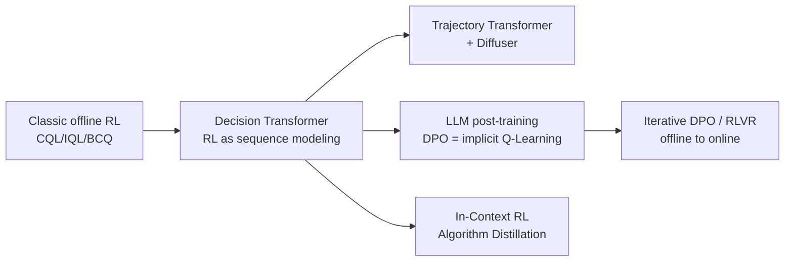

# 10.3 Offline RL Experiments and the LLM Perspective

> [12.2](./sequence-modeling) recast RL as sequence modeling. This section pulls the perspective back to the LLM era — you'll see that **DPO is, at its core, a special case of offline RL**, and understanding this explains many empirical phenomena in LLM post-training.

## Offline RL, DPO, and Preference Data in the LLM Era

By now you may already suspect something: **an LLM post-training preference dataset is, in essence, an offline RL dataset**.

### DPO as Implicit Q-Learning

The DPO objective derived in [Chapter 2, DPO](../chapter17_dpo/principles):

$$\mathcal{L}_{\text{DPO}} = -\mathbb{E}_{(x, y_w, y_l)}\left[\log \sigma\left(\beta \log \frac{\pi_\theta(y_w \mid x)}{\pi_{\text{ref}}(y_w \mid x)} - \beta \log \frac{\pi_\theta(y_l \mid x)}{\pi_{\text{ref}}(y_l \mid x)}\right)\right]$$

Formally, this is a classification loss. But Rafailov et al. 2024 (the original DPO authors), in a follow-up paper "From $r$ to $Q^*$," revealed its RL nature: **DPO is equivalent to an implicit, KL-constrained form of Q-Learning**.

Define the implicit advantage function:

$$\hat{A}(x, y) = \beta \log \frac{\pi_\theta(y \mid x)}{\pi_{\text{ref}}(y \mid x)}$$

Notice there's no explicit reward model here — but you can show there exists an implicit reward function $\hat{r}(x, y) = \beta \log(\pi_\theta / \pi_{\text{ref}}) + \beta \log Z(x)$ such that $\hat{A}$ is the advantage function under that reward. Going further, define a token-level value:

$$Q^*(s_t, a_t) = \hat{r}(s_t, a_t) + \gamma \mathbb{E}_{s_{t+1}}\left[\max_{a'} Q^*(s_{t+1}, a')\right]$$

The DPO loss becomes:

$$\mathcal{L} = -\mathbb{E}\left[\log \sigma\left(\hat{A}(x, y_w) - \hat{A}(x, y_l)\right)\right]$$

This is exactly the **softmax loss of a preferential Bradley-Terry model applied to the implicit advantage**. Once DPO training converges, $\hat{A}$ automatically satisfies an implicit Bellman equation (see Rafailov et al. 2024 for the derivation). This means:

- **DPO is offline RL**: training never interacts with a reward model or an environment — it only uses a fixed $(x, y_w, y_l)$ dataset
- **DPO's constraint**: KL divergence to the reference model $\pi_{\text{ref}}$, which corresponds to "not straying too far from the behavior policy" in offline RL
- **DPO has no extrapolation error**: because it never uses a max operator at all — it learns relative values directly from preference data. Every $(x, y_w, y_l)$ comes from the behavior policy $\pi_{\text{ref}}$ (the SFT model), and during training, how far the new policy $\pi_\theta$ can drift from $\pi_{\text{ref}}$ is strictly bounded by the KL term $\beta$. This is structurally identical, in the math, to the "conservative constraints" of CQL/IQL

Once you see this correspondence, a lot of empirical phenomena in LLM post-training explain themselves: $\beta$ too small → $\pi_\theta$ drifts too far from $\pi_{\text{ref}}$ → reward hacking (the LLM equivalent of a policy flying off into OOD territory in offline RL); $\beta$ too large → over-conservative → the model learns nothing. This is exactly the same trade-off as tuning $\alpha$ to control CQL's conservatism in offline RL.

### Preference Data as an Offline Trajectory Dataset

Compare the LLM preference dataset with the D4RL offline dataset from [Chapter 10](../chapter11_continuous_control/intro):

| Dimension            | D4RL (MuJoCo)                             | LLM Preference Data                                        |
| -------------------- | ----------------------------------------- | ---------------------------------------------------------- |
| State $s$            | robot joint angles                        | prompt $x$                                                 |
| Action $a$           | joint torques                             | response $y$                                               |
| Reward $r$           | scalar reward                             | preference $y_w \succ y_l$ (implicit reward)               |
| Data source          | some behavior policy $\pi_\beta$          | human annotation / RM model                                |
| Training objective   | $\max Q^\pi$ s.t. $\pi \approx \pi_\beta$ | $\max$ implicit reward s.t. $\pi \approx \pi_{\text{ref}}$ |
| Offline RL algorithm | CQL / IQL / DT                            | DPO / IPO / KTO                                            |

This correspondence isn't a coincidence — **DPO is, at its core, offline RL specialized to LLMs**. Once you see this, it becomes clear why the LLM post-training community borrows so heavily from the offline RL toolbox:

- **IPO (Identity Preference Optimization)**: replaces DPO's softmax with a squared loss — analogous to changing the form of the conservative regularizer in offline RL
- **KTO (Kahneman-Tversky Optimization)**: trains on single points instead of preference pairs — analogous to advantage-weighted regression
- **Iterative DPO**: repeatedly collects data and retrains — essentially the LLM version of offline-to-online RL
- **RLHF with PPO**: essentially online RL with the RM playing the role of the environment, but every rollout is still bounded by a KL constraint — a direct descendant of offline RL's "behavior-policy constraint"

### The Return of the Sequence-Modeling Perspective

DT's idea gets a second life in the LLM era. A modern LLM is itself a sequence model, so recasting RL post-training as "conditional sequence generation" is almost the natural move:

- **Process Reward Model + Search** ([Chapter 19](../chapter20_prm_search/inference-time-search)): treats the reasoning trajectory as a decision sequence, with the PRM serving as a step-level reward and beam search playing a role similar to the Trajectory Transformer
- **Expert Iteration / STaR**: the current model generates trajectories, high-reward ones are filtered out, and the model is retrained via SFT — essentially an iterative version of DT
- **In-Context RL (Algorithm Distillation, Laskin et al. 2022)**: the entire RL learning history is used as the prompt, letting a transformer learn to "do RL in-context" — a direct continuation of DT's "RL as sequence modeling" philosophy

::: tip One-Sentence Summary
**Offline RL is the parent discipline of LLM post-training.** DPO inherits CQL/IQL's wisdom on handling extrapolation error, recast as KL constraints plus preference learning; Decision Transformer's insight — rewriting RL as sequence modeling — is what lets the RL training stack and the LLM training stack merge into one. Understanding this chapter is a prerequisite for understanding [Chapter 11, Imitation Learning and Inverse RL](../chapter13_imitation_meta_rl/intro), [Chapter 19, PRM Search](../chapter20_prm_search/inference-time-search), and [Chapter 24, Code World Model](../chapter23_rl_based_swe/world-model-and-deep-swe).
:::

## Chapter Summary

1. **Offline RL's central tension is distribution shift**: a fixed dataset plus Q-Learning's max operator equals exploding extrapolation error. Every algorithm in this chapter is solving the same problem — how to keep the new policy from straying off the data distribution
2. **Three conservative routes**: BCQ constrains the action space, CQL penalizes OOD Q-values, IQL avoids the max operator entirely — plus the engineering-driven BC-regularization route (TD3+BC, AWAC)
3. **Decision Transformer is a paradigm shift**: it drops the Bellman equation and writes RL as conditional sequence generation, with RTG as the control variable and a GPT architecture processing trajectories directly
4. **Trajectory Transformer + Diffuser** push "sequence modeling" further, toward modeling the joint trajectory distribution and generating via diffusion
5. **DPO is, at its core, offline RL**: the preference dataset is an offline trajectory dataset, the KL constraint is a behavior-policy constraint, and implicit Q-Learning is the DPO loss

The next chapter, [Chapter 11, Imitation Learning, Inverse RL, and Meta-RL](../chapter13_imitation_meta_rl/intro), tackles another "no reward signal" setting: you can only observe expert behavior, so how do you work backward to a reward or a policy? This connects deeply to this chapter's offline RL, and to SFT / imitation learning in LLMs.

## Further Reading

- [Fujimoto et al. 2019 "Off-Policy Deep Reinforcement Learning without Exploration" (BCQ)](https://arxiv.org/abs/1812.02900)
- [Kumar et al. 2020 "Conservative Q-Learning for Offline Reinforcement Learning" (CQL)](https://arxiv.org/abs/2006.04779)
- [Kostrikov et al. 2022 "Offline Reinforcement Learning with Implicit Q-Learning" (IQL)](https://arxiv.org/abs/2110.06169)
- [Fujimoto & Gu 2021 "A Minimalist Approach to Offline Reinforcement Learning" (TD3+BC)](https://arxiv.org/abs/2106.06860)
- [Nair et al. 2020 "AWAC: Accelerating Online Reinforcement Learning with Offline Data"](https://arxiv.org/abs/2006.09359)
- [Chen et al. 2021 "Decision Transformer: Reinforcement Learning via Sequence Modeling"](https://arxiv.org/abs/2106.01345)
- [Janner et al. 2021 "Offline Reinforcement Learning as One Big Sequence Modeling Problem" (Trajectory Transformer)](https://arxiv.org/abs/2106.02039)
- [Janner et al. 2022 "Planning with Diffusion for Flexible Behavior Synthesis" (Diffuser)](https://arxiv.org/abs/2205.09991)
- [Rafailov et al. 2023 "Direct Preference Optimization: Your Language Model is Secretly a Reward Model"](https://arxiv.org/abs/2305.18290)
- [Rafailov et al. 2024 "From r to Q\*: Your Language Model is Secretly a Q-Function" (the formal equivalence between DPO and Q-Learning)](https://arxiv.org/abs/2404.12358)
- [Levine et al. 2020 "Offline Reinforcement Learning: Tutorial, Review, and Perspectives on Open Problems"](https://arxiv.org/abs/2005.01643)
- [Laskin et al. 2022 "In-Context Reinforcement Learning with Algorithm Distillation"](https://arxiv.org/abs/2210.14215)
