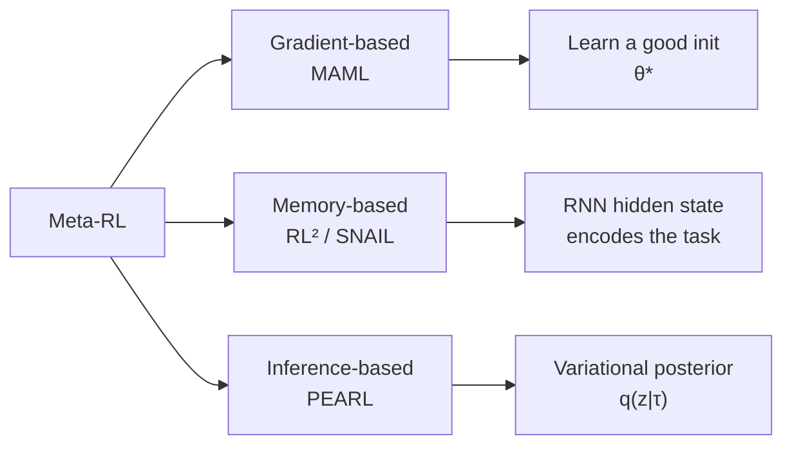
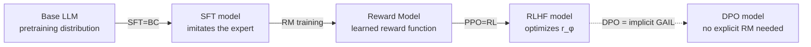

# 11.3 Meta-RL and MAML, RL², PEARL, In-Context RL

> [Section 13.2](./irl-gail) covered inferring a reward from expert demonstrations. This section deals with a different kind of setting: **the environment itself keeps changing**. Meta-RL (Meta Reinforcement Learning) gives an agent the ability to "adapt quickly to a new task" — after pretraining on a batch of related tasks, it can master a new one with just a handful of interactions.

## MAML, RL², and PEARL

Every algorithm so far has assumed a fixed task. Real settings change constantly: a robot arm gets swapped to a new workpiece, a self-driving car moves to a new city, an LLM moves to a new domain. **Meta-RL** aims to **learn how to learn quickly** — train on a large set of related tasks so the agent can adapt to a brand-new one from very few samples.

### Three meta-RL paradigms



### Learning a good initialization

Model-Agnostic Meta-Learning (Finn et al. 2017) has a simple core idea: find an initialization $\theta^*$ such that **one or two steps of gradient descent adapt it to a new task**.

The outer objective:

$$\min_{\theta} \; \mathbb{E}_{T_i \sim p(T)}\left[\mathcal{L}_{T_i}\left(\theta - \alpha \nabla_\theta \mathcal{L}_{T_i}(\theta)\right)\right]$$

The inner loop takes one step of SGD to get $\theta_i' = \theta - \alpha \nabla_\theta \mathcal{L}_{T_i}(\theta)$, and the outer loop evaluates $\theta_i'$'s loss on $T_i$. Differentiating through this inner step requires a **second-order gradient** (the gradient of a gradient-descent step):

$$\nabla_\theta \mathcal{L}_{T_i}(\theta_i') = \nabla_{\theta_i'} \mathcal{L}_{T_i}(\theta_i') \cdot (I - \alpha \nabla^2_\theta \mathcal{L}_{T_i}(\theta))$$

In practice people often use the **first-order approximation, FOMAML**: drop the Hessian term and keep only $\nabla_{\theta_i'} \mathcal{L}_{T_i} \cdot (-\alpha \nabla_\theta)$, which cuts the compute cost substantially.

```python
def maml_meta_update(meta_policy, tasks, inner_lr=0.1, outer_lr=0.001):
    meta_grad = 0
    for task in tasks:
        # === Inner loop: clone the parameters, adapt with a few SGD steps ===
        theta_prime = meta_policy.params.clone()
        for _ in range(n_inner_steps):
            inner_loss = task.compute_loss(theta_prime)
            theta_prime -= inner_lr * grad(inner_loss, theta_prime)

        # === Outer loop: evaluate the adapted parameters, backprop into the meta parameters ===
        outer_loss = task.compute_loss(theta_prime)
        # autograd handles the second-order gradient automatically here
        g = grad(outer_loss, meta_policy.params)
        meta_grad += g

    meta_policy.params -= outer_lr * meta_grad / len(tasks)
```

### Encoding the task into an RNN's hidden state

RL², proposed by Duan et al. (2016), takes a different route: **the entire RL algorithm gets compressed into an RNN's hidden-state transition**.

The setup: train an RNN policy $\pi_\theta(a_t \mid h_t)$ across multiple episodes, where $h_t = f_\theta(h_{t-1}, s_{t-1}, a_{t-1}, r_{t-1}, \text{done})$. The interaction history within an episode — rewards, transitions — accumulates in the hidden state, letting the policy make better decisions **later in the same task** than it did earlier. That is equivalent to the policy "learning" the current task on the fly.

The key trick: during meta-training, the hidden state is **not reset across episodes**, which forces the RNN to learn to "infer the task from the rewards of earlier rounds." This is an **implicit version of learning-to-learn** — RL² never specifies a learning algorithm; it just lets the network discover one for itself.

### PEARL and variational task inference

Probabilistic Embeddings for Actor-Critic RL (Rakelly et al. 2019) models the "task posterior" explicitly. Suppose the task is determined by a latent variable $z \sim p(z)$ — a goal location, a friction coefficient — and the policy $\pi_\theta(a \mid s, z)$ is conditioned on $z$.

Adaptation then reduces to inferring the posterior $q_\phi(z \mid \tau_{1:K})$: given a small amount of experience $\tau$, output a task embedding $z$. The training objective combines an ELBO term with the RL loss:

$$\mathcal{L} = -\mathbb{E}_{z \sim q_\phi}\left[\sum_t r(s_t, a_t, z)\right] + \beta \cdot D_{\text{KL}}\left(q_\phi(z \mid \tau) \,\|\, p(z)\right)$$

On Meta-World (50 robotic manipulation tasks), PEARL reaches 80% of full performance after just 5 adaptation steps, far outperforming MAML, which needs 50 or more.

| Method | Adaptation mechanism                 | Second-order gradient?                             | Sample efficiency | Inference style           |
| ------ | ------------------------------------ | -------------------------------------------------- | ----------------- | ------------------------- |
| MAML   | Gradient descent                     | Yes (avoidable with the first-order approximation) | Medium            | Explicit parameter update |
| RL²    | RNN hidden state                     | No (trained end to end)                            | High              | Implicit (black box)      |
| PEARL  | Variational posterior $q(z\mid\tau)$ | No                                                 | Highest           | Explicit (interpretable)  |

### Meta-RL and few-shot learning

Meta-RL shares its core idea with supervised few-shot learning: **train a prior on a large set of related tasks, then adapt to a new one from just a few samples**. This idea directly inspired in-context learning in LLMs — the topic of the next section.

## In-Context RL and Algorithm Distillation

RL²'s implicit "task inference" found a revival in the transformer era. DeepMind's 2022 **Algorithm Distillation** (Laskin et al.) shows that **a transformer's in-context ability can distill an entire RL algorithm**.

### Treating RL history as sequence modeling

Take an RL training run that spans many tasks, with each trajectory $\tau = (s_0, a_0, r_0, s_1, a_1, r_1, \ldots)$. Algorithm Distillation's key insight:

> Look at the progress along a single RL training run: **the early episodes come from a novice policy, and the later episodes from an expert one**. If you train a transformer to predict "given the history of the previous $k$ episodes, what's the next action," it has no choice but to **learn the novice-to-expert improvement process in context** — which means implicitly learning the RL algorithm itself.

How the data is organized:

```
[episode_1 (poor policy): s0 a0 r0 s1 a1 r1 ... |
 episode_2 (slightly better): s0 a0 r0 ... |
 ...
 episode_N (expert): s0 a0 r0 ...]
            ↑
     transformer input: concat all history
     target: predict the next action within each episode
```

### How this differs from RL²

| Dimension                  | RL²                  | Algorithm Distillation              |
| -------------------------- | -------------------- | ----------------------------------- |
| Model                      | Small RNN (LSTM/GRU) | Large transformer                   |
| Data                       | Online meta-training | **Offline** learning histories      |
| What in-context learns     | Task ID (implicit)   | **The RL algorithm itself**         |
| Cross-algorithm generality | A single algorithm   | Can distill DQN, PPO, A2C, and more |

AD's key experiment: train only on PPO histories, and at test time the transformer **can carry out the function of RL algorithms it has never seen** — because it learned the general mechanism of "how to use reward to improve a policy."

```python
def algorithm_distillation_data_generate(env, rl_algorithm, n_runs=1000, n_episodes_per_run=200):
    """Collect AD training data: across many runs, where each run is one full RL learning process"""
    dataset = []
    for run in range(n_runs):
        policy = init_random_policy()
        run_history = []
        for ep in range(n_episodes_per_run):
            trajectory = rollout(env, policy)
            run_history.append(trajectory)
            # An online RL algorithm updates the policy (DQN/PPO/A2C, take your pick)
            policy = rl_algorithm.update(policy, trajectory)
        # Each run becomes one training example: a complete learning curve
        dataset.append(run_history)
    return dataset


def ad_inference(transformer, env, n_adapt_episodes=10):
    """At test time, the transformer learns in-context on a new environment"""
    context = []  # accumulated history
    for ep in range(n_adapt_episodes):
        s = env.reset()
        done = False
        while not done:
            # Key point: the action is predicted by the transformer, conditioned on context
            a = transformer.predict_next_action(context, s)
            s_next, r, done = env.step(a)
            context.append((s, a, r))
            s = s_next
        # Note: the transformer's parameters are never updated! It only "learns" within the context
```

### Decision Transformer: a different route

Decision Transformer (Chen et al. 2021) showed even earlier that RL can be recast as sequence modeling: feed the transformer $(R, s, a)$ triples, where $R$ is the return-to-go. Conditioned on a target return $R^*$, the model generates the actions that achieve it.

$$a_t = \text{Transformer}\left(R_t, s_t, a_{t-1}, R_{t-1}, s_{t-1}, \ldots\right)$$

DT is not in-context RL — it is a **conditional policy**. Still, it inspired follow-ups such as Online DT and Elastic DT, which gradually converged with in-context RL.

### In-context RL's connection to LLMs

The history of in-context learning in LLMs runs remarkably parallel to in-context RL:

- **GPT-3's in-context learning** (2020): give the model a few examples in the prompt, and it learns the task without updating any parameters — the in-context version of **supervised learning**
- **Algorithm Distillation's in-context RL** (2022): give the model a few reward-tagged trajectories in the context, and it learns RL without updating any parameters — the in-context version of **reinforcement learning**

Both rely on a transformer's capacity for **inductive reasoning**. This explains why LLMs, after RLHF, exhibit an emergent ability to "improve within the context" — the transformer has encoded some implicit RL mechanism.

## The connection to LLM SFT/RLHF

Map the concepts from the previous sections onto LLM training, and you find that **the entire LLM post-training stack is a combination of imitation learning and RL**.

### SFT is behavior cloning

Recall the SFT loss from [Chapter 13, RLHF](../chapter15_rlhf/base-model-to-assistant):

$$\mathcal{L}_{\text{SFT}}(\theta) = -\sum_{t=1}^T \log \pi_\theta(y_t \mid x, y_{<t})$$

This is exactly the behavior-cloning loss from Section 14.1 — $(x, y)$ is the "expert demonstration," and $\pi_\theta$ is the policy. Every problem SFT has is a classic BC problem:

- **Distribution shift**: during training, the expert states are high-quality instruction-response pairs; at deployment, the model's own generated tokens drift away from that distribution
- **Error accumulation**: once a generated token drifts, the tokens that follow it land in "unseen territory" and are more prone to error too
- **Insufficient coverage**: the SFT dataset can't cover every state the model will actually visit at deployment

RLHF's PPO stage is, at its core, an "automated version of DAgger" — it lets the model receive reward feedback on trajectories it generated itself, gradually pulling the training distribution back toward the deployment distribution.

### Rereading InstructGPT's three stages

The three stages of InstructGPT (Ouyang et al. 2022) can be reread as follows:



1. **SFT stage = behavior cloning**: learn the format of the behavior from human demonstrations
2. **RM stage = an approximation of inverse RL**: infer a "reward function" from preference data — the LLM-era version of the MaxEnt IRL idea (though it uses a Bradley-Terry model rather than a maximum-entropy formulation)
3. **PPO stage = forward RL**: run on-policy optimization against the learned reward function, fixing SFT's distribution shift

[Chapter 7, DPO](../chapter17_dpo/dpo-theory-and-family) can be seen as a simplified form of GAIL: DPO's implicit reward $\log \pi_\theta(y_w \mid x) - \log \pi_\theta(y_l \mid x) - \log \pi_{\text{ref}}(y_w \mid x) + \log \pi_{\text{ref}}(y_l \mid x)$ folds the "expert vs. non-expert" discriminative learning directly into the policy itself.

### LLM adaptation from a meta-RL perspective

An LLM's few-shot in-context learning can be seen as a "**zero-shot version of RL²**":

- RL²: meta-trains across tasks, and the RNN hidden state implicitly encodes the task
- LLM in-context: pretrains across a corpus, and the context window implicitly encodes the task

Both come down to "**adapting from context alone, with no parameter updates**." Algorithm Distillation shows that a transformer's in-context ability can encode a complete RL algorithm — which suggests that **an LLM trained with RLHF has, to some degree, "internalized the RL process"** and can keep improving through context at inference time.

### Offline imitation learning and the DPO family

[Chapter 10, Offline RL](../chapter12_offline_rl/intro) converges with this chapter here: when all you have is **expert demonstrations plus suboptimal data**, offline imitation learning methods (DemoDICE, SMILe, DWBC) use conservative estimates to avoid overvaluing suboptimal actions — the same idea that underlies DPO's "explicit reference-policy regularization."

::: tip Why this chapter matters
Once you understand this chapter, you'll see through to the essence of LLM post-training:

- SFT isn't magic — it's 30-year-old behavior cloning
- RLHF's reward wasn't invented from nothing — it's an industrial-scale implementation of inverse RL
- DPO isn't a new theory — it's the dual form of GAIL applied to LLMs
- In-context RL reveals that an LLM's few-shot ability is, at its core, a form of implicit RL
  :::

## Chapter Summary

Imitation learning, inverse RL, and meta-RL — these three themes answer the core questions that lie outside classic RL:

1. **Behavior cloning (BC)** treats imitation learning as supervised learning, but suffers from **distribution shift**; **DAgger** fixes this by iteratively collecting failure states
2. **MaxEnt IRL** infers a reward function from expert demonstrations, but computing the partition function $Z$ is expensive
3. **GAIL** expresses the reward implicitly through adversarial GAN-style training, and is the theoretical predecessor of DPO in the LLM era
4. **Meta-RL** learns "how to learn quickly": MAML learns a good initialization, RL² compresses the algorithm into an RNN, PEARL explicitly infers the task posterior
5. **In-Context RL / Algorithm Distillation** distills an entire RL algorithm into a transformer's in-context ability, connecting to few-shot learning in LLMs
6. **LLM post-training** can be rewritten as BC (SFT) + inverse RL (RM) + forward RL (PPO), with DPO as the dual form of GAIL

The next chapter, [Chapter 13, Exploration, MARL, and Hierarchical RL](../chapter14_exploration_marl_hierarchical/intro), turns to three more advanced topics: how to explore when reward is sparse, how to train when multiple agents interact, and how to plan hierarchically when the horizon is extremely long.

## Further Reading

- [Pomerleau 1989 "ALVINN: An Autonomous Land Vehicle in a Neural Network" (the earliest BC)](https://www.ri.cmu.edu/publications/alvinn-an-autonomous-land-vehicle-in-a-neural-network/)
- [Ross, Gordon & Bagnell 2011 "A Reduction of Imitation Learning and Structured Prediction to No-Regret Online Learning" (DAgger)](https://arxiv.org/abs/1011.0686)
- [Ziebart et al. 2008 "Maximum Entropy Inverse Reinforcement Learning"](https://www.aaai.org/Papers/AAAI/2008/AAAI08-227.pdf)
- [Ho & Ermon 2016 "Generative Adversarial Imitation Learning" (GAIL)](https://arxiv.org/abs/1606.03476)
- [Finn, Abbeel & Levine 2017 "Model-Agnostic Meta-Learning for Fast Adaptation of Deep Networks" (MAML)](https://arxiv.org/abs/1703.03400)
- [Duan et al. 2016 "RL²: Fast Reinforcement Learning via Slow Reinforcement Learning"](https://arxiv.org/abs/1611.02779)
- [Rakelly et al. 2019 "Efficient Off-Policy Meta-Reinforcement Learning via Probabilistic Context Variables" (PEARL)](https://arxiv.org/abs/1903.08254)
- [Laskin et al. 2022 "In-Context Reinforcement Learning with Algorithm Distillation"](https://arxiv.org/abs/2210.14215)
- [Chen et al. 2021 "Decision Transformer: Reinforcement Learning via Sequence Modeling"](https://arxiv.org/abs/2106.01345)
