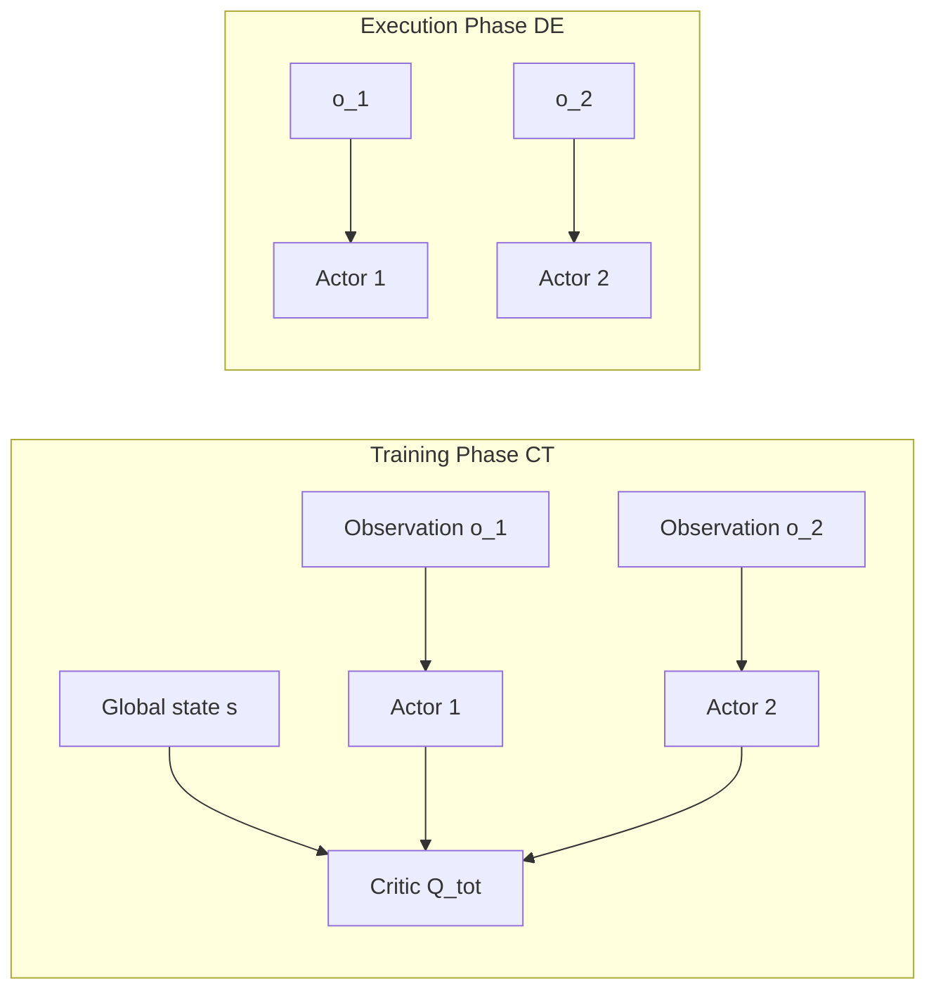

# 12.2 Multi-Agent RL, CTDE, MADDPG, and MAPPO

> [14.1](./intro) covered the hard-exploration problem for a single agent. This section turns to the multi-agent setting -- when several agents in an environment learn at the same time, each agent's view of the environment keeps shifting, because the other agents are changing too, and that breaks the stationarity assumption behind the MDP. The **CTDE** (Centralized Training Decentralized Execution) paradigm is the industry-standard answer for large-scale multi-agent RL.

## Multi-Agent RL and the CTDE Framework

When multiple agents in an environment learn simultaneously, the standard MDP assumption breaks down. From the point of view of a single agent $i$, the transition $P(s' \mid s, a_i)$ is no longer fixed -- it depends on the current policies of the other agents $a_{-i}$, and those policies keep changing. This **non-stationarity** means Q-value estimates never converge. Independent learning, where each agent treats its opponents as part of the environment, often collapses into a "one step forward, one step back" oscillation on cooperative tasks.

### From Normal-Form Games to MARL

The simplest way to formalize multi-agent interaction is the **Normal-Form Game**: a joint action $a = (a_1, \ldots, a_n)$, with each agent receiving its own reward $r_i(a)$. A Nash equilibrium is a joint policy in which no agent can unilaterally change its own policy to improve its expected payoff. Game-theoretic solutions assume rational opponents and a known model, but deep MARL has to deal with high-dimensional observations, unknown rewards, and opponents that are themselves learning.

### Centralized Training, Decentralized Execution

**Centralized Training Decentralized Execution** is the most practical compromise used in industry. During training, every agent's observations and actions are visible, so the critic can draw on global information. During execution, each agent can see only its own observation, so the actor has to make decentralized decisions.

Formally, the decentralized policy $\pi_i(a_i \mid o_i)$ depends only on the local observation $o_i$, while the centralized critic $Q_i^{\text{tot}}(s, a_1, \ldots, a_n)$ depends on the global state and the joint action. This satisfies two constraints at once:

- **Rich training signal**: the critic sees the global state, which sidesteps the non-stationarity of treating opponents as part of the environment
- **Feasible execution**: the actor sees only local information, so deploying to a real multi-machine system requires no communication



The CTDE paradigm has produced three broad families of algorithms: value decomposition (VDN, QMIX), actor-critic methods (MADDPG, MAPPO), and communication-based methods (CommNet, TarMAC). The rest of this section focuses on the two leading actor-critic representatives.

## MADDPG and MAPPO

### MADDPG: One Centralized Critic per Agent

Multi-Agent DDPG (Lowe et al., 2017) extends DDPG directly to the multi-agent setting. Each agent $i$ holds its own actor $\mu_{\theta_i}(o_i)$ and its own **centralized critic** $Q_i(o_1, a_1, \ldots, o_n, a_n)$. The critic's gradient is:

$$\nabla_{\theta_i} J(\mu_{\theta_i}) = \mathbb{E}\left[\nabla_{\theta_i} \mu_{\theta_i}(o_i) \cdot \nabla_{a_i} Q_i(o_1, a_1, \ldots, o_n, a_n)\big|_{a_i = \mu_{\theta_i}(o_i)}\right]$$

Note that the critic's input dimension grows linearly with the number of agents, and the gradient is taken **only with respect to its own $a_i$** -- the other agents' actions are treated as given. This "I learn my own best response to everyone else" structure is what lets MADDPG converge stably on mixed cooperative-competitive tasks, such as predator-prey in the _Particle Environments_.

```python
class MADDPG:
    def __init__(self, n_agents, obs_dim, action_dim):
        # one actor plus a centralized critic per agent
        self.actors = [Actor(obs_dim, action_dim) for _ in range(n_agents)]
        self.critics = [Critic(n_agents * (obs_dim + action_dim), 1)
                        for _ in range(n_agents)]

    def update(self, batch):
        obs, actions, rewards, next_obs = batch  # trajectories for all agents
        for i in range(self.n_agents):
            # centralized critic target: next actions for all agents
            next_actions = [self.actors_target[j](next_obs[j])
                            for j in range(self.n_agents)]
            target_q = self.critics_target[i](
                torch.cat([*next_obs, *next_actions], -1))
            y = rewards[i] + self.gamma * target_q
            # critic regresses toward y
            current_q = self.critics[i](
                torch.cat([*obs, *actions], -1))
            critic_loss = F.mse_loss(current_q, y.detach())

            # actor takes gradient only w.r.t. its own action
            pred_action_i = self.actors[i](obs[i])
            all_actions = list(actions)
            all_actions[i] = pred_action_i
            actor_loss = -self.critics[i](
                torch.cat([*obs, *all_actions], -1)).mean()
            ...
```

MADDPG's weaknesses: (1) the centralized critic's input dimension explodes with the number of agents, making it impractical once you have dozens of them; (2) it inherits all of the stability problems of the DDPG family (see [Chapter 9](../chapter11_continuous_control/intro#_12-3-td3-ddpg-的稳定性补丁)).

### MAPPO: Extending PPO to Multi-Agent

Multi-Agent PPO (Yu et al., 2022) extends PPO's on-policy actor-critic to CTDE: each agent has its own decentralized actor $\pi_{\theta_i}(a_i \mid o_i)$, and all agents share one centralized critic $V_\phi(s)$ (or a $Q_\phi$ that also takes the joint action as input). PPO's clipped objective transfers naturally to the multi-agent setting, because the probability ratio $\pi_{\theta_i}/\pi_{\theta_i}^{\text{old}}$ is computed independently for each agent, and clipping keeps any single agent's policy from jumping so far that it collapses the joint distribution.

```python
def mappo_update(actors, critic, buffer, n_agents, clip_eps=0.2):
    for epoch in range(E):
        for batch in buffer.iter():
            s, obs_list, a_list, old_logp_list, adv, ret = batch
            # centralized critic: estimate V(s)
            values = critic(s)
            new_logp_list = [log_prob(actors[i](obs_list[i]), a_list[i])
                             for i in range(n_agents)]
            for i in range(n_agents):
                ratio = (new_logp_list[i] - old_logp_list[i]).exp()
                s1 = (ratio * adv[i]).mean()
                s2 = torch.clamp(ratio, 1 - clip_eps, 1 + clip_eps) * adv[i]
                policy_loss = -torch.min(s1, s2).mean()
                entropy_bonus = -new_logp_list[i].mean()
                update(actors[i], policy_loss + 0.01 * entropy_bonus)
            value_loss = F.mse_loss(values, ret)
            update(critic, value_loss)
```

MAPPO's engineering advantages have made it the **de facto standard** for MARL over the past couple of years:

- **Stability**: PPO's clipping is more robust than DDPG's off-policy updates
- **Unified hyperparameters**: a single hyperparameter set gets close to SOTA on the _StarCraft Multi-Agent Challenge_ (SMAC), _Hanabi_, and _Multi-Agent MuJoCo_
- **Scalability**: the shared critic and distributable actors suit large clusters

### Comparing CTDE Algorithms

| Algorithm                  | Critic Input                         | Actor Input | on/off-policy | Representative Tasks          |
| -------------------------- | ------------------------------------ | ----------- | ------------- | ----------------------------- |
| IQL (independent learning) | $o_i$                                | $o_i$       | off           | weak baseline                 |
| VDN / QMIX                 | $s$ (linear/monotonic decomposition) | $o_i$       | off           | cooperative tasks             |
| MADDPG                     | $(o_1,a_1,\ldots,o_n,a_n)$           | $o_i$       | off           | mixed cooperative-competitive |
| MAPPO                      | $s$                                  | $o_i$       | on            | SMAC, Hanabi                  |

::: tip What Is Value Decomposition
VDN assumes $Q_{\text{tot}} = \sum_i Q_i(o_i, a_i)$; QMIX generalizes this so that $Q_{\text{tot}}$ is a monotonic function of the individual $Q_i$ (which guarantees that $\arg\max$ decomposes cleanly). Both are CTDE methods, but they belong to the "value decomposition" branch, which isn't this chapter's main thread. MAPPO now outperforms QMIX on most cooperative tasks.
:::

## Section Summary

The core challenge in multi-agent RL is non-stationarity -- every agent's view of the environment keeps changing. The CTDE (Centralized Training Decentralized Execution) paradigm resolves the non-stationarity of training with a centralized critic, while decentralized actors guarantee that each agent decides independently at deployment. MADDPG extends DDPG to multiple agents; MAPPO extends PPO to multiple agents -- and the latter is the current SOTA for StarCraft multi-agent micromanagement.

The next section, [14.3 Hierarchical RL and a Prelude to Generative World Models](./hierarchical), addresses the third scenario we've been deferring -- **extremely long task horizons** -- which requires hierarchical RL to decompose long-horizon decisions into a sequence of options.
