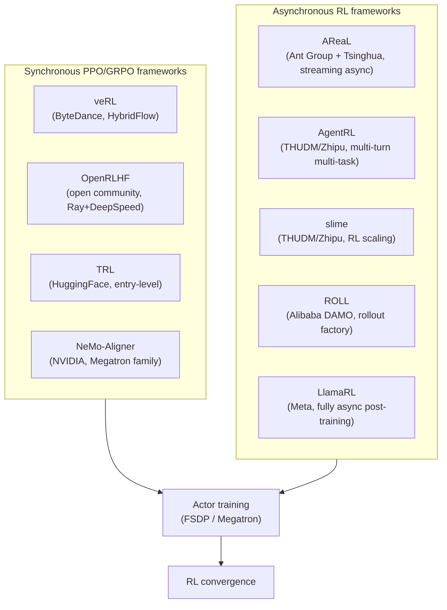

# Chapter 14 · LLM RL in Industry

[Chapter 13, RLHF](../chapter15_rlhf/intro) laid out the full alignment training loop: Reward Model training, the PPO main loop, KL constraints, evaluation methods. The experiments there ran on a 7B model, single machine, 8 GPUs. But once the training target becomes a 671B MoE, the context window stretches to 128K, and rollout runs across a thousand-GPU cluster, every engineering detail starts to decide whether training converges at all. This chapter lifts the viewpoint from "algorithm level" to "industrial systems level" — covering training-framework selection, reward-signal design, training-cost accounting, and the core derivations that keep showing up in industry interviews.

To keep the chapter coherent, its material is split across four files by facet. This file covers Sections 17.1, 17.3, 17.5, and 17.7. The other three sections live here:

| Section                                                                                      | Topic                                                                 | File                                          |
| -------------------------------------------------------------------------------------------- | --------------------------------------------------------------------- | --------------------------------------------- |
| [17.2 The Modern Post-Training Pipeline Paradigm](../chapter17_dpo/industrial-post-training) | A panorama of post-training at major labs, domestic and international | `chapter17_dpo/industrial-post-training.md`   |
| [17.4 Optimizers and Training Stability](../chapter17_dpo/modern-industrial-practice)        | GLM-4.6, Llama 4, MuonClip                                            | `chapter17_dpo/modern-industrial-practice.md` |
| [17.6 Hands-on veRL Code-Generation RL](../chapter18_grpo/verl-code-sandbox)                 | Code-verifier + PPO in practice                                       | `chapter18_grpo/verl-code-sandbox.md`         |

## 17.1 Comparing Training Frameworks

An LLM RL training framework has to orchestrate several models at once — Actor, Critic, Reference, Reward Model, Rollout Engine — while also handling on-policy data flow, distributed training, and weight synchronization with the inference engine. These requirements sit outside what HuggingFace's `Trainer` or `Accelerate` were designed for, which is why a crop of frameworks built specifically for LLM RL emerged starting in 2024. This section compares seven representative open-source frameworks and gives you a basis for choosing among them.

### The Framework Landscape



### veRL, OpenRLHF, TRL, NeMo-Aligner

#### veRL

[veRL](https://github.com/volcengine/verl) (Volcano Engine Reinforcement Learning, ByteDance, 2024) is the de facto mainstream LLM RL training framework, backed by the paper [HybridFlow, arXiv:2409.19256](https://arxiv.org/abs/2409.19256). Its core abstraction is **single-controller + multi-model orchestration**: one Driver process orchestrates five Workers — Actor, Critic, Reference, Reward Model, Rollout Engine — each running on its own group of GPUs (a ResourcePool).

The engineering highlight of veRL is decoupling the training stack from the inference stack: the Actor trains with FSDP/Megatron, Rollout runs on vLLM for inference, and the two are connected through a weight-synchronization interface, `sync_weights`. This decoupling lets vLLM's inference optimizations — PagedAttention, continuous batching, tensor parallelism — plug directly into RL training, pushing rollout throughput 5-10x above naive HuggingFace generation.

veRL is the de facto choice behind the open training scripts for Qwen3, DeepSeek-R1, Llama 4, Mistral, and others. For the detailed architecture, see [Chapter 14, Section 16.4 Distributed Sync, Async, and MoE Training](./distributed-sync).

#### OpenRLHF

[OpenRLHF](https://github.com/OpenRLHF/OpenRLHF) (open community, 2024) takes the Ray + DeepSpeed route. It wraps Actor, Critic, Reward Model, and Reference each as a Ray Actor and relies on Ray's distributed scheduler for cross-node communication. The training backend is DeepSpeed ZeRO, supporting all three flavors of the zero-redundancy optimizer — ZeRO-1/2/3.

OpenRLHF's strength is being **community-friendly** — its config files are close to HuggingFace style, it covers the widest range of algorithms (PPO, GRPO, DPO, KTO, SimPO, Rejection Sampling, Iterative DPO), and its documentation is thorough, which makes it a good fit for academic reproduction. Its weakness is throughput at large scale, which lags behind veRL: OpenRLHF has no native vLLM integration for rollout (it has to be bolted on externally), and weight-sync overhead runs high.

#### TRL

[TRL](https://github.com/huggingface/trl) (Transformer Reinforcement Learning, official HuggingFace) is the entry-level framework. It builds directly on `transformers.Trainer` and supports PPO, DPO, GRPO, and similar algorithms. TRL's positioning is "get any HuggingFace user running RLHF in five minutes," and that positioning **trades away large-scale training capability** — no vLLM integration, no ResourcePool scheduling, no multi-node orchestration. TRL suits single-machine experiments and teaching scenarios at 7B and below.

#### NeMo-Aligner

[NeMo-Aligner](https://github.com/NVIDIA/NeMo-Aligner) (NVIDIA) is the RL extension of the NeMo training stack, built on Megatron-LM underneath. Its distinguishing trait is deep integration with the NVIDIA hardware stack: TensorRT-LLM inference acceleration, FP8 training via TransformerEngine, and NVLink full-mesh optimization. NeMo-Aligner delivers the best per-GPU throughput on H100/H200 clusters, but comes with higher configuration complexity and a smaller community ecosystem than veRL/OpenRLHF.

### AReaL, AgentRL, SLIME, ROLL, LlamaRL

Synchronous frameworks (veRL/OpenRLHF/NeMo) work well on RLHF/GRPO tasks because a single rollout is short — a math problem averages 500-2000 tokens. Agentic RL tasks (SWE, Browser, DeepResearch), though, have wildly variable rollout durations — a fast one takes seconds, a slow one has to run tests, invoke tools, and wait on environment responses, which can take minutes. Synchronous training forces the entire GPU cluster to wait for the slowest episode, and utilization drops below 30%.

This is exactly the problem asynchronous frameworks solve: decouple rollout generation from training so that experience arriving at different speeds keeps flowing continuously into the training queue.

#### AReaL

[AReaL](https://github.com/inclusionAI/AReaL) (Ant Group and Tsinghua, 2025) is a large-scale asynchronous LLM RL system, described in [arXiv:2505.24298](https://arxiv.org/abs/2505.24298). Its core innovation is **fully asynchronous rollout**: rollout workers keep generating experience continuously while training workers consume it asynchronously. AReaL handles the resulting offset — "by the time training runs, the policy has already moved K steps" — with staleness-aware PPO / importance sampling:

$$\rho_t^{\text{stale}} = \frac{\pi_\theta(a_t \mid s_t)}{\pi_{\theta_{\text{gen}}}(a_t \mid s_t)}$$

Here $\pi_{\theta_{\text{gen}}}$ is the old policy that was active at generation time. When training falls too far behind, AReaL discards experience that has gone too stale. On SWE-bench multi-turn agent training, AReaL raised GPU utilization from 35% under a synchronous setup to 85%.

#### AgentRL

[AgentRL](https://github.com/THUDM/AgentRL) (THUDM / Zhipu, 2025) is a training and environment-deployment framework aimed at multi-turn, multi-task Agentic RL, described in [arXiv:2510.04206](https://arxiv.org/abs/2510.04206). Its core idea isn't "multi-agent" — it's turning generation and training into a fully-asynchronous pipeline, and giving heterogeneous task environments a unified function-call API, containerized environment development, and a centralized controller plus task workers. On the algorithm side, AgentRL uses cross-policy sampling to strengthen multi-turn exploration and task advantage normalization to stabilize multi-task training; the framework also underlies the construction of AutoGLM.

#### SLIME

[slime](https://github.com/THUDM/slime) (THUDM / Zhipu ecosystem, 2025) is an LLM post-training framework built for RL scaling, not a bare HTTP rollout service. Its two core capabilities: Megatron + SGLang for high-performance training and rollout, and a custom data-generation interface plus server-based engines that can plug into arbitrary rollout workflows. Multi-turn tool calls, environment interaction, verifier feedback, and reward computation all flow through the same training/rollout/Data Buffer path. slime has been validated in the post-training of GLM-4.5, GLM-4.6, and GLM-5.

#### ROLL

[ROLL](https://github.com/alibaba/ROLL) (Alibaba DAMO Academy) is a rollout factory focused on wrapping diverse environments (SWE-bench, BrowserGym, OSWorld) into a unified rollout interface. Its signature feature is the **environment recipe system** — packaging "task definition + tool set + database schema + verifier" into a reusable recipe, so agent training data can be produced at scale.

#### LlamaRL

[LlamaRL](https://arxiv.org/abs/2505.24034) (Meta, 2025) is the purely asynchronous framework used for Llama 4 post-training. Its design philosophy is **full disaggregation**: rollout generation, policy training, and reward evaluation each run on their own independent GPU cluster, kept in sync through a distributed parameter server doing asynchronous weight updates. LlamaRL's design assumption is a trillion-parameter MoE model — at that scale, no single cluster can hold everything, so physical separation becomes mandatory.

### Framework Comparison Table

The table below lines up the seven frameworks across their key dimensions:

| Framework    | Origin                 | Training Backend | Inference Engine | Async Support | Typical Scale                  | Algorithm Coverage           | GitHub Stars (2026Q2) | Community Activity |
| ------------ | ---------------------- | ---------------- | ---------------- | ------------- | ------------------------------ | ---------------------------- | --------------------- | ------------------ |
| **veRL**     | ByteDance              | FSDP/Megatron    | vLLM             | Partial       | 1000s of GPUs                  | PPO/GRPO/DPO/SPIN/RS         | 9.8k                  | Very high          |
| **OpenRLHF** | Open community         | DeepSpeed ZeRO   | vLLM/SGLang      | No            | 100s of GPUs                   | PPO/GRPO/DPO/KTO/SimPO       | 5.2k                  | High               |
| **TRL**      | HuggingFace            | Accelerate       | None native      | No            | Single machine / small cluster | PPO/GRPO/DPO                 | 11k                   | High               |
| **NeMo**     | NVIDIA                 | Megatron-LM      | TRT-LLM          | No            | 1000s of GPUs                  | PPO/DPO/SteerLM              | 1.8k                  | Medium             |
| **AReaL**    | Ant Group and Tsinghua | FSDP             | vLLM/SGLang      | Fully async   | 100s-1000s of GPUs             | PPO/GRPO + async             | 1.1k                  | Medium             |
| **AgentRL**  | THUDM/Zhipu            | FSDP/Ray         | SGLang           | Fully async   | 1000s of GPUs                  | GRPO + multi-turn multi-task | 0.8k                  | Medium             |
| **LlamaRL**  | Meta                   | Megatron         | In-house         | Fully async   | 10,000s of GPUs                | Internal PPO variant         | 0.5k                  | Low (internal)     |

### Selection Decision Tree

```text
What's your training scale?
├── Single machine / single GPU (under 7B)
│   └── TRL (simplest, best docs)
├── Small cluster (8-32 GPUs, 7B-30B)
│   └── OpenRLHF (good community, full algorithm coverage)
├── Medium cluster (32-256 GPUs, 30B-100B)
│   ├── Synchronous tasks (math, code RLVR) → veRL
│   └── Asynchronous tasks (agents, long rollout) → AReaL
└── Large cluster (256+ GPUs, 100B+)
    ├── MoE + long context → veRL + Megatron
    ├── Trillion-parameter + physical separation → LlamaRL style
    └── Multi-turn tools + custom rollout → AgentRL / slime
```

A pattern that recurs in practice: **validate the algorithm on TRL/OpenRLHF first, then scale up on veRL**. Verifying algorithmic correctness doesn't need a large cluster — TRL can get GRPO running end-to-end on a single GPU in 30 minutes. Only after that validation passes do you switch to veRL for large-scale training, which avoids burning algorithm-iteration time on engineering problems.

## 17.3 Two-Track Reward Design

[Section 17.2](../chapter17_dpo/industrial-post-training) already touched on how modern post-training splits reward into two categories — **Verifiable Reward** and **Pairwise Preference Reward**. This section digs into the mathematical structure of each, where each applies, and the hybrid strategies used in industry.

### What Actually Separates the Two Reward Tracks

**Verifiable Reward (VR)** comes from a **deterministic verification function**: given a prompt $q$ and a response $o$, the verifier outputs a binary (or continuous) score:

$$r_{\text{VR}}(q, o) = \mathbb{1}[\text{extract}(o) == \text{answer}(q)]$$

Math problems get checked against the answer, code problems get checked against test cases, logic problems get checked by a rule-based verifier. The defining feature of VR is that it's **noise-free and free of subjectivity** — a correct answer is correct, a wrong one is wrong.

**Pairwise Preference Reward (PPR)** comes from a learned Reward Model $R_\phi$, trained on human preference data $(o_w, o_l)$ (chosen and rejected):

$$\mathcal{L}_{\text{RM}} = -\mathbb{E}\left[\log \sigma\left(R_\phi(q, o_w) - R_\phi(q, o_l)\right)\right]$$

Once trained, $R_\phi(q, o)$ produces a scalar score that serves as the RL reward. The defining feature of PPR is that it's **noisy and carries subjective bias** — it's learning "what humans on average prefer," which makes it prone to reward hacking and prone to getting minority preferences wrong.

| Dimension          | Verifiable Reward                           | Pairwise Preference Reward                  |
| ------------------ | ------------------------------------------- | ------------------------------------------- |
| Reward source      | Rule-based verifier / execution environment | Learned Reward Model                        |
| Noise level        | Zero (deterministic)                        | High (depends on RM quality)                |
| Labeling cost      | Near zero (automated verification)          | High (needs pairwise comparisons)           |
| Applicable tasks   | Math, code, logic, tools                    | Open-ended dialogue, writing, safety, style |
| Hacking risk       | Low (verifier is authoritative)             | High (RM can be gamed)                      |
| Training stability | High                                        | Medium (needs KL constraints)               |

### Prompt Selection in Pre-PPO

VR training's success rate depends heavily on prompt quality. A key observation comes from ByteDance's Seed-Thinking paper, [arXiv:2504.13914](https://arxiv.org/abs/2504.13914): **not every verifiable prompt is worth training on**. If a problem is too easy for the current policy (every rollout gets it right) or too hard (every rollout gets it wrong), the within-group reward variance is zero, the advantage is zero, and that batch of data **contributes nothing to the gradient**.

Seed-Thinking lays out three criteria for prompt selection:

1. **Learnability**: the current policy's pass rate falls in $[0.1, 0.9]$. Problems that are always right or always wrong get filtered out.
2. **Diversity**: problems span different reasoning patterns (algebra, geometry, combinatorics, number theory), which keeps the policy from collapsing onto a single solution template.
3. **Difficulty stratification**: bucket problems (easy/medium/hard) by the base model's pass rate, and schedule buckets by curriculum during training.

The concrete implementation is rejection sampling: sample $N=16$ rollouts per problem from the base model, and tabulate the pass rate $p_i$. Then filter by the following rule:

```python
def filter_prompts(prompts, base_model, num_rollouts=16):
    learnable = []
    for prompt in prompts:
        rollouts = [base_model.generate(prompt) for _ in range(num_rollouts)]
        rewards = [verifier(prompt, r) for r in rollouts]
        pass_rate = sum(rewards) / num_rollouts
        # Keep only prompts whose pass rate falls in [0.1, 0.9]
        if 0.1 <= pass_rate <= 0.9:
            learnable.append((prompt, pass_rate))
    # Bucket by pass rate (curriculum)
    easy = [p for p, r in learnable if r >= 0.5]
    hard = [p for p, r in learnable if r < 0.5]
    return {"easy": easy, "hard": hard}
```

This strategy concentrates the RL signal on "boundary problems" — ones where the model gets part right and part wrong. DAPO's **Dynamic Sampling** rests on the same idea: keep monitoring each prompt's within-group reward variance during training, and drop or oversample prompts whose variance runs too low.

### Hybrid Reward and Joint VR + GenRM Training

Real production models never rely on VR alone or PPR alone. **Hybrid Reward** mixes the two by task type:

$$R_{\text{total}}(q, o) = \alpha \cdot R_{\text{VR}}(q, o) + (1 - \alpha) \cdot R_{\text{GenRM}}(q, o)$$

Here $\alpha$ is a task-dependent weight — math/code problems set $\alpha = 1.0$ (pure VR), open-ended dialogue sets $\alpha = 0.0$ (pure GenRM), and intermediate tasks mix the two proportionally.

#### GenRM vs. Discriminative RM

**Discriminative RM** is the traditional approach: train a classification head to predict "which response is better," producing a scalar score $R_\phi(q, o) \in \mathbb{R}$.

**Generative RM (GenRM)** is the newer trend from 2024: reformulate the RM as a generation task. Given a prompt $q$ and two responses $o_1, o_2$, have the LLM generate a single token, "A" or "B," indicating which is better:

$$P_{\text{GenRM}}(o_1 \succ o_2 \mid q) = \frac{\pi_\theta(\text{"A"} \mid q, o_1, o_2)}{\pi_\theta(\text{"A"} \mid q, o_1, o_2) + \pi_\theta(\text{"B"} \mid q, o_1, o_2)}$$

The advantages of GenRM:

- **Reuses pretrained capability**: no need to train a classification head from scratch — it draws directly on a strong LLM's in-context reasoning ability.
- **Supports chain-of-thought judgment**: letting the RM generate reasoning before its judgment lifts accuracy 10-20% over scoring directly.
- **Interpretable**: the judgment process is text, so it can be audited and debugged.

The drawback is inference cost — each judgment requires generating a few hundred tokens — so GenRM is typically used **offline** to generate preference data, which then trains a lightweight discriminative RM for online RL. This pipeline shows up in Qwen3, Llama 4, and ERNIE 4.5 alike.

#### The Rule + Test + Verifier Three-Layer Structure

For code tasks, a reward based on unit tests alone isn't robust enough — the model can write "hardcoded" answers that pass the given test cases without generalizing. **RTV (Rule-Test-Verifier)** is a three-layer reward that addresses this:

```python
def rtv_reward(prompt, code, test_cases):
    # Layer 1: Rule reward - check code format, length, forbidden patterns
    rule_score = check_format(code) + check_no_hardcode(code)

    # Layer 2: Test reward - run the public test cases
    test_score = run_tests(code, test_cases["public"])

    # Layer 3: Verifier reward - run hidden tests + LLM judge score
    hidden_score = run_tests(code, test_cases["hidden"])
    judge_score = llm_judge(prompt, code, rubric="correctness, style, efficiency")

    return 0.1 * rule_score + 0.5 * test_score + 0.3 * hidden_score + 0.1 * judge_score
```

The motivation behind RTV is **fighting reward hacking** — a single-layer reward is easy to game (hardcoding tests, gaming length, formatting with no substance), and stacking several independent layers makes hacking exponentially harder. MiniMax M2.1, Cursor Composer 2, and GPT-5-Codex all use similar multi-layer reward structures.

### Normalizing Reward Scale

The biggest engineering problem when mixing multiple rewards is **inconsistent scale**. A math-problem reward is $\{0, 1\}$, a code pass rate is $[0, 1]$, a GenRM score might be $[-3, 3]$, and a length penalty might be $[-0.5, 0.5]$. Add them directly and the largest-scale reward dominates the gradient.

ERNIE 4.5's **Unified Rewarding System** gives the standard fix — z-score normalize within each task domain:

$$\tilde{r}_{\text{domain}} = \frac{r - \mu_{\text{domain}}}{\sigma_{\text{domain}}}$$

where $\mu_{\text{domain}}, \sigma_{\text{domain}}$ are the mean and standard deviation of same-domain rewards within the current batch. After normalization all rewards sit at roughly the $[-3, 3]$ scale and can be safely summed.

Another approach is **GRPO's within-group normalization** — z-score the $G$ rollouts belonging to the same prompt against each other. This naturally eliminates cross-prompt scale differences, and it's one of GRPO's implicit advantages over PPO.

## 17.5 Estimating Training Cost

Cost accounting for industrial LLM training is what fundraising, hiring, and compute-procurement decisions rest on. This section builds a complete cost model spanning pretraining through RL, and calibrates the estimation formulas against public data from DeepSeek, Qwen, and Llama.

### The Basic Cost Formula

LLM training GPU-hours roughly follow:

$$\text{GPU-hours} \approx \frac{6 \cdot N_{\text{params}} \cdot N_{\text{tokens}}}{\text{GPU\_FLOPS} \cdot \text{MFU}}$$

where:

- $N_{\text{params}}$ is the parameter count
- $N_{\text{tokens}}$ is the number of training tokens
- The coefficient 6 comes from the forward + backward FLOPs estimate (2x forward + 4x backward, roughly 6 FLOPs per token per parameter)
- $\text{GPU\_FLOPS}$ is the theoretical peak throughput of a single GPU (roughly 989 TFLOPS for H100 BF16)
- $\text{MFU}$ (Model FLOPs Utilization) is the actual utilization achieved, typically 30%-50%

For example, the estimate for DeepSeek-V3 (671B parameters, 14.8T tokens, H800 cluster):

$$\text{GPU-hours} = \frac{6 \cdot 671 \times 10^9 \cdot 14.8 \times 10^{12}}{989 \times 10^{12} \cdot 0.45} \approx 2.664 \times 10^6 \text{ H800-hours}$$

This matches the **2.664M H800 hours** published in the [DeepSeek-V3 technical report](https://arxiv.org/abs/2412.19437) exactly, which shows the formula above is reliable at the hundred-billion-parameter scale.

### Cost Breakdown by Training Stage

The table below aggregates training costs for several published models (from technical reports or credible estimates):

| Model             | Params     | Pretraining tokens | Pretraining GPU-hours | Post-training GPU-hours | Total cost (H100-equivalent, $2/hour) |
| ----------------- | ---------- | ------------------ | --------------------- | ----------------------- | ------------------------------------- |
| Llama 3 8B        | 8B         | 15T                | 1.3M                  | 0.13M (10%)             | $2.86M                                |
| Llama 3 70B       | 70B        | 15T                | 6.4M                  | 0.64M (10%)             | $14.1M                                |
| Llama 3 405B      | 405B       | 15T                | 30.8M                 | 3.1M (10%)              | $67.8M                                |
| Qwen2.5 72B       | 72B        | 18T                | 7.7M                  | 1.5M (~20%)             | $18.4M                                |
| DeepSeek-V3       | 671B (MoE) | 14.8T              | 2.664M (H800)         | ~0.3M                   | ~$5.9M                                |
| DeepSeek-R1-Zero  | 671B (MoE) | -                  | -                     | ~128K GPU-hours         | ~$0.26M                               |
| GPT-4 (estimated) | ~1.8T      | ~13T               | ~80M                  | ~10M                    | ~$180M                                |

A few observations worth noting:

1. **Pretraining dominates the cost**: for a typical model, pretraining accounts for 80%-90% of total cost. RL is the "seasoning" — but it's the spoonful of seasoning that decides whether the model becomes a real product.
2. **MoE cuts cost significantly**: DeepSeek-V3's 671B MoE (37B active) does roughly the compute work of a 100B-scale dense model, at only 1/10 the cost of Llama 3 405B.
3. **R1-Zero is remarkably cheap**: DeepSeek reports that R1-Zero's RL stage used only about 128K GPU-hours (roughly 13 days on 512 GPUs), negligible relative to pretraining cost. That's why the open-source community could reproduce R1-Zero so quickly.

### Breaking Down RL-Stage Cost

RL training cost is more complex than SFT because it bundles the compute cost of several models together. Taking GRPO on veRL as an example, the per-step cost decomposes as:

$$C_{\text{RL-step}} = C_{\text{rollout}} + C_{\text{actor-update}} + C_{\text{ref-forward}} + C_{\text{reward}}$$

Typical proportions (7B model, batch = 512 prompts x 8 rollouts per step):

| Component          | Share of compute | Notes                                            |
| ------------------ | ---------------- | ------------------------------------------------ |
| Rollout generation | 50%-60%          | 4096 rollouts of ~2K tokens each, vLLM inference |
| Actor update       | 20%-25%          | FSDP backward pass                               |
| Reference forward  | 10%-15%          | Computing the KL divergence (no_grad)            |
| Reward computation | 5%-10%           | VR runs on CPU; GenRM needs extra inference      |

**Rollout generation is the bottleneck** — which is exactly why veRL and AReaL both treat vLLM integration and asynchronous rollout as core engineering priorities.

### Practical Cost-Estimation Rules of Thumb

A few practical formulas below:

**1. SFT cost estimate**

$$C_{\text{SFT}} \approx \frac{2 \cdot N_{\text{params}} \cdot N_{\text{tokens}}}{\text{GPU\_FLOPS} \cdot \text{MFU}_{\text{SFT}}}$$

The coefficient is 2 (only forward + backward, no RL-style multi-round sampling), and $\text{MFU}_{\text{SFT}}$ typically runs 40%-50%.

**2. RLHF cost estimate (PPO)**

Each RLHF step needs to: roll out $G$ responses and train Actor/Critic/RM. As a rough estimate, total RLHF cost runs **5-10x** the cost of SFT at the equivalent token count:

$$C_{\text{RLHF}} \approx (5 \sim 10) \cdot C_{\text{SFT}}^{\text{equiv}}$$

This is because PPO has to run forward/backward on four models, and each prompt requires sampling multiple rollouts.

**3. RLVR cost estimate (GRPO)**

GRPO drops the Critic and Reward Model training, bringing cost down to about 60% of PPO's:

$$C_{\text{RLVR}} \approx 0.6 \cdot C_{\text{RLHF}}$$

This is also why R1-Zero could train a strong reasoning model with so little compute — the critic-free design pushes RL cost about as low as it can go.

**4. Inference cost estimate (deployment stage)**

Post-deployment inference cost gets overlooked easily, but it has a huge impact on long-run TCO:

$$C_{\text{inference}} = \text{requests} \cdot \text{avg\_tokens} \cdot \frac{2 \cdot N_{\text{active}}}{\text{GPU\_FLOPS} \cdot \text{MFU}_{\text{infer}}}$$

Notice this uses $N_{\text{active}}$ (active parameters), not total parameters — a MoE model only activates a subset of experts during inference, so its cost runs far below a dense model's. This is MoE's core advantage for product deployment.

### Practical Cost-Control Strategies

1. **Data curation beats stacking more compute**: 10K high-quality samples beat 100K low-quality ones, but curation itself takes compute (rejection sampling).
2. **Validate on a small model first**: verify the algorithm and hyperparameters at 7B before scaling to 70B/400B, avoiding costly retrains after a failure at large scale.
3. **Mixed-precision training**: BF16 training runs about 2x faster than FP32; FP8 (supported on H100) is another 1.5-2x faster. But lower precision demands more of training stability, which requires tricks like QK-clip.
4. **Reuse checkpoints**: keep checkpoints at every stage — pretraining, SFT, RL — to avoid retraining from scratch. DeepSeek's multi-stage training pipeline is built around exactly this kind of checkpoint reuse.

## 17.7 Common Interview Topics at Chinese Alignment Teams

This section surveys the core topics that keep recurring in 2025-2026 interviews at Chinese alignment teams — Zhipu, ByteDance Seed, Moonshot, Alibaba Tongyi, DeepSeek, Tencent Hunyuan, and others. These aren't a "question bank" — they reflect the capability dimensions industry teams actually care about: **derivation ability, engineering-systems understanding, and training-resource estimation**.

### The Complete Derivation Chain: PG → REINFORCE → TRPO → PPO → GRPO

This is the core derivation that keeps coming up at Zhipu and ByteDance Seed interviews. The interviewer typically starts at the policy gradient theorem and asks the candidate to derive all the way to GRPO, explaining the engineering motivation behind each step along the way.

#### Step 1: The Policy Gradient Theorem

Start from the expected return:

$$J(\theta) = \mathbb{E}_{\tau \sim \pi_\theta}\left[\sum_t \gamma^t r_t\right]$$

Take the gradient with respect to $\theta$, using the log-derivative trick:

$$\nabla_\theta J(\theta) = \mathbb{E}_{\tau \sim \pi_\theta}\left[\nabla_\theta \log \pi_\theta(\tau) \cdot R(\tau)\right] = \mathbb{E}\left[\sum_t \nabla_\theta \log \pi_\theta(a_t \mid s_t) \cdot G_t\right]$$

Here $G_t = \sum_{t' \geq t} \gamma^{t'-t} r_{t'}$ is the return. For the full derivation, see [Chapter 6, REINFORCE](../chapter08_policy_gradient/reinforce).

#### Step 2: REINFORCE's Variance Problem

Using $G_t$ directly as the weight gives extremely high variance — a single rollout's return swings wildly. **Introducing a baseline** reduces that variance:

$$\nabla_\theta J(\theta) = \mathbb{E}\left[\nabla_\theta \log \pi_\theta(a_t \mid s_t) \cdot (G_t - b(s_t))\right]$$

Theory shows the optimal baseline is $b(s_t) = V^\pi(s_t)$ (the state-value function), at which point $(G_t - V^\pi(s_t))$ becomes the **advantage function** $A_t$. This is the seed of Actor-Critic — it requires a Critic network to estimate $V^\pi$.

#### Step 3: TRPO's Trust Region

REINFORCE and vanilla PG carry an engineering flaw: too large a step and the policy collapses. TRPO (Schulman et al., 2015) constrains the update magnitude with a KL-divergence bound:

$$\max_\theta \; \mathbb{E}\left[\frac{\pi_\theta(a_t \mid s_t)}{\pi_{\theta_{\text{old}}}(a_t \mid s_t)} A_t\right] \quad \text{s.t.} \quad \bar{D}_{\text{KL}}(\pi_{\theta_{\text{old}}} \| \pi_\theta) \leq \delta$$

TRPO solves this constrained optimization with conjugate gradients plus line search, which makes it engineering-heavy. For the full derivation, see [Chapter 8, PPO](../chapter10_ppo/intro).

#### Step 4: PPO's Clip Approximation

PPO (Schulman et al., 2017) found that TRPO's constrained optimization can be approximated with a simple clip:

$$\mathcal{L}_{\text{PPO}} = \mathbb{E}\left[\min\left(\rho_t A_t, \; \text{clip}(\rho_t, 1-\epsilon, 1+\epsilon) A_t\right)\right]$$

Here $\rho_t = \pi_\theta(a_t \mid s_t) / \pi_{\theta_{\text{old}}}(a_t \mid s_t)$ is the importance-sampling ratio. The clip keeps $\rho_t$ from straying too far from 1, acting as a soft version of TRPO's constraint.

#### Step 5: GRPO Drops the Critic

PPO needs a Critic to estimate $A_t$, but in the LLM setting the Critic is a network the same size as the Actor, which doubles memory usage. GRPO's (DeepSeek, 2024) key insight: **sample a group of rollouts for the same prompt, and use the within-group mean in place of a Critic**:

$$A_i = \frac{r_i - \text{mean}(r_1, \ldots, r_G)}{\text{std}(r_1, \ldots, r_G)}$$

Here $r_i$ is the reward of the $i$-th rollout and $G$ is the group size. This eliminates the Critic network entirely — the advantage comes directly from within-group reward statistics. For the full derivation, see [Section 9.4, GRPO's Core Mechanism](../chapter18_grpo/grpo-practice-and-mechanism).

#### Bonus Points in the Interview

After the full derivation, interviewers often follow up with "what problem did each step solve":

| Step           | Problem solved                        | Cost                                              |
| -------------- | ------------------------------------- | ------------------------------------------------- |
| PG → REINFORCE | Formalizes the policy gradient        | High variance                                     |
| REINFORCE → AC | Introduces a baseline to cut variance | Requires a Critic network                         |
| AC → TRPO      | Bounds the policy-update magnitude    | Constrained optimization is complex               |
| TRPO → PPO     | Simplifies the constraint to a clip   | Sensitive to the hyperparameter $\epsilon$        |
| PPO → GRPO     | Drops the Critic                      | Sensitive to group size, loses token-level signal |

Being able to explain clearly why "GRPO is mathematically equivalent to using a data-driven baseline" is the line between reciting formulas and genuinely understanding them.

### The DPO Family and Regularization

The DPO family is another high-frequency topic. Common questions: deriving DPO, the differences among IPO/SimPO/KTO, and how DPO training gets regularized.

#### The Core DPO Derivation

Start from RLHF's KL-constrained optimization objective:

$$\max_\pi \; \mathbb{E}_{(q, o) \sim \pi}[r(q, o)] - \beta \cdot \text{KL}(\pi \| \pi_{\text{ref}})$$

DPO's key observation: this optimization problem has a **closed-form solution**. For every $q$, the optimal policy satisfies:

$$\pi^*(o \mid q) = \frac{1}{Z(q)} \pi_{\text{ref}}(o \mid q) \exp\left(\frac{r(q, o)}{\beta}\right)$$

Solving back for $r$:

$$r(q, o) = \beta \log \frac{\pi^*(o \mid q)}{\pi_{\text{ref}}(o \mid q)} + \beta \log Z(q)$$

Substituting into the Bradley-Terry preference model $P(o_w \succ o_l) = \sigma(r(o_w) - r(o_l))$, the $Z(q)$ term cancels:

$$P(o_w \succ o_l \mid q) = \sigma\left(\beta \log \frac{\pi^*(o_w \mid q)}{\pi_{\text{ref}}(o_w \mid q)} - \beta \log \frac{\pi^*(o_l \mid q)}{\pi_{\text{ref}}(o_l \mid q)}\right)$$

Maximizing likelihood with respect to $\theta$ then gives the **DPO loss**:

$$\mathcal{L}_{\text{DPO}} = -\mathbb{E}\left[\log \sigma\left(\beta \log \frac{\pi_\theta(o_w \mid q)}{\pi_{\text{ref}}(o_w \mid q)} - \beta \log \frac{\pi_\theta(o_l \mid q)}{\pi_{\text{ref}}(o_l \mid q)}\right)\right]$$

For the full derivation, see [Chapter 15, Deriving DPO](../chapter17_dpo/intro).

#### Comparing the DPO Family

| Method    | Core change                                          | Problem it solves                            |
| --------- | ---------------------------------------------------- | -------------------------------------------- |
| **DPO**   | BT model + closed-form solution to the KL constraint | Avoids RM training and the RL loop           |
| **IPO**   | Replaces log-sigmoid with squared loss               | DPO overfits when preferences are strong     |
| **KTO**   | Uses a Kahneman-Tversky utility function             | Needs no paired data, only good/bad labels   |
| **SimPO** | Drops the reference model, adds length normalization | Removes the ref model, simplifies deployment |
| **ORPO**  | Merges SFT and preference optimization into one      | Removes the need for a separate SFT stage    |

#### Regularizing DPO

Common failure modes in DPO training:

1. **Reward hacking**: the model pushes $\pi_\theta(o_w)$ far above $\pi_{\text{ref}}(o_w)$, but generalizes poorly.
2. **Length bias**: DPO tends to make the chosen response longer than the rejected one.
3. **Distribution shift**: DPO is an offline algorithm, so the training data distribution drifts away from the current policy over time.

Industrial-grade regularization includes:

- **KL regularization**: $\mathcal{L}_{\text{DPO+KL}} = \mathcal{L}_{\text{DPO}} + \lambda \cdot \text{KL}(\pi_\theta \| \pi_{\text{ref}})$
- **Length normalization**: divide the log-ratio by $|o|$ to remove the length bias
- **Conservative DPO (cDPO)**: apply label smoothing to the labels to avoid overconfidence
- **Iterative DPO**: generate fresh preference data with the current policy, then retrain, to ease distribution shift

### DeepSpeed vs. Megatron Engineering Comparison

This is a distributed-training engineering question frequently asked at ByteDance, Alibaba, and Huawei. The two frameworks represent two different philosophies for LLM training.

#### DeepSpeed and ZeRO-Series Memory Optimization

[DeepSpeed](https://github.com/microsoft/DeepSpeed) (Microsoft)'s core innovation is **ZeRO (Zero Redundancy Optimizer)**, which shards training state across GPUs:

- **ZeRO-1**: shards optimizer states (roughly 16 bytes/param, corresponding to Adam's $m$, $v$)
- **ZeRO-2**: shards optimizer states + gradients
- **ZeRO-3**: shards optimizer states + gradients + parameters (the most aggressive)

ZeRO-3 brings per-GPU memory down from $O(N)$ to $O(N / \text{GPUs})$, at the cost of higher communication overhead. DeepSpeed also integrates MoE, pipeline parallelism, and long-sequence attention.

#### Megatron-LM and 3D Parallelism

[Megatron-LM](https://github.com/NVIDIA/Megatron-LM) (NVIDIA) takes the **3D Parallelism** route:

- **Data Parallelism (DP)**: different GPUs process different batches
- **Tensor Parallelism (TP)**: a single layer's weight matrix gets split by column across GPUs (e.g., the Q/K/V matrices split by head)
- **Pipeline Parallelism (PP)**: the model's layers get split into stages, each stage placed on a group of GPUs, run as a pipeline

3D parallelism's advantage is high memory efficiency and clean communication patterns, which suits extremely large models well. Megatron's TP implementation demands high NVLink/RoCE interconnect bandwidth.

#### Engineering Comparison

| Dimension             | DeepSpeed ZeRO                            | Megatron 3D Parallel                        |
| --------------------- | ----------------------------------------- | ------------------------------------------- |
| Core idea             | State sharding (extends data parallelism) | Orthogonal dimensions (DP + TP + PP)        |
| Communication pattern | All-gather / reduce-scatter               | All-reduce / all-to-all / P2P               |
| Interconnect needs    | Medium (InfiniBand suffices)              | High (NVLink full-mesh ideal)               |
| Memory efficiency     | Highest at ZeRO-3                         | Medium (TP splits weights)                  |
| Ease of use           | Simple configuration                      | Complex configuration (manual TP/PP tuning) |
| Typical users         | Open community, HuggingFace               | NVIDIA, Llama, Qwen                         |
| MoE support           | Yes (DeepSpeed-MoE)                       | Yes (Megatron-Core MoE)                     |
| Long context          | Yes (DeepSpeed-Ulysses)                   | Yes (Megatron-Context)                      |

#### Typical Choices

What industry teams tend to pick:

- **Small models (<10B)**: DeepSpeed ZeRO-2, simple and sufficient
- **Medium models (10B-100B)**: DeepSpeed ZeRO-3 + Megatron TP (hybrid parallelism)
- **Very large models (100B+)**: Megatron 3D parallelism + Megatron-Core MoE
- **Domestic accelerators (Ascend, Cambricon)**: DeepSpeed has better compatibility; Megatron depends heavily on the NVIDIA stack

veRL supports both FSDP (DeepSpeed-style) and Megatron backends, letting users pick based on scale.

### On-the-Spot Training Resource Estimation

This is the most hands-on kind of question in interviews — given a concrete training task, estimate on the spot how many GPUs, how many days, and how much money it takes.

#### A Representative Question

> "Run GRPO on Qwen2.5-7B over 100,000 math problems, sampling 8 rollouts per problem, each rollout averaging 1024 tokens, training for 3 epochs. How many GPUs do you need? How long will it take?"

**Estimation steps:**

**Step 1: Estimate total token count**

$$N_{\text{tokens}} = 10^5 \times 8 \times 1024 \times 3 = 2.46 \times 10^9 \text{ tokens}$$

Note this is the rollout token count; add the backward-pass token count from the actor update (roughly the same order of magnitude), and total compute doubles.

**Step 2: Estimate total FLOPs**

Each GRPO step needs: rollout generation (inference) + actor update (training) + reference forward (KL). A rough estimate of total FLOPs:

$$\text{FLOPs} = 6 \cdot N_{\text{params}} \cdot N_{\text{tokens}} \cdot k$$

where $k$ is the RL coefficient (roughly 3-4 for GRPO, covering rollout + update + reference). For a 7B model:

$$\text{FLOPs} = 6 \times 7 \times 10^9 \times 2.46 \times 10^9 \times 3.5 \approx 3.6 \times 10^{20}$$

**Step 3: Estimate GPU-hours**

Assume A100 80GB (312 TFLOPS BF16, 35% MFU):

$$\text{GPU-hours} = \frac{3.6 \times 10^{20}}{312 \times 10^{12} \times 0.35} \approx 3300 \text{ GPU-hours}$$

**Step 4: Convert to actual resources**

An 8-GPU A100 node delivers about 250 GPU-hours/day (24h x 8 x 0.7 utilization, accounting for downtime):

$$\text{days} = \frac{3300}{250} \approx 13 \text{ days}$$

With 4 nodes (32 GPUs), that drops to roughly 3-4 days.

**Step 5: Estimate cost**

At an A100 cloud price of $2/hour:

$$\text{cost} = 3300 \times 2 = \$6,600$$

#### Bonus Points in the Interview

Pointing out a few extra engineering details earns extra credit:

1. **Memory check**: a 7B model under GRPO needs roughly 60GB per GPU (Actor 14GB + Ref 14GB + Rollout 14GB + activations + KV cache). An A100 80GB can hold this on a single GPU; a 40GB A100 would need 2-way TP.
2. **MFU calibration**: MFU is only about 20% at small batch sizes and only reaches 40% at large batch sizes. Give an MFU range, don't just pick a number out of thin air.
3. **Budget for failed reruns**: real training runs should reserve about 30% of GPU-hours for reruns after failures, so the final procurement figure should be estimated around 4300 GPU-hours.
4. **Cost comparison**: could you use H100 instead? H100 BF16 delivers roughly 3x the FLOPs of A100 at about $3/hour. $3300 \times 3 / 3 = 3300$ — the dollar cost stays similar, but you'd need half as many GPUs. If the cluster is capacity-constrained, H100 is the better deal.

### Open-Ended Questions and System Design

Senior interviews ask open-ended questions that probe a candidate's grasp of the whole RL system. A typical one:

**"Design an RLHF training system that supports a 70B model and 10 million preference-data samples, with a training-time budget under 2 weeks."**

A framework for answering:

1. **Data layer**: storing preference data, sampling, deduplication, quality filtering
2. **Training layer**: RM training (a 70B RM) + Actor PPO training
3. **Inference layer**: vLLM rollout engine, weight-synchronization strategy
4. **Monitoring layer**: reward curves, KL divergence, response length, reward-hacking detection
5. **Resource allocation**: how many GPUs go to RM training, how many to the Actor, how many to rollout
6. **Failure recovery**: checkpoint strategy, resuming from a break, warm restart

The core of answering this kind of question is **systems thinking** — not just "use the PPO algorithm," but designing the full chain from data to deployment.

## Chapter Summary

Chapter 14 lifts the viewpoint from algorithm level to industrial-systems level:

1. **Comparing training frameworks** (17.1): veRL, OpenRLHF, TRL, NeMo-Aligner on the synchronous side vs. AReaL, AgentRL, SLIME, ROLL, LlamaRL on the asynchronous side. Synchronous frameworks suit short-rollout RLHF/GRPO; asynchronous frameworks suit long-rollout Agentic RL.
2. **The modern post-training pipeline** ([17.2](../chapter17_dpo/industrial-post-training)): cold-start SFT → reasoning RL → agentic RL → general-preference backfill is the de facto industry paradigm as of 2025.
3. **Two-track reward design** (17.3): Verifiable Reward (math, code, rules) and Pairwise Preference Reward (open dialogue, safety, style) get mixed by task type, paired with z-score normalization to avoid scale conflicts.
4. **Optimizers and training stability** ([17.4](../chapter17_dpo/modern-industrial-practice)): MuonClip, QK-clip, and low-precision training are the key stability tools for trillion-parameter models.
5. **Estimating training cost** (17.5): pretraining accounts for 80%-90% of total cost; the RL stage, though a small slice of compute, decides whether the model ships. MoE cuts cost significantly — DeepSeek-V3's 671B MoE cost only 2.664M H800 hours.
6. **Hands-on veRL code RL** ([17.6](../chapter18_grpo/verl-code-sandbox)): a three-layer verifier (format + compilation + tests) is the standard approach for code RLVR.
7. **Interview topics at Chinese alignment teams** (17.7): the PG → GRPO derivation chain, the DPO family, DeepSpeed vs. Megatron, and on-the-spot training-resource estimation are high-frequency topics that reflect what industry teams actually value.

The real value of this chapter isn't memorizing every framework's details — it's building **systematic judgment**: seeing a new model or paper and being able to immediately tell what training stack it likely used, what reward design, what cost scale, and what training-stability challenges it faced. That judgment is the key step from "reading papers" to "actually doing industrial-grade RL."

The next chapter, [Chapter 15, the DPO Family](../chapter17_dpo/dpo-theory-and-family), derives DPO and its variants in depth; [Chapter 14, Section 16.4, Distributed Training](./distributed-sync) breaks down the engineering design of veRL/AReaL/LlamaRL from a systems-architecture angle.

## Further Reading

### Training Frameworks

- [HybridFlow: A Flexible and Efficient RLHF Framework (veRL, arXiv:2409.19256)](https://arxiv.org/abs/2409.19256)
- [OpenRLHF: An Easy-to-use, Scalable and High-performance RLHF Framework](https://arxiv.org/abs/2405.11143)
- [AReaL: A Large-Scale Asynchronous Reinforcement Learning System for Language Reasoning (arXiv:2505.24298)](https://arxiv.org/abs/2505.24298)
- [LlamaRL: A Distributed Asynchronous Reinforcement Learning Framework for LLMs (arXiv:2505.24034)](https://arxiv.org/abs/2505.24034)
- [NeMo-Aligner: Scalable Toolkit for Efficient Model Alignment](https://arxiv.org/abs/2405.01481)

### Reward Design and Data Strategy

- [Seed1.5-Thinking: Advancing Superb Reasoning Models with Reinforcement Learning (arXiv:2504.13914)](https://arxiv.org/abs/2504.13914)
- [Generative Reward Models](https://arxiv.org/abs/2410.12832)
- [Skywork-OR1: Mitigating Premature Entropy Collapse in RL (arXiv:2505.22312)](https://arxiv.org/abs/2505.22312)
- [DAPO: An Open-Source LLM RL System at Scale](https://arxiv.org/abs/2503.14476)

### Training Cost and Infrastructure

- [DeepSeek-V3 Technical Report (arXiv:2412.19437)](https://arxiv.org/abs/2412.19437)
- [DeepSeek-R1: Incentivizing Reasoning Capability via RL (arXiv:2501.12948)](https://arxiv.org/abs/2501.12948)
- [Llama 3 Herd of Models](https://arxiv.org/abs/2407.21783)
- [Qwen2.5 Technical Report (arXiv:2412.15115)](https://arxiv.org/abs/2412.15115)

### Distributed Training Systems

- [Megatron-LM: Training Multi-Billion Parameter Language Models Using Model Parallelism](https://arxiv.org/abs/1909.08053)
- [DeepSpeed: System Optimizations Enable Training Deep Learning Models with Over 100 Billion Parameters](https://dl.acm.org/doi/10.1145/3394486.3406703)
- [ZeRO: Memory Optimizations Toward Training Trillion Parameter Models](https://arxiv.org/abs/1910.02054)
