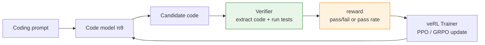

# 16.8 Hands-On: veRL Code Generation RL Experiment

The previous section on OPD treated the teacher as a source of dense reward. This section returns to the RLVR line, but switches to a harder setting: **code generation**.

Code problems share a key advantage with math problems: the answer doesn't need a human to score it subjectively — you can run tests against it instead. Pass the tests, get a positive reward; fail them, get a low or zero reward. Compared with math RLVR, the reward for code tasks is harder still — it's not enough to check whether the output looks right, you have to actually execute the model's generated code.

This section uses veRL to run PPO training on a code generation task. Section 8.7 already used veRL on GSM8K math problems; here we switch to code problems, and the biggest change is the reward function — math only needs to extract a final number and compare it, while code has to execute the model's output.

This section draws on Volcengine's veRL Code Sandbox tutorial[^volcengine-verl-code-sandbox], specifically the following pieces:

- **Training configuration**: the overall setup of Eurus-2-RL-Data (code samples only) + the Qwen2.5 model family + PPO (GAE advantage estimation).
- **Data processing**: the pipeline for filtering overly long prompts and randomly sampling 1000 training examples.
- **Reward design**: treating the model's generated code as a standalone program and running stdin/stdout tests to compute a pass rate (see the reward function design below).
- **Evaluation method and data**: the EvalScope evaluation pipeline on GSM8K, HumanEval, and LiveCodeBench, along with before/after comparison data from RL training.

Volcengine's original tutorial used a VKE cluster plus the SandboxFusion cloud sandbox for large-scale distributed training. This section adapts that setup to a **local GPU environment**: subprocess isolation instead of a cloud sandbox, single/multi-GPU scripts instead of cluster deployment, while keeping the same algorithm logic and parameter configuration. A complete, industrial-strength code agent experiment lives in [10.5 Training a DeepCoder Agent with rLLM](../chapter22_agentic/rllm-deepcoder-lab), which focuses more on AgentFlow and the sandbox cookbook; this section focuses on how to wire a code verifier into the veRL training framework.



## Why code generation suits RLVR

For an ordinary chat task, it's hard to define a "correct answer." Given the same reply, some people prefer it concise and others prefer it detailed, and a reward model can be gamed by the policy.

Code tasks are much simpler. Say the problem asks you to write `two_sum(nums, target)`:

```python
def two_sum(nums, target):
    ...
```

We can prepare tests:

```python
assert two_sum([2, 7, 11, 15], 9) == [0, 1]
assert two_sum([3, 2, 4], 6) == [1, 2]
assert two_sum([3, 3], 6) == [0, 1]
```

No matter how elegant the model's writing is, if the tests fail, the reward is low. No matter how long its explanation is, if it doesn't produce executable code, the reward is also low. This kind of feedback is far more reliable than text scoring based on whether an answer "looks correct."

Code RLVR reward is usually structured in three tiers:

| Tier                 | What it checks                                                       | Typical reward |
| -------------------- | -------------------------------------------------------------------- | -------------- |
| Format check         | Whether a code block was extracted, whether the function name exists | 0.0–0.2        |
| Compile/syntax check | Whether the code imports or executes                                 | 0.0–0.3        |
| Unit tests           | How many test cases pass                                             | 0.0–1.0        |

The third tier matters most. The first two tiers just keep training from having zero signal early on.

## Environment setup

### Hardware requirements

This section's configuration targets a **single GPU** (24 GB VRAM, e.g. RTX 3090 / 4090 / A5000) or a **multi-GPU** environment:

| Model              | Parameters | Training scheme         | VRAM needed                       |
| ------------------ | ---------- | ----------------------- | --------------------------------- |
| Qwen2.5-Coder-0.5B | 0.5B       | Full-parameter + vLLM   | ~18 GB (single GPU)               |
| Qwen2.5-Coder-1.5B | 1.5B       | LoRA + vLLM             | ~20 GB (single GPU)               |
| Qwen2.5-Coder-7B   | 7B         | Full-parameter training | ~80 GB (single A100 or multi-GPU) |

As in Section 8.7, PPO needs to load the Actor, Critic (trainable), and Reference (frozen) simultaneously, plus the vLLM inference engine — so VRAM pressure is heavier than pure SFT. A 0.5B code model with full-parameter training is the safest single-GPU starting point.

### Installing veRL

If you already installed veRL following Section 8.7, you can skip this. Otherwise:

```bash
# Create the environment
conda create -n verl python==3.10 -y
conda activate verl

# Install PyTorch (CUDA 12.x)
pip install torch torchvision --index-url https://download.pytorch.org/whl/cu121

# Install veRL
git clone https://github.com/volcengine/verl.git
cd verl
pip install -e .

# Install vLLM (inference engine)
pip install vllm==0.8.3

# Install Flash Attention
pip install flash-attn --no-build-isolation
```

### Data preparation

This section uses the [Eurus-2-RL-Data](https://huggingface.co/datasets/PRIME-RL/Eurus-2-RL-Data) dataset from the PRIME-RL project, a **math + code** reasoning dataset built specifically for reinforcement learning.

> **Note (issue #53)**: Eurus-2-RL-Data does **not** have top-level fields like `entry_point` or `tests`. Its actual structure is veRL's native format, with the verification information living in the `reward_model` column:
>
> | Field          | Meaning                                                                                                                                                                                          |
> | -------------- | ------------------------------------------------------------------------------------------------------------------------------------------------------------------------------------------------ |
> | `prompt`       | A chat message array: `[{"role":"system",...}, {"role":"user",...}]`. The system message is PRIME's reasoning-action template (`[ASSESS]`/`[ADVANCE]`/…); the user message is the actual problem |
> | `ability`      | `"math"` or `"code"` — this experiment only takes `code`                                                                                                                                         |
> | `reward_model` | `{"ground_truth": <answer>, "style": "rule"}`. For code samples, `ground_truth` is a JSON string `{"inputs": [...], "outputs": [...]}` — that is, stdin/stdout test pairs                        |
> | `data_source`  | Where the problem comes from: `codecontests` / `taco` / `apps` / `codeforces`                                                                                                                    |
> | `extra_info`   | `{"index": ..., "split": ...}`                                                                                                                                                                   |

In other words, these code samples are **competitive-programming problems that read from stdin and write to stdout**, not "implement this function signature" problems — which is why there's no `entry_point`, and the tests are input/output pairs rather than assert statements. The reward function has to run the model's generated code as a standalone program, feed it input, and compare the output.

The dataset already comes split: 480,000 training examples (25,000 of which have `ability=="code"`), and 2048 validation examples (1024 of which are code).

The script for processing the data is at [code/chapter18_grpo/verl_code_rlvr/prepare_data.py](../../../code/chapter18_grpo/verl_code_rlvr/prepare_data.py), and it produces the parquet files veRL needs in one shot:

```bash
conda activate test
python code/chapter18_grpo/verl_code_rlvr/prepare_data.py
```

What the script does:

1. **Filter code samples**: `ability == "code"`, yielding 25,000 code problems.
2. **Rebuild the prompt**: strip PRIME's reasoning-action template out of the system message (it's meaningless for code generation), keep only the user's problem statement, and rebuild it in **chat message format**: `[{"role":"system","content":"You are a competitive programming assistant."}, {"role":"user","content":"<stdin/stdout instructions + problem>"}]`. Do not use a plain text string here — veRL applies `apply_chat_template` to the prompt, and a plain string gets discarded (see the caveat in the field table below).
3. **Filter + sample**: filter out samples whose prompt exceeds 512 tokens (1 token ≈ 4 characters), then randomly sample 1000 examples and save them to `~/data/eurus2/train1000.parquet`; the validation split is saved directly as `~/data/eurus2/validation.parquet`.

Once processing is done, the columns of `train1000.parquet` are veRL's native format:

| Field          | Meaning                                                   | Example                                                                                                                       |
| -------------- | --------------------------------------------------------- | ----------------------------------------------------------------------------------------------------------------------------- |
| `prompt`       | **Chat message list** (system instruction + user problem) | `[{"role":"system","content":"You are a competitive programming assistant."}, {"role":"user","content":"Read the problem…"}]` |
| `reward_model` | `{"ground_truth": I/O test JSON, "style": "rule"}`        | `'{"inputs": [...], "outputs": [...]}'`                                                                                       |
| `data_source`  | Problem source                                            | `"codecontests"` / `"taco"` / `"apps"`                                                                                        |
| `ability`      | `"code"`                                                  | `"code"`                                                                                                                      |
| `extra_info`   | `{index, split}`                                          | `{"index": 0, "split": "dummy"}`                                                                                              |

> **Why does the prompt have to be chat message format instead of plain text?** veRL's RLHFDataset hands `prompt` to the model's `apply_chat_template`. If `prompt` is a plain string, Qwen's template discards the content outright and only produces the system + assistant special tokens (in practice, just 24 tokens) — the model never sees the problem, and reward stays at 0. That's why `prepare_data.py` rebuilds the prompt using the `[{"role": "system", ...}, {"role": "user", ...}]` structure.

During training the model only sees `prompt`; veRL passes `reward_model.ground_truth` to the reward function for verification. This is the core of code RLVR — **the reward function doesn't judge writing style, it only judges whether the code passes the tests**.

## Reward function design

Section 8.7's GSM8K reward only needed to extract a final number from the model's output and do a single numeric comparison. Code tasks are entirely different: you have to extract a code block from markdown, execute it in an isolated environment against tests, and handle compile errors, runtime exceptions, and timeouts.

This is the biggest engineering difference from Section 8.7. Let's walk through the reward function module by module.

### Extracting code from the model's output

The model's output is usually markdown text mixing explanation and code. We need to extract the Python code portion:

````python
import re

_CODE_BLOCK_RE = re.compile(r"```(?:python)?\n(.*?)```", re.DOTALL)


def extract_code(response: str) -> str:
    """Extract a Python code block from the model's output.

    The model typically outputs something like:
        "```python\nimport sys\n\nfor line in sys.stdin: ...```"
    We just need the part between ```python and ```.
    If the model didn't output a code block, fall back to treating the
    whole response as code.
    """
    match = _CODE_BLOCK_RE.search(response)
    if match:
        return match.group(1).strip()
    return response.strip()
````

If the model doesn't produce a properly formatted code block, `extract_code` falls back to returning the entire response as code — which usually causes a syntax error, and reward comes out to 0. That's itself a useful training signal: it forces the model to learn to output code in the correct format.

### Running stdin/stdout tests (I/O verification)

This is where this section diverges most from Section 8.7. Eurus-2-RL-Data's code samples have **no `tests` field (no assert statements)** — `reward_model.ground_truth` is a JSON string `{"inputs": [...], "outputs": [...]}`, meaning the generated code needs to be **run as a standalone program**: feed each input to stdin, and compare stdout against the expected output.

We use `subprocess` to spawn a real child process, which is safer than `exec`: it gives complete process isolation, so an infinite loop, file operations, or network requests written by the model can't touch the training process:

```python
import json
import subprocess
import sys
import tempfile
from pathlib import Path


def run_io_tests(code: str, ground_truth_json: str, timeout_s: float = 10.0):
    """Run code as a standalone program, testing it against the
    inputs/outputs in ground_truth.

    Returns (pass_rate, detailed results for the first few tests). Any
    exception (syntax error, crash, timeout, output mismatch) only
    affects that one test case and never interrupts scoring.
    """
    tests = json.loads(ground_truth_json)
    inputs, outputs = tests["inputs"], tests["outputs"]

    with tempfile.NamedTemporaryFile("w", suffix=".py", delete=False) as f:
        f.write(code)
        tmp_path = f.name

    try:
        passed = 0
        for inp, expected in zip(inputs, outputs):
            try:
                proc = subprocess.run(
                    [sys.executable, tmp_path],
                    input=inp, capture_output=True, text=True, timeout=timeout_s,
                )
                got = proc.stdout.strip()
                if proc.returncode == 0 and got == expected.strip():
                    passed += 1
            except subprocess.TimeoutExpired:
                pass  # timeout (infinite loop / inefficient code) just fails this one case
        return passed / len(inputs)
    finally:
        Path(tmp_path).unlink(missing_ok=True)
```

The timeout is set to 10 seconds. Most competitive-programming unit tests finish in under 1 second, so 10 seconds leaves plenty of headroom. If it times out, it usually means the model wrote an infinite loop or extremely inefficient code, and only that one test case takes the hit.

### Wrapping it into veRL's reward interface

veRL's RewardManager (`verl/workers/reward_manager/naive.py`) calls the reward function with this signature:

```python
score = self.compute_score(
    data_source=data_source,   # the dataset's data_source column
    solution_str=response_str, # the model's full generated response
    ground_truth=ground_truth, # the dataset's reward_model["ground_truth"]
    extra_info=extra_info,     # the dataset's extra_info column
)
```

So `compute_score` needs to match this signature. When it returns a dict, veRL uses the `"score"` key as PPO's main reward, and the other keys (`pass_rate`, `format`) get attached as logging info:

```python
def compute_score(data_source, solution_str, ground_truth, extra_info=None):
    """veRL reward entry point.

    Args:
        data_source: dataset source (codecontests/taco/apps/codeforces)
        solution_str: the model's full generated response (markdown text)
        ground_truth: reward_model["ground_truth"]; for code samples this
            is a JSON string of I/O tests
        extra_info: the dataset's extra_info column (only index/split for
            this dataset, unused here)

    Returns:
        {"score": pass_rate, "pass_rate": pass_rate, "format": whether code was extracted}
    """
    match = _CODE_BLOCK_RE.search(solution_str)
    format_ok = 1.0 if match else 0.0
    code = extract_code(solution_str)
    if not code:
        return {"score": 0.0, "pass_rate": 0.0, "format": 0.0}

    pass_rate, _ = run_io_tests(code, ground_truth)
    return {"score": pass_rate, "pass_rate": pass_rate, "format": format_ok}
```

### Full code

The full file is at [code/chapter18_grpo/verl_code_rlvr/code_reward.py](../../../code/chapter18_grpo/verl_code_rlvr/code_reward.py). You can self-test it directly (no training environment needed):

```bash
python code/chapter18_grpo/verl_code_rlvr/code_reward.py
```

Sample output:

```
Correct code -> score=1.00 pass_rate=1.00 format=1
Wrong code   -> score=0.00 pass_rate=0.00 format=1
No code      -> score=0.00 pass_rate=0.00 format=0
```

The core idea behind this reward function is: **don't judge writing style, only judge whether the code passes the tests**. No matter how long an explanation the model writes, if the code doesn't run, the reward is 0. This kind of hard signal is far more reliable than a reward model's soft score.

## Prompt template

When training a code model, the prompt should constrain the output format as tightly as possible. Early in training you don't want the model free to write long explanations, or the verifier ends up spending a lot of effort just extracting the code.

Eurus-2-RL-Data's code samples are "read stdin, write stdout" competitive problems, with **no** field split into `entry_point`/`problem_statement`. When `prepare_data.py` rebuilds the prompt, it uses **chat message format** (see `CODE_GEN_SYSTEM` / `CODE_GEN_USER_TEMPLATE` in [prepare_data.py](../../../code/chapter18_grpo/verl_code_rlvr/prepare_data.py)):

```json
[
  {
    "role": "system",
    "content": "You are a competitive programming assistant."
  },
  {
    "role": "user",
    "content": "Read the problem below and write a Python solution that reads from stdin and writes to stdout.\nReturn only one Python code block, with no explanations.\n\nProblem:\n{problem}"
  }
]
```

Here `{problem}` is the problem statement from the dataset's user message (keeping the Input/Output format description and examples). Compared with an earlier version of this approach, this drops the `Function name: {entry_point}` line — because these problems don't ask for a specific function signature, they ask for a program that reads stdin and writes stdout on its own.

**Why does this have to be chat format?** veRL hands `prompt` to `apply_chat_template`. A plain text string gets discarded outright by Qwen's template (leaving only the system + assistant special tokens), and the model never sees the problem. So even when training a base coder model, it's best to keep the chat structure so the template can correctly assemble the full prompt. What matters most is keeping the training and evaluation templates consistent.

## Single-GPU training script

This builds on the structure of Section 8.7's veRL PPO script, adapted for code generation. The overall framework doesn't change; there are three key differences: the dataset switches to Eurus-2-RL-Data (code samples only), the reward function switches to code verification, and `max_response_length` grows from 256 to 512 (code answers tend to run longer than math reasoning).

The script's design follows the same philosophy as Section 8.7: every parameter has a default set via environment variables, so when you need to adjust something you don't touch the script — you just override it on the command line. The full script is at [code/chapter18_grpo/verl_code_rlvr/run_qwen_coder_ppo_single_gpu.sh](../../../code/chapter18_grpo/verl_code_rlvr/run_qwen_coder_ppo_single_gpu.sh).

Compared with Section 8.7's GSM8K script, the key new piece of configuration here is **wiring up the reward** — without setting `custom_reward_function`, the reward never actually takes effect (an earlier version of this document missed this):

```bash
# ---- Reward configuration ----
# Use code_reward.py for rule-based reward (running stdin/stdout tests); no reward model is trained
# This is the biggest difference from Section 8.7: reward comes from code execution verification, not a pretrained RM
REWARD=(
    reward_model.enable=False
    custom_reward_function.path="$REWARD_FILE"
    custom_reward_function.name=compute_score
)
```

Here `$REWARD_FILE` defaults to `code_reward.py` in the same directory as the script, and `custom_reward_function.name=compute_score` tells veRL to call the `compute_score` function inside `code_reward.py`. When launching training, add `${REWARD[@]}` to `main_ppo`'s argument list:

```bash
python3 -m verl.trainer.main_ppo \
    "${DATA[@]}" "${MODEL[@]}" "${ACTOR[@]}" "${ROLLOUT[@]}" \
    "${REF[@]}" "${CRITIC[@]}" "${REWARD[@]}" "${TRAINER[@]}" "$@"
```

The rest of the script (data, model, Actor/Reference/Critic, Trainer configuration) is essentially the same as Section 8.7.

### Reading the configuration

Compared with Section 8.7's GSM8K PPO configuration, a few key differences stand out:

| Configuration         | GSM8K (Section 8.7) | Code generation (this section)      | Why                                                                 |
| --------------------- | ------------------- | ----------------------------------- | ------------------------------------------------------------------- |
| Dataset               | GSM8K math problems | Eurus-2-RL-Data (code samples only) | Code tasks need verifiable test cases                               |
| Reward function       | `gsm8k_reward`      | `code_reward`                       | Code needs to extract and run stdin/stdout tests                    |
| `max_response_length` | 256                 | 512                                 | Code answers tend to run longer than math reasoning                 |
| Base model            | Qwen2.5-0.5B        | Qwen2.5-Coder                       | The coder variant works better for code generation                  |
| Reward wiring         | —                   | `custom_reward_function`            | Code reward is a custom function, so it must be wired up explicitly |

The other parameters (learning rate, `clip_ratio`, GAE, etc.) stay the same as Section 8.7 — they're PPO algorithm parameters and don't change with the task type.

### Mapping to Section 8.7's four-model structure

As in Section 8.7, PPO training involves four model roles:

| Role in Section 8.7 | Corresponding piece here       | Description                                                         |
| ------------------- | ------------------------------ | ------------------------------------------------------------------- |
| Actor               | `actor_rollout_ref.actor.*`    | The trainable policy — generates candidate code and gets updated    |
| Reference           | `actor_rollout_ref.ref.*`      | The frozen SFT model, used to compute the KL constraint             |
| Critic              | `critic.*`                     | The trainable value function, used for GAE advantage estimation     |
| RM/Reward           | `code_reward.py:compute_score` | Code verification: extract, run in a subprocess, check stdin/stdout |

The key difference is in the last row: Section 8.7 used math answer matching (extract a number, do a numeric comparison); this section uses code execution verification (extract code → run in a subprocess → compare input/output). The reward signal is still a score from 0 to 1 based on test pass rate, but the engineering complexity of code reward is considerably higher.

## Launching training

### Running the script directly

```bash
chmod +x run_qwen_coder_ppo_single_gpu.sh
bash run_qwen_coder_ppo_single_gpu.sh
```

### Overriding parameters with environment variables

```bash
# Switch to the 1.5B coder model
MODEL_PATH=Qwen/Qwen2.5-Coder-1.5B-Instruct \
TRAIN_BATCH_SIZE=64 \
PPO_MINI_BATCH_SIZE=16 \
bash run_qwen_coder_ppo_single_gpu.sh
```

```bash
# Scale to multiple GPUs (8 GPUs)
NNODES=1 NDEVICES_PER_NODE=8 \
TRAIN_BATCH_SIZE=1024 \
PPO_MINI_BATCH_SIZE=256 \
ROLLOUT_TP=2 \
bash run_qwen_coder_ppo_single_gpu.sh
```

Ray initializes automatically inside `main_ppo`. On a single GPU, all workers take turns on the same card; with multiple GPUs, Ray assigns them automatically — you don't need to manage the cluster by hand.

### Training output

Once training starts, the terminal prints the key metrics:

```
[Step 1]  train | reward/score=0.03 | reward/pass_rate=0.03 | reward/format=0.15 | kl=0.000
[Step 5]  val   | reward/score=0.08 | reward/pass_rate=0.08
[Step 6]  train | reward/score=0.12 | reward/pass_rate=0.12 | reward/format=0.45 | kl=0.002
[Step 10] val   | reward/score=0.21 | reward/pass_rate=0.21
```

> The metric name is `reward/score` (that is, the `score` key from `compute_score`'s return dict, which veRL uses as PPO's main reward); `pass_rate` and `format` are extra logging metrics.

Notice that the `format` metric usually rises before `pass_rate` — the model first learns to "output code in the right block format," and only afterward gradually learns to "write code that passes the tests." This is the typical training dynamic for code RLVR.

## Analyzing training metrics

### Reading the key metrics

| Metric             | Healthy signal                 | Warning signal                                         |
| ------------------ | ------------------------------ | ------------------------------------------------------ |
| `reward/pass_rate` | Rises slowly                   | Stays at 0 long-term, or suddenly spikes               |
| `reward/format`    | Rises before pass_rate         | Stays low the whole time (model isn't outputting code) |
| `kl`               | Grows slowly                   | Keeps shooting up                                      |
| `actor_loss`       | Fluctuates between 0.5 and 1.0 | Explodes above 10, or NaN                              |
| `response_length`  | Stable or slightly growing     | Spikes in lockstep with reward                         |

### Typical training curve for code RLVR

**Phase 1: learning the format (steps 1–10).** `pass_rate` stays near 0, but `format` starts rising. The model is learning to put code inside a ` ```python ` code block, but most of what it writes still doesn't run. `kl` stays close to 0.

**Phase 2: learning to write code (steps 10–40).** `pass_rate` starts climbing steadily. The model has stabilized on outputting code in the right format, and starts learning to write code that compiles, then code that passes some of the tests. This phase is where PPO is most effective.

**Phase 3: diminishing returns (step 40+).** The pace of `pass_rate` growth slows down. The remaining errors are usually a ceiling on model capability — the problems are simply too hard for a model of this size.

### Reference evaluation results

Below are evaluation numbers from Volcengine's official experiment (Qwen2.5-7B-Instruct-1M, roughly 1000 training examples from Eurus-2-RL-Data, 130 PPO steps)[^volcengine-verl-code-sandbox], evaluated on three benchmarks using [EvalScope](https://github.com/modelscope/evalscope):

| Model                                     | GSM8K | HumanEval | LiveCodeBench |
| ----------------------------------------- | ----- | --------- | ------------- |
| Qwen2.5-7B-Instruct-1M (original)         | 0.82  | 0.59      | 0.50          |
| Qwen2.5-7B-Instruct-1M-step130 (after RL) | 0.83  | 0.59      | 0.53          |

A few things stand out:

- **LiveCodeBench shows the clearest improvement** (0.50 → 0.53), which is the most direct evidence of coding ability — RL training makes the model perform better on dynamic programming problems.
- **GSM8K improves slightly** (0.82 → 0.83), suggesting code RL training also transfers somewhat to math reasoning.
- **HumanEval stays unchanged** (0.59) — this benchmark's problem set is relatively fixed, and 1000 training examples give limited coverage of it.

After RL training, the model's math-reasoning steps are more clearly organized, its language is more concise, and it's better at following the prompt's required output format. In principle, more training steps and more training data would push these numbers further.

> **Note**: the table above comes from Volcengine's official experiment on a multi-GPU setup. This section's single-GPU script uses a smaller model and fewer training steps, so the exact numbers will differ, but the training dynamics and trends match.

## Model evaluation

Once training finishes, evaluate the checkpoint independently to confirm PPO training actually produced a capability gain.

### Merging the checkpoint

veRL trains with FSDP, so the saved checkpoint is sharded across GPUs. It needs to be merged into standard HuggingFace format:

```bash
python scripts/model_merger.py merge \
    --backend fsdp \
    --local_dir /path/to/checkpoints/global_step_20/actor \
    --target_dir ./merged_model
```

### Evaluating with EvalScope

Use [EvalScope](https://github.com/modelscope/evalscope) for independent evaluation:

```bash
# Install EvalScope
pip install evalscope

# Evaluate coding ability (HumanEval + LiveCodeBench)
evalscope eval \
    --model ./merged_model \
    --datasets humaneval livecodebench \
    --limit 100

# Evaluate math reasoning (as a control)
evalscope eval \
    --model ./merged_model \
    --datasets gsm8k \
    --limit 100
```

Things to watch when evaluating:

- **Use a held-out test set**: never evaluate on the training set, or the score is inflated.
- **Compare against a baseline**: also evaluate the original pre-RL model, so you can quantify the actual gain from PPO.
- **Check multiple benchmarks**: HumanEval alone isn't enough — LiveCodeBench reflects a code model's real-world ability better.

## Scaling from a single GPU to multiple GPUs

Once you understand the single-GPU configuration, scaling to multiple GPUs only requires changing a handful of key parameters:

| Parameter              | Single GPU | 8 GPUs | Description                                                 |
| ---------------------- | ---------- | ------ | ----------------------------------------------------------- |
| `NDEVICES_PER_NODE`    | 1          | 8      | Number of GPUs                                              |
| `TRAIN_BATCH_SIZE`     | 128        | 1024   | Total batch size (FSDP splits it across GPUs automatically) |
| `PPO_MINI_BATCH_SIZE`  | 64         | 256    | Same as above                                               |
| `ROLLOUT_TP`           | 1          | 2      | vLLM tensor-parallel degree                                 |
| `ROLLOUT_GPU_MEM_UTIL` | 0.4        | 0.6    | With more GPUs, each one can use a bit more memory          |

The learning rate, `clip_ratio`, GAE parameters, and so on **don't need to change** — they're algorithm parameters and don't depend on hardware scale.

## Relationship to the 10.5 DeepCoder experiment

This section and [10.5](../chapter22_agentic/rllm-deepcoder-lab) cover the same broad direction: training a code model with sandbox reward. They differ in focus:

| Section            | Framework | Focus                                                             |
| ------------------ | --------- | ----------------------------------------------------------------- |
| 9.7 (this section) | veRL      | Wiring a code verifier into the PPO/GRPO training framework       |
| 10.5               | rLLM      | Running a complete Agentic experiment with the DeepCoder cookbook |

If you want to get an end-to-end case running first, look at 10.5. If you're already comfortable with veRL and want to extend math RLVR to code tasks, follow this section's data, reward, and trainer interfaces.

## Experiment checklist

Before you start training for real, check at least these points:

- The test set must not appear in the training data.
- The reward function must set a timeout, or an infinite loop will hang a rollout.
- The reward log should record three kinds of failure: compile failure, runtime failure, test failure.
- Don't look only at training reward — keep a fixed, independent eval set and track Pass@1.
- If you add a format reward, its weight should never exceed the test-pass reward's weight.

The upside of code generation RL is that the feedback is hard and reproducible; the difficulty is that the engineering surface is more complex. Getting the verifier rock-solid matters more than tuning PPO/GRPO hyperparameters.

[^volcengine-verl-code-sandbox]: Volcengine, "veRL Code Sandbox: Code Generation Reinforcement Learning," https://www.volcengine.com/docs/6460/1756203
