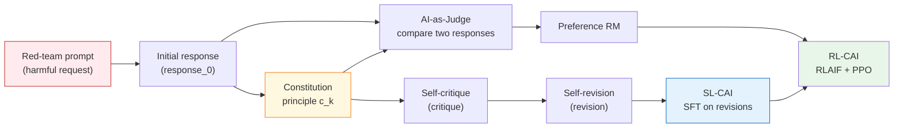
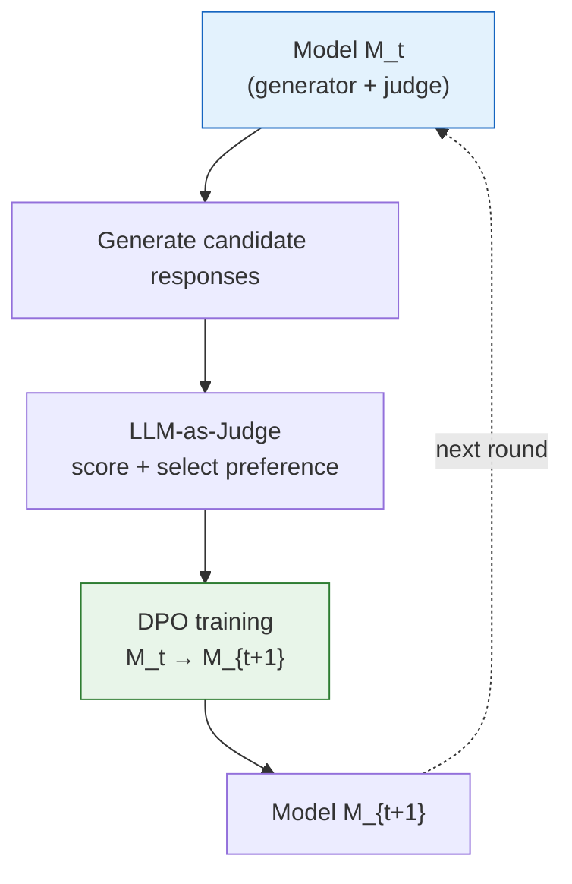

# Chapter 19 · Constitutional AI and RLAIF

> [Chapter 13 RLHF](../chapter15_rlhf/intro) worked out the "human-labeled preferences → reward model → PPO" pipeline end to end; [Chapter 15 DPO/GRPO](../chapter17_dpo/intro) then compressed it into a form that needs neither an RM nor a Critic. All of these methods share one assumption: **preference data comes from humans**. That assumption breaks once model capability approaches or exceeds the labelers' own — humans can't label fast enough (cost and speed), and they can't label accurately enough either (their judgment falls short on math, code, and long-context tasks). This chapter answers one question: **when human labeling becomes the bottleneck on alignment, where does the training signal come from?** Anthropic's 2022 answer was _Constitutional AI: Harmlessness from AI Feedback_ — have the AI act as its own judge, revise its own drafts, and generate its own preference pairs.

## 21.1 The Constitutional AI Framework

The bottleneck in RLHF is the supply of annotated data. When Anthropic trained the first generation of Claude in 2022, two concrete problems surfaced:

1. **Labeling harmful content is expensive.** Asking annotators to score two responses to "how do I build a weapon" is slow, psychologically taxing, and prone to inconsistency.
2. **Helpfulness and harmlessness pull against each other in RLHF.** The harder a model tries to avoid harm, the more it tends to dodge anything mildly sensitive, until it degrades into an assistant that refuses everything. Anthropic calls this **evasiveness**.

Constitutional AI's (CAI, Bai et al. 2022) central insight is this: give the model an explicit set of principles, and let it evaluate its own responses, rather than asking humans "which response is safer." That set of principles is called the _Constitution_, and it draws on three sources:

- The UN's _Universal Declaration of Human Rights_
- Trust & Safety industry guidelines
- Anthropic's internal research documentation on being nonviolent, honest, and helpful

### The Form of the Constitution: Natural-Language Principles

The Constitution is a collection of **natural-language rules**. Each rule takes a form like:

> "Choose the response that is the least harmful. If both responses are equally harmless, choose the more helpful one."

> "Assess whether the response helps the user engage in illegal or violent activity; if so, choose the response that declines most politely and firmly."

Each principle $c_k$ is a prompt template fed to the model so it can evaluate a response $y$. The evaluation text the model produces is the **AI feedback**.

### Two Tracks: SL-CAI and RL-CAI

Engineering-wise, CAI splits into two stages. Both stages share the same Constitution, but they generate the training signal differently.



**SL-CAI (Supervised):** have the model generate an initial response $y_0$ to a red-team prompt $x$; then use a Constitution principle $c_k$ to have the model critique itself, $\text{critique}(x, y_0, c_k)$; then have it write a revised version $y^* = \text{revise}(x, y_0, \text{critique}, c_k)$. Train the model on $(x, y^*)$ as SFT data. The advantage of this track is that it **directly teaches the model how to write harmless responses**.

**RL-CAI (Reinforcement Learning):** generate two responses $y_1, y_2$ for each prompt, have the model (acting as judge) pick the better one according to the Constitution, producing a preference pair $(x, y_w, y_l)$; train a reward model $r_\phi$ on these pairs; then run PPO to maximize $r_\phi$ minus a KL penalty. This track reuses [RLHF's PPO loop](../chapter15_rlhf/ppo-rlhf-loop) — the only thing that changes is swapping the human annotator for an AI judge. That's why RL-CAI is usually also called **RLAIF**.

### Minimal SL-CAI Pseudocode

```python
def sl_cai_generate(base_model, redteam_prompts, constitution):
    sft_pairs = []
    for x in redteam_prompts:
        # 1. Let the model freely generate an initial response
        y0 = base_model.generate(x)

        # 2. Sample a Constitution principle and have the model critique itself
        c = constitution.sample()
        critique = base_model.generate(
            f"{x}\nResponse: {y0}\n"
            f"Critique the response above according to this principle: {c}\nCritique:"
        )

        # 3. Have the model write a revised version
        y_star = base_model.generate(
            f"{x}\nOriginal response: {y0}\nCritique: {critique}\n"
            f"Please rewrite it according to '{c}':"
        )

        sft_pairs.append({"prompt": x, "response": y_star})

    return sft_pairs  # Use this data for SFT
```

The pseudocode looks simple, but the effect is striking. Anthropic reported that the Claude trained with CAI **exceeded** the pure-RLHF version on harmlessness, while **helpfulness barely dropped** — breaking exactly the curse of helpfulness and harmlessness pulling against each other that plagues RLHF.

## 21.2 RLAIF: Replacing Human Labels with AI Feedback

RLAIF (Reinforcement Learning from AI Feedback) shares the same PPO framework as RLHF; the only difference is where the preference pairs come from. Let's walk through this pipeline step by step and compare it precisely against RLHF.

### Generating Preference Pairs

Given a set of prompts $\{x_i\}$, for each $x_i$:

1. Sample two responses from the current model $\pi_t$: $y_1^{(i)}, y_2^{(i)} \sim \pi_t(\cdot \mid x_i)$.
2. Assemble a judge prompt from a Constitution principle $c_k$:

   $$
   J(x, y_1, y_2, c_k) = \text{"Given the request } x \text{ and two responses } y_1, y_2, \text{choose the one that best follows: } c_k"
   $$

3. Have the judge model $\pi_J$ generate a choice, and parse out $y_w, y_l$.
4. Write $(x, y_w, y_l)$ into the preference dataset $\mathcal{D}_{\text{AI}}$.

Note that the judge model can be $\pi_t$ itself (self-evaluation), or a stronger model (a distillation setup).

### Training the Preference RM

RLAIF still trains an RM. Its structure is identical to RLHF's, and the loss is still the [Bradley-Terry form](../chapter15_rlhf/reward-function-design):

$$
\mathcal{L}_{RM}(\phi) = -\mathbb{E}_{(x, y_w, y_l) \sim \mathcal{D}_{AI}} \log \sigma\big(r_\phi(x, y_w) - r_\phi(x, y_l)\big)
$$

The only difference: $\mathcal{D}_{AI}$ comes from an AI judge, while RLHF's $\mathcal{D}_{pref}$ comes from humans.

### The PPO Loop

Once $r_\phi$ is trained, run standard RLHF-PPO:

$$
R_{\text{RLAIF}}(x, y) = r_\phi(x, y) - \beta \, D_{KL}\big(\pi_\theta(\cdot \mid x) \,\|\, \pi_{\text{ref}}(\cdot \mid x)\big)
$$

This step is identical to [Chapter 8 PPO](../chapter10_ppo/intro): the KL coefficient $\beta$ still keeps the policy from drifting too far.

### RLHF vs. RLAIF: The Essential Difference

| Dimension                          | RLHF                                                   | RLAIF                                                         |
| ---------------------------------- | ------------------------------------------------------ | ------------------------------------------------------------- |
| Preference source                  | Human annotators, pairwise                             | AI judge scoring against the Constitution                     |
| Labeling cost                      | $\$0.5\text{--}\$5$ per pair, millions of pairs needed | Inference cost only, ~$\$10^{-4}$ per pair                    |
| Labeling speed                     | Weeks to months                                        | Ten million per day                                           |
| Labeling consistency               | Inter-annotator Cohen's κ ≈ 0.4–0.6                    | Same judge, repeated sampling, κ ≈ 0.7–0.9                    |
| Capability domains it suits        | Values, style, common sense                            | Math, code, long context, specialized knowledge               |
| Capability domains it doesn't suit | Reasoning beyond the annotators' own level             | Open questions where the model itself doesn't know the answer |

::: warning The Capability Ceiling of RLAIF
RLAIF's quality is bounded by the judge model itself. During the Claude 2 era, having Claude 2 judge Claude 2 produced **self-preference bias** — the judge tends to favor responses that are stylistically closer to its own. When the model being judged exceeds the judge's own capability, RLAIF ends up reinforcing wrong answers instead. This is exactly the "sycophancy" and "reward model over-optimization" problem that [Chapter 28 Reward Hacking](../chapter30_alignment_failures/intro) covers in depth.
:::

### A Rough Cost Comparison

Suppose training a SOTA assistant requires 500,000 preference pairs.

- **RLHF route:** $\$2$ per labeled pair, $\$1\text{M}$ total, roughly 3 months.
- **RLAIF route:** inference on an H100 cluster, $\sim 8{,}000$ tokens per prompt-plus-two-responses, H100 inference priced at $\$0.002$/1k tokens $\Rightarrow$ $\sim\$0.016$ per pair, $\$8{,}000$ total, roughly 2 days.

The cost gap spans two orders of magnitude, which is why almost all large-model alignment work after 2024 shifted to a hybrid of **RLAIF plus a small pool of high-quality human preferences**.

## 21.3 Self-Correction and Self-Rewarding

CAI's two core mechanisms — **Self-Critique** and **Self-Revision** — are, at bottom, a way of writing "thinking" explicitly into text. This section breaks down their mathematical structure and extends it to Meta's 2024 Self-Rewarding Language Models.

### Formalizing Self-Critique

Given $(x, y_0, c_k)$, self-critique is a conditional generation:

$$
\text{critique} \sim \pi_\theta(\cdot \mid x, y_0, c_k, \text{"critique:"})
$$

The output is a **text critique**, not a numeric score. That gives two advantages:

1. **Interpretable.** The critique text can be read directly by a person — far more transparent than a black-box scalar score.
2. **Chain-of-thought effect.** Having the model write a critique before a revision forces it to work out what's wrong before fixing it — the same mechanism as [CoT prompting](../chapter19_reasoning/intro).

Empirically, **critiquing before revising** produces 10-20% higher quality than having the model rewrite directly (Lee et al. 2023, the "Star" self-correction experiments).

### Formalizing Self-Revision

The revised response is also a conditional generation:

$$
y^* \sim \pi_\theta(\cdot \mid x, y_0, \text{critique}, c_k, \text{"revision:"})
$$

The training objective for all of SL-CAI is to have $\pi_\theta$ learn this conditional distribution $p(y^* \mid x, y_0, c_k)$ — concretely, that means SFT:

$$
\mathcal{L}_{\text{SL-CAI}} = -\mathbb{E}_{(x, y_0, c_k)} \big[\log \pi_\theta(y^* \mid x, y_0, c_k)\big]
$$

Notice something subtle here: the $y^*$ in the SFT data was generated by the same model, so **the model is learning to produce the best answer it already implicitly knows**. This looks circular, but it genuinely distills the "how to revise" capability into the weights, so at deployment time the explicit critique step is no longer needed.

### Self-Rewarding Language Models

Meta's 2024 Self-Rewarding Language Models (Yuan et al., arXiv:2401.10020) pushes the CAI idea to its limit: **drop human labeling entirely, and drop the separate RM training too** — the model acts as its own judge inside a DPO loop.

Each iteration has three steps:



Formally: given a prompt $x$, the model generates $N$ candidates $\{y_1, \ldots, y_N\}$, then scores them itself using an "LLM-as-Judge" prompt to get scores $\{s_1, \ldots, s_N\}$. It picks the highest-scoring $y_w$ and lowest-scoring $y_l$, forms a preference pair, and feeds it to [DPO](../chapter17_dpo/dpo-theory-and-family):

$$
\mathcal{L}_{\text{DPO}}(\theta) = -\log \sigma\Big(\beta \log \frac{\pi_\theta(y_w \mid x)}{\pi_{\text{ref}}(y_w \mid x)} - \beta \log \frac{\pi_\theta(y_l \mid x)}{\pi_{\text{ref}}(y_l \mid x)}\Big)
$$

The key observation: DPO needs no explicit RM ([proved in Chapter 15](../chapter17_dpo/dpo-theory-and-family)), so **the entire pipeline is self-contained** — the model is simultaneously the generator, the judge, and the learner.

### Results After Three Rounds of Iteration

Meta ran three rounds of self-rewarding on Llama 2-70B (M1 → M2 → M3), with these results:

- AlpacaEval 2 win rate: M1 55% → M2 65% → M3 72%
- Judge capability (on RewardBench): M1 75% → M2 80% → M3 83%

::: details Why Self-Rewarding Converges
In principle, self-rewarding could collapse into "self-congratulation" — the model just learns to please the judge, and the judge is itself. Meta's experiments show the first three rounds are effective, but progress **essentially stalls after round four**. There are two reasons:

1. DPO's reference model $\pi_{\text{ref}}$ is updated every round, which acts as a soft KL constraint and limits drift;
2. mixing in a fixed proportion of real SFT data prevents capability collapse.

Deeper theoretical analysis (a 2024 Yuan et al. follow-up) shows that iteration works as long as judge capability stays at or above generator capability; once that reverses, the loop reinforces itself through "reward hacking." That's why self-rewarding has to be paired with an **external verification signal** (such as RLVR).
:::

## Section Summary

Constitutional AI's (CAI) core move is replacing human labeling with AI feedback: the model judges itself, rewrites itself, and generates its own preference pairs. RLAIF feeds the preference pairs CAI generates into the standard RLHF pipeline. Self-Correction and Self-Rewarding push "AI judging AI" further still.

The next section, [21.2 HHH Principles and Claude in Practice](./hhh-practice), covers how Anthropic actually implements the three HHH principles — Helpful, Harmless, Honest — in training Claude.
