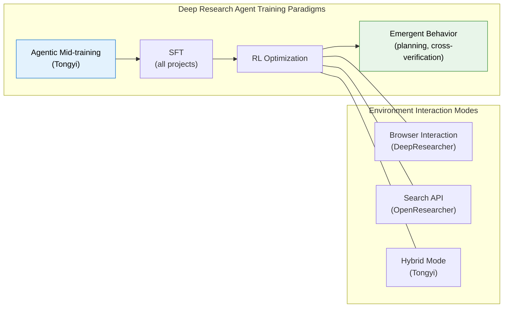
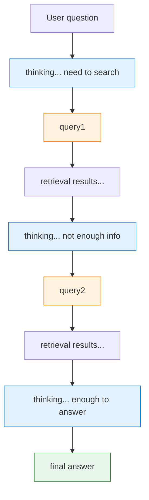

# Chapter 22 · Deep Research and Browser Agents

Previous sections discussed multi-turn RL credit assignment, trajectory synthesis, and tool-use training for Web Agents and Code Agents. Now we look at an application that integrates all of these: the **Deep Research Agent**. Its goal is to make AI behave like a human researcher — autonomously conducting long-horizon, multi-step information search, analysis, and synthesis, ultimately producing a trustworthy research report.

In 2025-2026, the Deep Research Agent became one of the hottest application directions in Agentic RL. This section works through six layers: the big picture, reasoning paradigms, core systems, reward design, data synthesis, and evaluation.

## What Is a Deep Research Agent?

A Deep Research Agent is not simply "search + summarize." It must solve a fundamental problem: **how do you get an AI to conduct robust, credible deep research in a real, complex web environment?** That means it has to plan search strategies, cross-validate sources, handle dynamic web content, and stay logically coherent across multi-step reasoning.

Compared with the Web Agent from the previous section, the core differences are:

| Dimension           | Web Agent                                                     | Deep Research Agent                                                                 |
| ------------------- | ------------------------------------------------------------- | ----------------------------------------------------------------------------------- |
| Task goal           | Complete a single operation (book a ticket, search a product) | Comprehensive research (multi-source analysis, cross-validation, report generation) |
| Interaction turns   | Usually 3-10 turns                                            | Usually 20-100+ turns                                                               |
| Evaluation criteria | Task success/failure                                          | Answer accuracy + citation quality + logical rigor                                  |
| Core challenge      | Element grounding, dynamic pages                              | Long-horizon planning, information synthesis, hallucination containment             |

### Browser Interaction vs Search API: Two Technical Paths

Deep Research Agents interact with the web in two broad ways:

**Browser interaction** — the AI operates a browser like a human: handling dynamically loaded pages, clicking buttons, filling in forms. Representative projects include DeepResearcher (end-to-end RL training in a real web search environment)[^deepresearcher] and WebAgent-R1 (interacting directly and online with the web environment). This approach can reach dynamic, unstructured content, but engineering complexity and latency are both high.

**Search API** — structured API requests return search results as JSON. Representative projects include OpenResearcher (works on a pre-downloaded, large-scale local corpus, zero network dependency)[^openresearcher] and PokeeResearch-7B (relies on a third-party search API service). This approach is efficient, stable, and easy to reproduce, but it may miss dynamic content.

The two paths aren't mutually exclusive. Frontier projects tend to combine them — Tongyi DeepResearch, for example, equips the model with Search (search-engine API), Visit (web content extraction), and a Python Interpreter as high-level tools [^tongyi_dr].

## From ReAct to Long-Horizon Research Collaboration

Deep Research Agent reasoning didn't arrive fully formed. Over the past two years, this line of work has moved through roughly three levels:


_Figure: Deep Research Agent multiple technical path comparison (Source: [Tongyi DeepResearch](https://tongyi-agent.github.io/blog/introducing-tongyi-deep-research/))_

1. **ReAct: the basic think-while-doing loop**
   - The core pattern is Thought → Action → Observation.
   - Good for short-chain tasks: search, open a page, then continue based on what you observed.
   - It answers one question: can the model use tools at all?

2. **Iterative Research: iterating on long-horizon tasks**
   - Once the task shifts from "find one answer" to "write a credible research report," plain ReAct stops being enough.

   
   _Figure: Tongyi DeepResearch's iterative research paradigm (Source: [Tongyi DeepResearch](https://tongyi-agent.github.io/blog/introducing-tongyi-deep-research/))_
   - The model has to repeatedly cycle through "retrieve → read → compare sources → revise the hypothesis → retrieve again."
   - What matters at this level is no longer tool calling by itself, but long-horizon planning, cross-validation, and context compression.

3. **Multi-agent Synthesis: dividing the labor of information synthesis**
   - As task scale grows further, systems split the single researcher into multiple roles — search, reading, evidence organization, final writing.
   - Multi-agent setups aren't valuable just for parallel speedup; splitting "discovering information" from "synthesizing information" also reduces the cognitive load carried by any one trajectory.
   - Work like DeepResearcher and Fathom-DeepResearch both reflect this trend.

Think of the three as stages on the same capability chain: **ReAct closes the tool loop, iterative research stretches that loop out, and multi-agent synthesis turns long-horizon research into a structured division of labor.** Agentic RL's role is to make the model do more than follow a template for calling tools — through real feedback, it gradually learns when to search, when to stop, and when cross-validation is needed.

## Core Models and Frameworks

Here are today's most representative open-source Deep Research models and training frameworks. They share one goal: evolving the LLM from a "chat model" into a "research model."

### DeepResearcher: End-to-End RL Training

DeepResearcher is the first framework to run end-to-end RL training in a **real, dynamic, open web environment** [^deepresearcher]. Earlier work mostly trained in controlled RAG environments or leaned on carefully engineered prompts — DeepResearcher instead lets the model interact directly with real search engines and web pages, learning from real feedback.

Its architecture uses multi-agent collaboration: dedicated "Browsing Agents" extract information from complex page structures, while the main agent plans research strategy and synthesizes information. The training objective is pure answer correctness (RLVR), with no process reward at all.


_Figure: DeepResearcher's emergent high-level behaviors after RL training (Source: [GAIR-NLP/DeepResearcher](https://github.com/GAIR-NLP/DeepResearcher))_

**Core finding: behavior emerges.** This is DeepResearcher's most striking result — RL training caused the model to spontaneously develop several categories of advanced behavior that it was **never explicitly trained to do**:

1. **Planning**: the model learned to decompose the question before searching, laying out a multi-step search plan
2. **Cross-verification**: the model actively confirms the same fact from multiple sources instead of trusting the first search result
3. **Self-reflection and redirection**: when search results are unsatisfying, the model adjusts its research direction on its own
4. **Honest reporting**: when it can't find a clear answer, the model learned to say so rather than fabricate one

This shows RL's value in agent training isn't just "optimizing a known policy" — it can also **discover strategies no human designed.** That has broad implications for Agentic RL: instead of trying to teach a model every behavior through SFT, use RL to let the model discover its own optimal strategy.

### Tongyi DeepResearch: Agentic Mid-training + Post-training

Alibaba Tongyi Lab's Tongyi DeepResearch is one of the strongest open-source Deep Research systems available [^tongyi_dr]. It beats OpenAI o3, DeepSeek-V3.1 (671B), and other much larger models on multiple benchmarks — with only 30.5B total parameters. The key is its MoE (Mixture of Experts) architecture, which activates just 3.3B parameters per inference, giving it extreme parameter efficiency.


_Figure: Tongyi DeepResearch's asynchronous RL training architecture (Source: [Tongyi DeepResearch](https://tongyi-agent.github.io/blog/introducing-tongyi-deep-research/))_

**A two-stage training paradigm.** Tongyi DeepResearch's core innovation is its **Agentic Mid-training + Post-training** two-stage pipeline:

1. **Agentic Mid-training (Agentic CPT)**: continual pre-training on large-scale synthetic tool-call trajectories, in two steps — first training basic agentic capability at a 32K context, then extending to 128K to introduce long-sequence (64K-128K) agentic behavior data. The goal at this stage isn't teaching the model "how to do good research"; it's giving the model an **inductive bias toward agentic behavior** — making it already "familiar" with the basic patterns of tool calling before it ever meets a concrete research task. A small amount of general pre-training data is interleaved in to keep the model from losing general language ability.

2. **Agentic Post-training**: three steps — an SFT cold start (learning research templates from high-quality synthetic trajectories), on-policy RL (optimizing the policy with a customized GRPO in real and simulated environments), and model merging (fusing variants with different capability preferences via parameter averaging).

**Two key techniques.** Beyond the training paradigm, Tongyi DeepResearch contributes two engineering innovations worth noting:

- **Context Management inference paradigm**: the core bottleneck of long-horizon research is a limited context window. Tongyi's Context Management is based on Markov state reconstruction — instead of keeping the full history at every step, it maintains a continuously updated "research summary" as compressed memory. That lets the model keep reasoning well no matter how deep the exploration goes.
- **Staged environment strategy**: different training stages use environments of different fidelity. Mid-training uses a "prior world environment" (zero cost, zero interaction) and a "simulated environment" (low cost, controllable); the Post-training RL stage first validates the algorithm in the simulated environment, then deploys to the real environment for final training. This addresses the instability, high latency, and high cost of real-environment APIs.

It reaches SOTA on BrowseComp, WebWalkerQA, FRAMES, HLE, and other deep-research benchmarks [^tongyi_dr].

### PokeeResearch-7B: Small Model, Big Potential

PokeeResearch-7B is one of the smallest usable open-source Deep Research models around, at just 7B parameters [^pokeeresearch]. Its significance is proving one point: **deep research capability isn't the exclusive property of large models.**

The practical takeaway: if your use case doesn't need "expert-across-every-discipline" research ability, but instead focuses on information integration within a specific domain (e-commerce, legal, medical), a 7B-class model paired with a carefully designed tool chain and data strategy can do the job. That dramatically lowers the deployment bar for Deep Research Agents — no A100 cluster required; a single consumer GPU is enough.

### SFR-DeepResearch: The Autonomous Single Agent

Salesforce's SFR-DeepResearch takes a route different from multi-agent systems: the **Autonomous Single Agent** [^sfr_dr]. Rather than splitting the research process into search, reading, writing, and other roles, it has one model carry the entire research pipeline end to end.

The advantage of this route is **architectural simplicity** — no communication overhead or coordination cost between multiple agents. But the challenge is just as obvious: a single model has to master search strategy, information synthesis, long-text generation, and more all at once, which invites capability conflicts. SFR's answer is to keep training with RL on top of a **reasoning-enhanced model** (one already RL-trained on math, code, and similar domains), leaning on its existing reasoning strength to carry the research task.

### rStar2-Agent: Extreme Training Efficiency

rStar2-Agent shows how much a well-designed RL algorithm can do [^rstar2]. It trains a 14B reasoning model with a GRPO-based agent RL algorithm, built on one core idea: **it's not that bigger models are better — it's that more precise training is better.**

Its practical value: if you're compute-constrained and can't train a 100B+ model, rStar2-Agent offers a viable alternative — with a carefully designed RL algorithm (better sampling strategies, more stable gradient estimation), a 14B-class model can still be highly competitive on tasks like mathematical reasoning.



## Reward and Algorithm Innovation: Beyond "Just Looking at the Outcome"

In Deep Research, rewarding only "is the final answer right" performs badly — the research process can stretch across dozens of steps, and a purely terminal reward can't teach the model an effective intermediate strategy. The work below focuses on designing finer, smarter reward functions.

### Citation-Aware Reward: CaRR

**Problem**: the most common and most dangerous hallucination in Deep Research Agents isn't "fabricating facts" — it's "fabricating citations": the model states a plausible-sounding claim and attaches a URL that looks real but doesn't exist, or cites a real paper while distorting its conclusion. A traditional outcome reward (checking only whether the answer is correct) can't catch this.

**Solution**: Citation-aware Rubric Rewards (CaRR) [^carr_dr], proposed jointly by Tsinghua University and Zhipu AI, encodes citation quality explicitly into the RL reward function. Rather than simply penalizing bad citations, its core idea is to compute a positive ratio reward, through the following pipeline:

1. **Rubric decomposition**: break the multi-hop question into a series of atomic factual statements (rubrics), each containing a hidden entity to verify.
2. **Entity recognition**: a judge model checks whether the model's final answer identifies the key entity in each rubric.
3. **Citation verification**: extract the URLs cited in the answer (up to 20), fetch the page content, and have the judge model decide whether each rubric is supported by the cited content.
4. **Evidence connectivity**: build a bipartite graph and run breadth-first search to check whether each rubric is logically connected to the final answer.

The final reward is the fraction of rubrics that are both satisfied and logically connected, out of all rubrics. This ratio reward is blended with the outcome reward (whether the answer is correct) at a tunable weight $\alpha$, forming the composite reward signal for GRPO training.

**Takeaway**: CaRR's design generalizes to any scenario that needs "verifiability" — not just citations. Whether code executes, whether a mathematical derivation is correct — all of these can use a similar "decompose → verify → compute a ratio" framework for reward design.

### Atomic Thought Reward: Atom-Searcher

**Problem**: a Deep Research trajectory can run to dozens of steps. If you use only a terminal reward (correct answer = 1, wrong = 0), credit assignment is nearly impossible — the model has no way to tell which of those dozens of steps were the crucial good decisions and which were bad decisions that just happened not to matter.

**Solution**: Atom-Searcher proposes the **Atomic Thought Reward (ATR)** [^atom_searcher], which decomposes complex reasoning into atomic-level units and gives a process reward at every intermediate step. The core idea: instead of waiting for the final answer to hand out reward, give feedback at every "atomic reasoning step."

**Why "atomic" rather than "step"?** Note that ATR isn't just "score every step." It first decomposes the reasoning chain into indivisible atomic units (e.g., "B follows from A"), then evaluates each atomic unit independently for logical correctness and information value. That decomposition is finer than step-level scoring, and more semantically meaningful than token-level scoring.

**Practical value**: ATR mainly helps early in training. While the model hasn't yet settled into a stable research strategy, dense process signal can substantially speed up convergence. Once the model has learned the basic research pattern, ATR's weight can be annealed down, letting terminal reward dominate again — which mirrors how humans learn: first learn how to do each step, then learn to judge the overall result.

### Evolving Rubrics: DR Tulu

**Problem**: RL training has a classic trap — **reward hacking**. The model finds loopholes in the scoring criteria to earn a high score without actually improving research quality. It might discover that "more citations = higher score" and start stuffing in citations, or that "longer answers = higher score" and start padding relentlessly. Once the model learns to game the system, training falls into a death spiral of "scores go up, quality doesn't."

**Solution**: Allen AI's DR Tulu proposes **RLER (Reinforcement Learning with Evolving Rubrics)** [^dr_tulu] — letting the scoring criteria themselves evolve as training proceeds. Its core strategy is "shooting at a moving target":

1. **Early training**: use loose rubrics to encourage exploration — e.g., "any citation earns points," with no demand on citation quality
2. **Mid training**: once the model has scored up under the current criteria, automatically tighten the standard — e.g., "citations only earn points if they're actually reachable"
3. **Late training**: use strict criteria to push final quality up — e.g., "cited content must actually support the claim to earn points"

Every time the standard tightens, whatever shortcut the model had already learned stops working, forcing it to find a strategy that genuinely improves quality.

**Takeaway**: RLER's idea is analogous to "leveling up the exam" in education — you can't keep giving the same test; the bar has to rise as the student improves. This strategy pairs naturally with CaRR's citation verification and Web-Shepherd's process scoring.

### RL Without Fine-Tuning: Memento

**Problem**: RL training demands significant compute, complex engineering infrastructure, and stable environment interaction. For many teams, that bar is too high. Is there a lighter-weight way to make an agent stronger?

**Solution**: Memento takes a completely different technical route [^memento] — **it doesn't touch model parameters at all**. Instead, an external "episodic memory" lets the agent retrieve similar past cases at inference time to guide its behavior. Concretely:

1. **Case accumulation**: store past successful and failed research trajectories as cases
2. **Case retrieval**: when facing a new question, retrieve the most similar successful cases from memory
3. **Strategy guidance**: feed the retrieved cases to the model as context, steering it toward a similar successful strategy

**Why does this matter?** Memento ranked first on the GAIA validation set (87.88% Pass@3), beating many models that went through extensive RL training. It's strong evidence that sometimes **"better retrieval" beats "better training."** It's also a reminder that RL isn't the only path to a stronger agent — external memory and inference-time strategy are directions equally worth attention. For resource-constrained teams, Memento's approach may be far more cost-effective than a full RL training run.

### Step-Level Process Reward: Web-Shepherd

**Problem**: in web-interaction scenarios, an outcome reward (checking only whether the final answer is correct) carries very little information. An agent might search 30 times, with 28 of them useless, and just happen to land the correct answer on the last try — the outcome reward gives the whole trajectory a high score, actually reinforcing a large amount of wasted behavior.

**Solution**: Web-Shepherd trains a dedicated **step-level Process Reward Model (PRM)** to evaluate the quality of each step in a web interaction [^web_shepherd]. Unlike an ORM (Outcome Reward Model), a PRM scores every step independently, providing dense training signal.

**Key design**: Web-Shepherd's PRM independently evaluates the quality of each step in a web navigation trajectory, giving a denser and more accurate training signal than a traditional outcome reward.

**Experimental result**: the PRM delivers a 10.9-percentage-point performance gain. That number looks modest on its face, but given that it comes purely from "a more accurate reward signal" — not any change to model architecture or data — its real significance is substantial: it's direct proof of **the practical value of process-level signal**.

**Relation to other work**: Web-Shepherd's PRM shares a goal with Atom-Searcher's ATR — both supply process-level signal — but at a different granularity: PRM scores per step, ATR scores per atomic reasoning unit. The two are complementary.

## Data and Trajectory Synthesis: RL's "Fuel"

Long-horizon, high-quality research trajectories are the key input for training a Deep Research Agent — and also the biggest bottleneck. The work below focuses on solving that problem.

### OpenResearcher: Fully Open-Source Trajectory Synthesis

**Problem**: training a Deep Research Agent needs a large volume of long-horizon research trajectories, but the real web is unstable, API calls are expensive, and reproduction is hard. Most research teams don't have the resources to collect real trajectories at scale.

**Solution**: OpenResearcher provides a **fully offline, zero-network-dependency** trajectory synthesis pipeline [^openresearcher]. It runs on a large, pre-downloaded local corpus, built around three simulated "browser primitives": `search`, `open`, and `find`. These three operations cover most research scenarios and are fully controllable and reproducible.

**Scale and quality**: OpenResearcher generated over 97K trajectories, some containing 100+ tool calls, spanning everything from simple fact lookups to complex multi-step reasoning.

**Practical value**: for resource-limited researchers, OpenResearcher is the friendliest starting point — no API key, no GPU cluster, an ordinary computer can run the whole synthesis pipeline. It's also an excellent testbed for validating new algorithms, since you can iterate quickly in a fully controllable, reproducible environment.

### Tongyi DeepResearch's Data Synthesis Pipeline: Fully Automated, Superhuman-Level

Tongyi DeepResearch's data synthesis pipeline [^tongyi_dr] is one of its core innovations — fully automated, with no human annotation required. It uses a **staged, complexity-increasing** strategy, tailoring different data types to different training stages:

- **Mid-training stage**: synthesizes large-scale agent behavior data covering the full research lifecycle, specifically four types of action data:
  - **Question synthesis**: entity-anchored open-world memory generates multi-style questions (multi-hop reasoning, numerical computation, etc.)
  - **Planning actions**: question decomposition and first-step action prediction — planning accuracy is what determines whether the task can succeed at all
  - **Reasoning actions**: given a question and relevant knowledge, generate a complete logical reasoning chain, with quality assured by filtering on both reasoning length and answer consistency
  - **Decision actions**: at each decision point in a trajectory, explore the space of feasible actions and reconstruct the trajectory as a multi-step decision sequence

- **Post-training stage**: build highly interconnected information structures through random walks over a knowledge graph, model information-retrieval questions with formal (set-theoretic) methods, gradually increase uncertainty to raise question difficulty, and ultimately produce superhuman QA pairs and PhD-level research questions

**A "data flywheel" mechanism**: this pipeline's most distinctive feature is that it can evolve itself. After a round of training, the stronger resulting model can turn around and generate higher-quality synthetic data, closing a positive feedback loop. Training-data quality keeps improving alongside model capability, instead of staying fixed.

### O-Researcher: Multi-Agent Collaboration and Distillation

**Problem**: if you generate research trajectories with just a single LLM (say, calling the GPT-4 API directly), the model tends to give shallow answers, or skip the search step altogether and "blind-guess" from internal knowledge — it can't produce the rigorous multi-step reasoning trajectories that agent training needs.

**Solution**: the OPPO AI Agent team's O-Researcher [^oresearcher] proposes a **Multi-Agent Distillation** framework. Instead of relying on a single model's one-shot generation, it assembles multiple strong closed-source models into a virtual "research team" that automatically synthesizes high-quality training data:

1. **Decomposition and planning (Planner Agent)**: breaks a complex user question into multiple independent sub-questions.
2. **Search and execution (Searcher/Executor Agent)**: independently runs web search, page scraping, and information extraction for each sub-question.
3. **Synthesis and summary (Summarizer Agent)**: cross-validates everything retrieved and synthesizes it into a final research report with precise citations.
4. **Debate and quality control (Reviewer Agent)**: through multi-agent debate and verification, sends the work back for revision if it finds logical gaps or citation errors.

**Core insight**: this "multi-agent workflow" simulating a human research team forces the generation of trajectories with **complete trial-and-error, cross-validation, and long-horizon reasoning.** O-Researcher then "distills" these very high-quality trajectories into a single open-source small model (7B/72B) through supervised fine-tuning (SFT) and Agentic RL (e.g., GRPO). This proves a broader point: **for complex tasks, multi-agent systems are an excellent way to synthesize high-quality SFT data, while at deployment time you can compress that capability back into a single strong agent.**

### Fathom-DeepResearch: Multi-Agent Self-Play

**Problem**: synthetic data often runs into a "not hard enough" problem — trajectories generated by a GPT-4-class model can be too easy for training a model of similar capability.

**Solution**: Fathom-DeepResearch uses **multi-agent self-play** to generate the DUETQA dataset [^fathom_dr]. Two 4B-parameter models play different roles:

- **Searcher (Fathom-Search-4B)**: responsible for searching and locating information on the web
- **Reasoner (Fathom-Synthesizer-4B)**: responsible for synthesizing the retrieved information into a coherent answer

The two models work together through self-play — the searcher locates information, the reasoner synthesizes the answer, and their interaction produces high-quality, diverse training data.

**Takeaway**: Fathom's approach is analogous to a GAN (generative adversarial network) — using two models' adversarial interaction to raise data quality. Even with the total parameter count unchanged, splitting capability across specialized sub-models can unlock stronger data-generation power. It also hints at the value of "specialized division of labor" in agent training.

## What Counts as "Good" Deep Research?

> This section focuses on evaluation dimensions specific to Deep Research. For the broader Agentic evaluation landscape — tool calling, end-to-end tasks, the full benchmark panorama, and building an evaluation system — see [Section 10.3: Industrial Practice, Evaluation, and Badcases](./industrial-evaluation).

A Deep Research Agent's "goodness" is about far more than whether the final answer is correct. A strong result has to satisfy four levels at once:

| Level                | Meaning                                          | How it's evaluated                             |
| -------------------- | ------------------------------------------------ | ---------------------------------------------- |
| Answer correctness   | Is the final conclusion correct                  | Compared against ground truth (Exact Match/F1) |
| Citation reliability | Is every claim traceable to a source             | Citation URL accessibility + content relevance |
| Process rigor        | Is the reasoning chain logically self-consistent | Step-level PRM scoring                         |
| Execution efficiency | Was the task completed in the fewest steps       | Number of interaction turns needed to finish   |

The mainstream evaluation benchmarks:

- **GAIA**: real-world complex QA, emphasizing multi-step reasoning, tool use, and comprehensive analysis.
- **Humanity's Last Exam (HLE)**: multi-disciplinary expert-level problems, testing the ceiling of the model's knowledge on hard tasks.
- **BrowseComp / BrowseComp-ZH**: a complex information-seeking benchmark, emphasizing progressively searching, locating, verifying, and integrating an answer across open web pages.
- **WebWalkerQA**: emphasizes path choices and information extraction while browsing — good for evaluating "browse while reasoning" ability.
- **FRAMES**: focused on long-horizon information integration and organizing multi-source evidence — closer to the scenario of "assembling material into a research conclusion."
- **xbench-DeepSearch**: a user-centered deep-research evaluation, testing whether a system can complete an end-to-end task around a real research need.
- **WebArena / Mind2Web**: operation success rate in web environments, leaning more toward interaction execution than research conclusions.
- **BFCL**: precision of tool/API calls, good for evaluating basic tool-use ability.

Group these benchmarks and they fall into three categories:

- **Research-outcome oriented**: GAIA, HLE, FRAMES, xbench-DeepSearch
- **Information-seeking oriented**: BrowseComp, BrowseComp-ZH, WebWalkerQA
- **Interaction-execution oriented**: WebArena, Mind2Web, BFCL

That's why Deep Research Agent evaluation can't rely on a single leaderboard: some benchmarks read like exam questions, some like finding information, some like operating a browser. Only by looking at all three signal types together can you tell whether a system can truly research, or merely search, or just click around a web page.

### What Behavior Gets Penalized?

Understanding what counts as "good" also means knowing what gets penalized during RL training:

- **Hallucinated citations**: fabricating a paper title, URL, or data source that doesn't exist
- **Taking shortcuts**: guessing the answer directly without searching, leaning on the model's stale internal knowledge
- **Cherry-picking information**: only searching for evidence that supports a predetermined conclusion, ignoring evidence to the contrary
- **Inefficient loops**: repeatedly searching the same keywords, burning tokens without making progress
- **Misattribution**: crediting information to the wrong source

## Designing Reward Functions: From Simple to Frontier

Depending on the complexity of the task you're training, reward functions can be designed in stages:

**Stage 1 — outcome-oriented:**

```python
# The simplest reward: only look at the final answer
reward = 1.0 if answer == ground_truth else 0.0
```

**Stage 2 — add process signal:**

```python
# Add tool-call quality and efficiency
reward = (
    accuracy_score(answer, ground_truth)      # Answer accuracy
    + 0.2 * valid_tool_call_ratio             # Fraction of valid tool calls
    - 0.1 * (num_turns / max_turns)           # Efficiency penalty
)
```

**Stage 3 — frontier practice:**

```python
# Citation quality + cross-validation + efficiency
reward = (
    0.4 * accuracy_score(answer, ground_truth)
    + 0.3 * citation_quality_score(answer)    # Citation accessibility + content relevance
    + 0.2 * cross_validation_score(answer)    # Whether key info is confirmed by multiple sources
    + 0.1 * efficiency_bonus(num_turns)       # Fewer steps, higher reward
)
```

## Selected Open-Source Resources

| Resource     | Type                | Core value                                                                               |
| ------------ | ------------------- | ---------------------------------------------------------------------------------------- |
| Awesome-GRPO | Resource repo       | Tracks GRPO and other frontier RL algorithm variants                                     |
| LLM-Explorer | Plugin tool         | From Tsinghua; strengthens RL algorithm exploration, +37.27% average performance         |
| WebSailor-V2 | Open-source project | Closes the gap between open- and closed-source agents via synthetic data and scalable RL |
| ReLook       | Research work       | Multi-modal LLM web-encoding RL, using visual feedback as the reward signal              |

## Practical Recommendations

If you want hands-on practice with Deep Research Agents, start with these three projects:

1. **DeepResearcher**: provides a complete framework for end-to-end RL training in a real environment, letting you directly experience the full process of training a "researcher."
2. **OpenResearcher**: fully open-sources the entire data synthesis pipeline — a solid foundation for studying and practicing Deep Research.
3. **rStar2-Agent**: if you want to explore improvements to the RL algorithm itself, it shows how to reach top-tier performance at very low training cost.

## Deep Research's Final Output

The discussion so far has focused on "search strategy" and "information synthesis" — the "input" and "processing" stages of Deep Research. But a complete Deep Research system also needs a high-quality **output** stage: turning research results into a structured report. In vertical domains like e-commerce, finance, and consulting, report quality is what determines the agent's practical value.

### The Unique Challenges of Report-Generation RL

Unlike code generation or mathematical reasoning, where the answer is verifiable, report-generation RL training faces its own set of challenges:

**Reward is subjective and multi-dimensional.** A good report has to satisfy accuracy, structural clarity, readability, completeness, and citation reliability all at once. These dimensions can trade off against each other — the most accurate report might be unreadable because it's packed with jargon.

**Output is extremely long.** A complete research report can run 3,000-10,000 words, far beyond standard RLHF's single-turn output (500-1,000 words). Ultra-long output brings gradient propagation difficulties and makes consistency harder to maintain.

**Structural constraints.** A report isn't free text — it needs headings, paragraphs, citations, and other structured elements. The model has to produce output that satisfies format requirements while keeping content quality high.

### Long-Text RL: LongWriter-Zero

LongWriter-Zero[^longwriter] solves the core problem: how to get a model to generate ten-thousand-word-scale text **without any long-text annotated data.** Its approach is a triple composite reward:

```python
def longwriter_reward(text, prompt):
    """Triple composite reward"""
    # 1. Length control (closer to the target length is better)
    target = extract_target_length(prompt)
    length_reward = compute_length_reward(len(text), target)

    # 2. Writing quality (scored by a dedicated RM)
    quality_reward = writing_quality_model.score(text)

    # 3. Structure score (headings, paragraphs, logical coherence)
    structure_reward = evaluate_structure(text)

    return 0.3 * length_reward + 0.4 * quality_reward + 0.3 * structure_reward
```

Its surprising finding: **RL can make long-text ability emerge naturally out of short-text ability.** No dedicated long-text SFT data is needed — the composite reward alone is enough to teach the model to plan a long-text structure.

Writer-R1[^writerr1] takes this further with **memory augmentation** — Memory-augmented Replay Policy Optimization stores the "success patterns" of high-quality writing and the "error patterns" of low-quality writing, retrieving relevant patterns for new tasks to raise the quality of generated writing.

### Hierarchical Constraints for Structured Output

RL-Struct[^rlstruct] proposes a **hierarchical reward function** that decomposes structured output into constraint levels:

| Level   | Constraint type                                             | Scoring                     |
| ------- | ----------------------------------------------------------- | --------------------------- |
| Level 0 | Output format validity (valid JSON/Markdown)                | Violation = 0 points        |
| Level 1 | Required-field completeness                                 | Deduction per missing field |
| Level 2 | Field content format (dates are dates, numbers are numbers) | Deduction for format errors |
| Level 3 | Content quality (accurate, coherent)                        | Continuous RM score         |
| Level 4 | Expression quality (fluent, precise)                        | Continuous RM score         |

Lower-level constraints are hard: a violation scores 0 outright. Higher levels are soft: the RM gives a continuous score. The model first learns to satisfy the hard constraints, then gradually optimizes the soft quality.

### A Multi-Dimensional Reward Framework for Reports

Breaking report quality into computable dimensions:

```python
def report_reward(report, task, verified_facts=None):
    """Multi-dimensional reward for report generation"""
    accuracy = accuracy_reward(report, verified_facts or {})
    structure = structure_reward(report)
    citation = citation_reward(report)
    length = length_reward(len(report), task.target_length)
    relevance = compute_relevance(report, task.question)

    return (
        0.30 * accuracy +
        0.20 * structure +
        0.15 * citation +
        0.10 * length +
        0.25 * relevance
    )
```

For training, a **short-to-long curriculum** is recommended — start with 500-word short reports and gradually work up to full 5,000-word reports. This lines up with Section 10.2 HardGen's[^hardgen] difficulty-adaptive approach.

### Deep Research's Two-Stage RL

Report generation and the search reasoning discussed earlier combine into a complete Deep Research training pipeline:

```
Stage 1: Search Reasoning RL
  → Trains search strategy, information integration, citation verification
  → Reward: answer accuracy + citation quality

Stage 2: Report Generation RL
  → Trains structured output, long-text planning, multi-dimensional quality
  → Reward: structural completeness + content quality + readability
```

Staged training is usually more stable — the model first learns to "find the right information," then learns to "write a good report." But when engineering conditions allow, end-to-end RL can reach a better overall result.

## An End-to-End Case: From Rubrics to Search Agent RL Training

We've discussed search strategy, reward design, and report generation separately. Now let's string them together and walk through a complete end-to-end process: **how do you train an AI search agent with RL, from scratch?** This case covers the full chain, from designing scoring criteria to training a Reward Model to RL optimization.

### Step 1: Define Multi-Dimensional Rubrics for AI Search

Rubrics (scoring criteria) are the first step in turning "what makes a good search result" into something measurable. A good scoring standard for an AI search agent typically covers:

| Dimension                | Meaning                                       | How it's scored                        |
| ------------------------ | --------------------------------------------- | -------------------------------------- |
| Answer relevance         | Is the response precisely on topic            | Semantic similarity + LLM judgment     |
| Factual accuracy         | Is the information correct and unhallucinated | Cross-verified against trusted sources |
| Citation quality         | Are trustworthy sources attached              | URL reachability + content relevance   |
| Information completeness | Does it cover every aspect of the question    | Key-information coverage rate          |
| Timeliness               | Is the information current                    | Publication-date detection             |

Each dimension gets a 1-5 scoring rubric. For "answer relevance," for example: 1 = completely irrelevant, 3 = partially relevant but with gaps, 5 = fully precise and comprehensive.

### Step 2: From Rubrics to a Reward Model

With rubrics in hand, the next step is collecting preference data and training a Reward Model.

**Data collection.** For the same search query, have the model (or several different models) generate multiple search results. Then have annotators — or an LLM-as-judge — score each result against the rubrics and build preference pairs: "result A is better than result B."

**RM training.** Train a Reward Model using the Bradley-Terry model (the reward model from Chapter 6). The input is a (query, search_result) pair; the output is a scalar score. This RM becomes the reward source for the RL training that follows.

But there's a key choice here: **train one comprehensive RM, or an independent RM for every rubric dimension?**

A single RM is simple but can't do fine-grained credit assignment. Multi-dimensional RMs can optimize each dimension separately, but cost more to train. In practice, it's best to start with a single RM to validate quickly, then split into multi-dimensional RMs if you need to.

```python
def train_search_reward_model(preference_data, base_model):
    """Train a Reward Model for the search scenario"""
    # preference_data: [(query, result_better, result_worse), ...]
    # Trained with the Bradley-Terry model
    # loss = -log(sigmoid(rm(query, better) - rm(query, worse)))

    rm = RewardModel(base_model)
    for query, better, worse in preference_data:
        score_better = rm.score(query, better)
        score_worse = rm.score(query, worse)
        loss = -torch.log(torch.sigmoid(score_better - score_worse))
        loss.backward()
        rm.update()
    return rm
```

### Step 3: Train a Search Agent with RL

With the RM in hand, RL training can begin. Take GRPO as an example (no separate Critic needed):

```python
async def search_agent_grpo_step(model, rm, queries, group_size=4, max_turns=10):
    """A GRPO training step for a Search Agent"""
    all_groups = []

    for query in queries:
        trajectories = []
        for _ in range(group_size):
            # Rollout: the agent performs the search task
            result = await rollout_search_agent(model, query, max_turns)
            # Score the search result with the RM
            reward = rm.score(query, result.final_answer)
            # Add rubric-dimension auxiliary rewards
            reward += 0.2 * citation_bonus(result)       # Citation reward
            reward += 0.1 * efficiency_bonus(result)      # Efficiency reward
            reward -= 0.3 * hallucination_penalty(result)  # Hallucination penalty
            trajectories.append((result, reward))

        # Rank within the group
        trajectories.sort(key=lambda x: x[1], reverse=True)
        all_groups.append(trajectories)

    # GRPO update
    for group in all_groups:
        best, worst = group[0], group[-1]
        if best[1] > worst[1]:
            await model.grpo_update(
                prompt=best[0].prompt,
                chosen=best[0].trajectory,
                rejected=worst[0].trajectory,
                advantage=best[1] - worst[1]
            )

    return all_groups
```

### Step 4: Detecting and Mitigating Reward Hacking

The most common trap in RL training is **reward hacking** — the model learns to game the reward function instead of genuinely improving search quality. Common patterns:

- **Citation stuffing**: the model discovers that "more citations = higher reward" and starts attaching 3-4 citations to every claim (many redundant or irrelevant)
- **Keyword matching**: the model discovers that including the ground-truth keywords earns a high score, so it stuffs in keywords instead of actually understanding
- **Length inflation**: the model discovers that longer answers are more likely to "stumble onto" the correct information, so it just keeps writing longer

**Detection.** Periodically check the model's real search quality on an independent evaluation set that never participates in training. If the RM score is climbing but performance on the independent set stays flat or drops, that's a reward-hacking signal.

**Mitigation.** DR Tulu's[^rler_dr] RLER (evolving rubrics) is an effective mitigation — once the model has "scored up" under the current rubrics, automatically tighten the scoring criteria so the old shortcut stops working. CaRR's[^carr_dr] citation-aware ratio reward also effectively curbs citation stuffing — it doesn't just check whether a citation exists, it verifies through evidence connectivity whether the cited content actually supports the final answer.

### Step 5: Evaluating and Iterating on Search Quality

After training (and during it), you need a systematic evaluation plan to keep monitoring search quality:

**Automated evaluation.** Periodically evaluate against a fixed test set: answer accuracy, citation accessibility, average interaction turns. These metrics can be collected automatically, forming a "dashboard" for training health.

**Manual spot checks.** Periodically sample and inspect model output quality — automated metrics can't fully capture things like "was the search strategy sensible" or "was the information synthesis actually good."

**Adversarial testing.** Use specially designed "trap questions" (containing outdated information, or contradictory information requiring cross-validation) to test whether the model takes shortcuts or hallucinates.

This "Rubrics → RM → RL → Hacking Detection → Evaluation" loop is a continuous, iterative process. Every round of iteration might mean adjusting the rubrics, retraining the RM, or reworking the RL reward composition.

## Search-R1 — Training an LLM to "Reason + Search" with RL

::: info Expected Outcomes

After completing this section, you will:

- Build Search-R1's offline Wikipedia retrieval environment from scratch
- Understand the rollout mechanism behind interleaved reasoning & search
- Train a 3B-7B model with GRPO or PPO so it **autonomously learns** when to search, what to search, and how to use the search results
- Reproduce the paper's reported results — **Qwen2.5-7B +41%, 3B +20%** — across 7 QA benchmarks including NQ, HotpotQA, and TriviaQA
- Master key engineering details: Retrieved Token Masking, outcome reward, multi-turn search interaction

Project: [PeterGriffinJin/Search-R1](https://github.com/PeterGriffinJin/Search-R1)
Paper: Jin et al. "Search-R1: Training LLMs to Reason and Leverage Search Engines with Reinforcement Learning" (arXiv 2503.09516)
Authors: Bowen Jin (UIUC), Hansi Zeng (UMass Amherst), Zhenrui Yue, Jinsung Yoon, Sercan O. Arik (Google Cloud AI Research), Dong Wang, Hamed Zamani, Jiawei Han (UIUC)

:::

### What Does Search-R1 Do?

Search-R1 is the first open-source framework where an LLM **autonomously learns** to call a search engine during RL training. Its core idea isn't prompting the model to "search whenever you're unsure" — it's letting the model discover the optimal search strategy on its own, through **trial-and-error plus a reward signal**.


_Figure: Search-R1 system architecture (Source: [PeterGriffinJin/Search-R1](https://github.com/PeterGriffinJin/Search-R1))_

Before training, the model just answers blindly when it hits a question. After training, it spontaneously produces behavior like this:

```text
Question: "Which novel by the author of 'The Old Man and the Sea' won the Pulitzer Prize?"

The model's thought process (after training):
<thinkpad>... who is the author of 'The Old Man and the Sea'?</thinkpad>
<search>author The Old Man and the Sea</search>
<information>Ernest Hemingway wrote The Old Man and the Sea (1952)...</information>
<thinkpad>... which of Hemingway's novels won the Pulitzer Prize?</thinkpad>
<search>Ernest Hemingway Pulitzer Prize novel</search>
<information>The Old Man and the Sea won the Pulitzer Prize for Fiction in 1953.</information>
<thinkpad>... that's enough information to answer</thinkpad>
<answer>The Old Man and the Sea</answer>
```

The key point: **the model was never explicitly taught the strategy "search for the author first, then search for the award"** — it learned that on its own during RL training, through repeated rollouts and reward feedback. This is consistent with the "behavior emergence" DeepResearcher[^deepresearcher] found.


_Figure: Qwen2.5-7B-Base learns multi-turn search and reasoning (Source: [PeterGriffinJin/Search-R1](https://github.com/PeterGriffinJin/Search-R1))_

### Why Reproduce Search-R1?

Among the many Deep Research projects out there, Search-R1 is the best fit for reproducing in a classroom setting:

| Dimension      | Search-R1                                   | Other projects                                     |
| -------------- | ------------------------------------------- | -------------------------------------------------- |
| Hardware needs | **A single L4 (24GB) can run the PPO demo** | DR Tulu needs 2 GPUs, Tongyi needs a large cluster |
| Retrieval      | **Offline Wikipedia, no API key needed**    | DeepResearcher needs the Serper/Bing API           |
| Data           | Public QA datasets, direct download         | Tongyi needs its own synthesis pipeline            |
| Framework      | veRL, ~1,000 lines of code, clean structure | rLLM/AReaL are more general but more complex       |
| Model          | 3B-7B is enough                             | DR Tulu 8B, Tongyi 30B                             |
| Paper results  | Clear comparison data across 7 benchmarks   | Some projects report only aggregate metrics        |

### Environment Setup

#### Hardware Requirements

| Setup                     | What it can do                                             |
| ------------------------- | ---------------------------------------------------------- |
| **Single L4 (24GB)**      | PPO training for Qwen2.5-3B, step-by-step Jupyter tutorial |
| **Single A100 (40/80GB)** | GRPO/PPO training for Qwen2.5-7B                           |
| **2-4x A100**             | Multi-node training for 30B+ models                        |

::: tip
Search-R1 provides a free [Lightning Studio notebook](https://lightning.ai) that lets you run PPO training on a single L4 at zero cost.
:::

#### Create the Training Environment

```bash
# Main training environment
conda create -n searchr1 python=3.9
conda activate searchr1

# Install PyTorch (CUDA 12.1)
pip install torch==2.4.0 --index-url https://download.pytorch.org/whl/cu121

# Install vLLM (inference engine)
pip3 install vllm==0.6.3

# Install veRL (RL training framework)
git clone https://github.com/PeterGriffinJin/Search-R1.git
cd Search-R1
pip install -e .

# Flash Attention 2 (speeds up training)
pip3 install flash-attn --no-build-isolation

# Logging
pip install wandb
```

#### (Optional) Create the Retrieval Environment

If you're using local retrieval (offline Wikipedia), you'll need a separate environment:

```bash
conda create -n retriever python=3.10
conda activate retriever

# PyTorch (faiss-gpu needs to be installed via conda)
conda install pytorch==2.4.0 torchvision==0.19.0 torchaudio==2.4.0 \
    pytorch-cuda=12.1 -c pytorch -c nvidia

# Retrieval dependencies
pip install transformers datasets pyserini
conda install -c pytorch -c nvidia faiss-gpu=1.8.0

# API service
pip install uvicorn fastapi
```

#### Verify the Installation

```bash
python -c "import vllm; import verl; print('OK')"
# Should print OK with no errors
```

### Data Preparation

Search-R1 supports three retrieval backends. For reproducing the paper's results, **offline Wikipedia retrieval** is recommended — no API key needed, and it's fully reproducible.

#### Training Data

Training data uses public QA datasets, downloaded directly from HuggingFace:

```bash
# Data downloads automatically the first time you train
# Main datasets used:
# - Natural Questions (NQ)
# - HotpotQA (multi-hop reasoning)
# - TriviaQA
# - 2WikiMultiHopQA
# - MuSiQue
# - Bamboogle
# - BeerQA
```

#### Build the Offline Wikipedia Index

```bash
# Start the local retrieval service
bash retrieval_launch.sh
```

`retrieval_launch.sh` supports three retrieval modes:

| Mode     | Description               | Use case                         |
| -------- | ------------------------- | -------------------------------- |
| `sparse` | BM25 sparse retrieval     | Quick validation, no GPU needed  |
| `dense`  | ANN dense retrieval       | Paper reproduction, best results |
| `online` | Calls the Serper/Bing API | Real web-environment experiments |

We recommend starting with `sparse` to validate the pipeline quickly, then switching to `dense` to reproduce the paper's results.

### Training

#### Interleaving Reasoning and Search

Search-R1's most important design choice is letting the model's **reasoning and search alternate.** The model reasons inside `<thinkpad>...</thinkpad>`, calls search inside `<search>query</search>`, and gets the search result back through `<information>...</information>`:



#### Retrieved Token Masking

Tokens returned by search (the `<information>` part) are **masked out** when computing the RL loss — only tokens the model itself generated participate in the gradient update. The reasoning is straightforward: the quality of a search result isn't under the model's control, so the model shouldn't be penalized just because the search engine returned something low-quality.

This is consistent with the Agent Loop design principle discussed in [Section 10.1](./intro): **environment feedback doesn't change the policy — only the policy's own decisions do.**

#### Reward Function

Search-R1 uses the simplest possible **outcome reward**:

```python
# Correct answer = 1.0, incorrect = 0.0
reward = 1.0 if answer_matches(response, ground_truth) else 0.0
```

No format reward, process reward, or search-efficiency reward is introduced. The paper found that a pure 0/1 outcome reward is enough to drive the model toward a sophisticated search strategy — consistent with DeepSeek-R1's RLVR finding: simple reward + lots of rollouts = emergent behavior.

#### GRPO Training

```bash
# Train Qwen2.5-7B-Instruct (needs A100 40GB+)
bash train_grpo.sh
```

Key hyperparameters for `train_grpo.sh`:

| Parameter                  | Recommended value          | Description                  |
| -------------------------- | -------------------------- | ---------------------------- |
| `actor_model_name_or_path` | `Qwen/Qwen2.5-7B-Instruct` | Policy model (3B also works) |
| `max_new_tokens`           | 2048                       | Max tokens per rollout       |
| `group_size`               | 4-8                        | GRPO group sample count      |
| `temperature`              | 0.7                        | Sampling temperature         |
| `max_turns`                | 10                         | Max search rounds            |
| `reward_fn`                | `exact_match`              | Reward function              |

#### PPO Training

```bash
# PPO needs a Value function, so memory requirements are a bit higher
bash train_ppo.sh
```

PPO adds a Critic network on top of GRPO, giving a more precise advantage estimate. But the paper's ablations show GRPO performs about as well as PPO on search tasks, with a simpler implementation.

#### Multi-Node Training (Optional)

Training a 30B+ model requires multiple GPUs/nodes:

```bash
# See the multi-node scripts under example/
# Launch after setting the PET_NODE_RANK environment variable
export PET_NODE_RANK=0  # head node
# or
export PET_NODE_RANK=1  # worker node
```

### Inference and Evaluation

#### Inference

```bash
python infer.py \
    --model_path ./checkpoints/searchr1_qwen7b_grpo \
    --retriever_url http://localhost:8000 \
    --max_turns 10
```

#### Evaluation Benchmarks

Search-R1 is evaluated on 7 QA benchmarks:

| Benchmark              | Type                  | Difficulty |
| ---------------------- | --------------------- | ---------- |
| Natural Questions (NQ) | Single-hop factual QA | Medium     |
| TriviaQA               | Knowledge QA          | Medium     |
| HotpotQA               | Multi-hop reasoning   | High       |
| 2WikiMultiHopQA        | Multi-hop reasoning   | High       |
| MuSiQue                | Multi-hop reasoning   | Very high  |
| Bamboogle              | Multi-hop reasoning   | Medium     |
| BeerQA                 | Multi-hop reasoning   | High       |

#### Expected Results

The paper's core results (compared with a RAG baseline):


_Figure: LLaMA3.2-3B-Base performance before and after RL training (Source: [PeterGriffinJin/Search-R1](https://github.com/PeterGriffinJin/Search-R1))_

| Model       | Baseline (RAG) | Search-R1 (RL) | Improvement |
| ----------- | -------------- | -------------- | ----------- |
| Qwen2.5-7B  | ~35%           | **~76%**       | **+41%**    |
| Qwen2.5-3B  | ~30%           | **~50%**       | **+20%**    |
| LLaMA3.2-3B | ~25%           | **~35%**       | **+10%**    |

::: details Note: Reproduction Variance

An independent reproduction, Search-R1++ (arXiv 2602.19526), found that small differences in training configuration — prompt templates, reward function details, retriever version — mean exactly matching the paper's numbers may take some tuning. Aim first for reproducing the **trend** (scores do go up after RL), then align on exact values afterward.
:::

### Reading the Key Code

#### Search Interaction in the Rollout

Search-R1's core rollout logic lives under `search_r1/`. The key flow:

1. **The model generates tokens** until it hits a `<search>` tag
2. **Generation pauses**, and the search query is extracted
3. **The retriever is called** (local Wikipedia or an online API)
4. **The search result is appended to the context** (`<information>...</information>`)
5. **Generation continues** until it hits an `<answer>` tag or reaches the max length

```python
# Simplified rollout pseudocode
def rollout(model, question, retriever, max_turns=10):
    context = format_prompt(question)
    for turn in range(max_turns):
        # The model generates until it hits <search> or <answer>
        output = model.generate(context, stop_tokens=["<search>", "<answer>"])

        if "<answer>" in output:
            return extract_answer(output)

        # Extract the search query
        query = extract_search_query(output)

        # Call the retriever
        search_results = retriever.search(query, top_k=3)

        # Append the results, keep generating
        context += output + f"<information>{search_results}</information>"

    return context  # Max turns reached, return whatever we have
```

#### Implementing Token Masking

```python
# Distinguish model-generated tokens from environment-returned tokens
# Only model-generated tokens participate in the loss computation
#
# Building info_mask:
#   1 = model-generated token (participates in loss)
#   0 = environment-returned token (masked, does not participate in loss)
#
# In the veRL implementation:
# - Tokens between <thinkpad>...</thinkpad> -> mask=1 (model reasoning)
# - Tokens between <search>...</search> -> mask=1 (model generates the search request)
# - Tokens between <information>...</information> -> mask=0 (environment-returned)
# - Tokens between <answer>...</answer> -> mask=1 (model output)
```

This is consistent with the Agent Loop discussed in [Section 10.1](./intro): observations returned by the environment shouldn't affect the policy gradient.

#### GRPO Policy Gradient

Search-R1 uses veRL's implementation of GRPO. The core steps:

1. Sample `group_size` trajectories for the same question
2. Score each trajectory with the outcome reward (0 or 1)
3. Compute the within-group relative advantage: $A_i = \frac{r_i - \mu}{\sigma + \epsilon}$
4. Update the model with an advantage-weighted policy gradient

### Reproduction Results Report Template

Once training is done, organize your results with this template:

**Table 1: Before/After Comparison**

| Benchmark | Base Model (RAG) | Search-R1 (RL) | Delta     |
| --------- | ---------------- | -------------- | --------- |
| NQ        | _fill in_        | _fill in_      | _compute_ |
| HotpotQA  |                  |                |           |
| TriviaQA  |                  |                |           |
| ...       |                  |                |           |

**Table 2: Training Cost**

| Metric                     | Value |
| -------------------------- | ----- |
| Training GPU-hours         |       |
| Avg. searches per question |       |
| Avg. rollout token count   |       |
| Training epochs            |       |

**Table 3: Badcase Analysis**

Sample 10-20 error cases and analyze:

- Was the search query reasonable?
- Did the search results contain the correct answer?
- Did the model make correct use of the search results?
- Was the failure due to insufficient search, or insufficient reasoning?

These three tables are the basic toolkit for a Deep Research Agent training report. Paper-level work also adds reward-hacking detection (reward rising while independent eval doesn't), trajectory-length analysis, search-query quality evaluation, and other dimensions.

### Directions to Take Further

Once you've reproduced Search-R1, here are directions to explore next:

1. **Better reward design**: swap the 0/1 outcome reward for CaRR's[^carr_dr] citation-aware reward or Atom-Searcher's[^atom_searcher] atomic thought reward
2. **Real web environment**: replace the local retriever with the Serper/Bing API to experience DeepResearcher's[^deepresearcher] real-web RL
3. **Trajectory synthesis + SFT**: follow O-Researcher's[^oresearcher] multi-agent distillation — cold-start with SFT, then RL
4. **Bigger models**: use multi-node training for 30B+ models, approaching Tongyi DeepResearch's[^tongyi_dr] results
5. **Evolving rubrics**: replace a static reward with DR Tulu's[^dr_tulu] RLER to fight reward hacking

<details>
<summary>Thought exercise: how does Search-R1's design connect to earlier chapters?</summary>

Search-R1 is a concrete landing point for everything this book has covered about RL, applied to the search-agent scenario:

- **RLVR (Chapter 7)**: Search-R1's reward is purely "is the answer right," with no Reward Model needed — that's exactly RLVR's core idea.
- **GRPO (Chapter 7)**: Search-R1 defaults to GRPO, replacing PPO's Critic network with group sampling plus relative comparison.
- **Agent Loop (Section 10.1)**: Search-R1's rollout is a concrete instance of the Agent Loop — the model alternates between reasoning and tool calls.
- **ORM vs PRM (Section 10.1)**: Search-R1 uses only an ORM (terminal reward). Atom-Searcher[^atom_searcher] and Web-Shepherd[^web_shepherd] build on this by adding a PRM (process reward).
- **Retrieved Token Masking**: the same idea as masking prompt tokens in PPO — only apply the gradient update to the part the policy actually controls.

</details>

## Recommended Hands-On Tutorials

If you've finished the Search-R1 experiment above and want more, here are 5 accessible Agentic RL tutorials with clear improvement numbers. All of them can be reproduced on 1-2 consumer or professional GPUs, covering scenarios from math reasoning to biomedicine.

| Tutorial                                  | What it trains                                                                                                                                                                                | Improvement                                  | GPU            | Link                                                                                                                                                                 |
| ----------------------------------------- | --------------------------------------------------------------------------------------------------------------------------------------------------------------------------------------------- | -------------------------------------------- | -------------- | -------------------------------------------------------------------------------------------------------------------------------------------------------------------- |
| **GRPO from Scratch** (Sebastian Raschka) | A 0.6B model does math reasoning on the MATH dataset, implementing every step of GRPO from scratch (advantages / rewards / logprobs / loss)                                                   | MATH-500: **15% → 47%**                      | 1 GPU          | [GitHub](https://github.com/rasbt/reasoning-from-scratch)                                                                                                            |
| **ART·E Email Search Agent** (OpenPipe)   | Qwen 2.5 14B learns to search an Enron email dataset to answer natural-language questions; multi-objective reward (accuracy + turns + hallucination penalty)                                  | **Beats o3**, single-GPU training under \$80 | 1×H100         | [ZenML Case Study](https://www.zenml.io/llmops-database/building-art-e-reinforcement-learning-for-email-search-agent-development)                                    |
| **Agent RFT 9-Step Guide** (TensorOps)    | A 7B model as a financial-document QA agent (search/list/read tools); the full 9-step flow from data construction to grader to training, framework optional (TRL / verl / OpenRLHF / Unsloth) | Includes a base-vs-fine-tuned comparison     | 1×24GB (LoRA)  | [TensorOps Blog](https://tensorops.ai/blog/practical-guide-to-agent-reinforcement-fine-tuning)                                                                       |
| **Open Deep Research** (OpenPipe ART)     | Qwen 2.5 14B trained as a deep research agent with SFT + GRPO, evaluated on DeepResearch Bench, built on the Langchain Open Deep Research framework                                           | **Beats Sonnet 4**                           | 1×H200, ~\$350 | [ART Tutorial](https://art.openpipe.ai/tutorials/open-deep-research)                                                                                                 |
| **Agentic AI Researcher** (Owkin)         | Qwen3-8B generates novel drug-target hypotheses, reward from a 5-dimensional LLM-judge panel (novelty / validity / druggability / feasibility / commercial value)                             | **Comprehensively beats GPT-5**              | 2×H200         | [Owkin Blog](https://www.owkin.com/blogs-case-studies/unlocking-the-next-era-of-therapeutic-discovery-training-an-agentic-ai-researcher-with-reinforcement-learning) |

What these tutorials share: the task is verifiable (math problems have answers, emails have ground truth, research reports can be scored), reward design is clear, and the training scale is affordable for an individual or a small team. Start with GRPO from Scratch — it uses the smallest model and the least code to help you understand the algorithm itself, then work up to more complex agentic scenarios from there.

## References

### I. End-to-End Deep Research Systems

These works build a complete "search → reason → output" loop. What they share: using the LLM as the core decision-maker, RL-trained to autonomously complete multi-step research tasks in real or simulated web environments. They mainly differ in **training paradigm** (mid-training vs pure post-training), **environment interaction mode** (real web vs simulated environment vs hybrid), and **model-scale strategy** (large model vs small model vs MoE).

[^deepresearcher]: Zheng Y, et al. "DeepResearcher: Scaling Deep Research via Reinforcement Learning in Real-world Environments." [arXiv:2504.03160](https://arxiv.org/abs/2504.03160), EMNLP 2025. **Highlights**: the first framework to run end-to-end RL training directly in a real, open web environment. During RL training, the model spontaneously developed planning, cross-verification, self-reflection, and honest-expression behaviors without ever being explicitly taught to — direct evidence that RL can discover strategies humans never designed.

[^tongyi_dr]: Tongyi DeepResearch Team. "Tongyi DeepResearch Technical Report." [arXiv:2510.24701](https://arxiv.org/abs/2510.24701), 2025. **Highlights**: proposes the Agentic Mid-training + Post-training two-stage paradigm, where mid-training injects an agentic inductive bias through continual pre-training, solving the problem that general base models lack agent priors. A 30.5B MoE model (3.3B activated) reaches SOTA on multiple benchmarks, demonstrating the MoE architecture's extreme parameter efficiency in agent scenarios.

[^sfr_dr]: Nguyen X-P, et al. "SFR-DeepResearch: Towards Effective Reinforcement Learning for Autonomously Reasoning Single Agents." [arXiv:2509.06283](https://arxiv.org/abs/2509.06283), 2025. **Highlights**: from Salesforce, focused on the autonomous single-agent route — instead of splitting into multiple roles, one model carries the entire research pipeline end to end. Explores continuing agent RL training on top of a reasoning-enhanced model.

[^pokeeresearch]: PokeeResearch-7B. [HuggingFace Model Card](https://huggingface.co/PokeeAI/pokee_research_7b), 2025. **Highlights**: reaches usable deep research capability at just 7B parameters, one of the smallest usable open-source Deep Research models available — a good reference point for resource-constrained teams.

### II. Reward Design and Training-Algorithm Innovation

These works don't build complete systems; they target a core bottleneck of Deep Research RL training: **how to design a more effective reward signal**. Their shared insight: relying on "is the final answer right" (outcome reward) alone falls far short for long-horizon research tasks — finer process-level signal is needed. They differ in **granularity** (step-level vs atomic-level) and **strategy** (fixed criteria vs evolving criteria vs training-free).

[^carr_dr]: Zhang J, Lv X, Feng L, Hou L, Li J. "Chaining the Evidence: Robust Reinforcement Learning for Deep Search Agents with Citation-Aware Rubric Rewards." [arXiv:2601.06021](https://arxiv.org/abs/2601.06021), 2026. **Highlights**: from Tsinghua University and Zhipu AI. Decomposes multi-hop questions into atomic rubrics and computes a ratio reward through citation verification and evidence-connectivity checks, effectively curbing "fabricated citations" — the most common hallucination type in Deep Research.

[^atom_searcher]: Deng Y, et al. "Atom-Searcher: Enhancing Agentic Deep Research via Fine-Grained Atomic Thought Reward." [arXiv:2508.12800](https://arxiv.org/abs/2508.12800), 2025. **Highlights**: proposes the Atomic Thought Reward (ATR), decomposing long reasoning chains into atomic-level units and giving a process reward at every intermediate step. Its core value is dramatically speeding up RL convergence — for research trajectories that often run dozens of steps, credit assignment from terminal reward alone is extremely hard, and ATR eases this with dense signal.

[^dr_tulu]: Shao R, Asai A, et al. "DR Tulu: Reinforcement Learning with Evolving Rubrics for Deep Research." [arXiv:2511.19399](https://arxiv.org/abs/2511.19399), 2025. **Highlights**: from Allen AI. RLER's core idea is letting the scoring criteria themselves evolve dynamically during training — loose early on to encourage exploration, strict later to raise quality. This "moving target" strategy naturally counters Reward Hacking: by the time the model learns to exploit the current standard, the standard has already tightened.

[^rler_dr]: Shao R, Asai A, et al. "DR Tulu: Reinforcement Learning with Evolving Rubrics for Deep Research." [arXiv:2511.19399](https://arxiv.org/abs/2511.19399), 2025. Same paper as above — RL training with evolving scoring criteria, effectively mitigating Reward Hacking.

[^web_shepherd]: Chae H, et al. "Web-Shepherd: Advancing PRMs for Reinforcing Web Agents." [arXiv:2505.15277](https://arxiv.org/abs/2505.15277), NeurIPS 2025 Spotlight. **Highlights**: the first step-level Process Reward Model (PRM) trained specifically for web navigation, delivering a 10.9-percentage-point gain on the WebAgent benchmark — direct evidence of process-level signal's practical value in agent training.

[^rstar2]: Shang N, et al. "rStar2-Agent: Agentic Reasoning Technical Report." [arXiv:2508.20722](https://arxiv.org/abs/2508.20722), 2025. **Highlights**: an efficient GRPO-based Agent RL algorithm that makes a 14B model highly competitive. Shows that training method matters more than model scale — a carefully designed RL algorithm can let a small model match a large one.

### III. Data and Trajectory Synthesis

These works solve the "fuel" problem for Deep Research RL training — how to get a large volume of high-quality, diverse, long-horizon research trajectories. The shared challenge: research-grade questions are extremely scarce in natural corpora, and manual annotation is expensive. Their shared solution is **synthetic data**, differing in synthesis strategy (self-play vs open-source pipeline vs curriculum-style escalation).

[^openresearcher]: Li Z, Jiang D, et al. "OpenResearcher: A Fully Open Pipeline for Long-Horizon Deep Research Trajectory Synthesis." [arXiv:2603.20278](https://arxiv.org/abs/2603.20278), 2026. **Highlights**: currently the most complete open-source trajectory synthesis solution — 97K+ trajectories, zero dependency on the real web, reproducible from three simulated primitives (search/open/find). The friendliest starting point for resource-limited researchers.

[^oresearcher]: Yao Y, Zhu H, Wang P, et al. "O-Researcher: An Open Ended Deep Research Model via Multi-Agent Distillation and Agentic RL." [arXiv:2601.03743](https://arxiv.org/abs/2601.03743), 2026. **Highlights**: proposed by the OPPO AI Agent team. Synthesizes high-quality, long-horizon reasoning trajectories through multi-agent collaboration (planner, executor, summarizer, reviewer), then distills that data into a single open-source model via SFT and a novel reinforcement learning method, reaching SOTA on multiple deep research benchmarks — evidence for the "multi-agent-synthesized data + single-agent deployment" paradigm.

[^browsecomp]: OpenAI. "BrowseComp: A Benchmark for Browsing Agents." [OpenAI Research](https://openai.com/index/browsecomp/), 2025. **Highlights**: contains 1,266 hard-to-find-information questions requiring long-horizon browsing and verification — one of the most frequently cited benchmarks in Deep Research / browsing-agent evaluation.

[^fathom_dr]: Singh S, Singh K, Moturi P. "Fathom-DeepResearch: Unlocking Long Horizon Information Retrieval and Synthesis for SLMs." [arXiv:2509.24107](https://arxiv.org/abs/2509.24107), 2025. **Highlights**: two 4B models play "searcher" and "reasoner" in self-play to generate the DUETQA dataset. The takeaway: even with a fixed total parameter budget, splitting capability across specialized sub-models can unlock stronger data-generation power.

[^hardgen]: Hao B, et al. "From Failure to Mastery: Generating Hard Samples for Tool-use Agents." [arXiv:2601.01498](https://arxiv.org/abs/2601.01498), 2026. **Highlights**: targeted generation of hard training data from the model's own failure cases. The idea is "practice where you stumbled" — automatically analyze the model's weak points and synthesize difficult samples for them, achieving difficulty-adaptive curriculum learning.

### IV. Report Generation and Long-Text RL

These works solve Deep Research's "last mile" problem — turning retrieved research material into a structured, high-quality report. The shared challenges: report output is extremely long (3,000-10,000 words), quality is multi-dimensional and subjective, and format constraints have to be satisfied alongside content quality. Their shared approach is guiding RL training with a **composite reward function**, differing in how that reward is decomposed into dimensions.

[^longwriter]: Wu Y, et al. "LongWriter-Zero: Mastering Ultra-Long Text Generation via Reinforcement Learning." [arXiv:2506.18841](https://arxiv.org/abs/2506.18841), 2025. **Highlights**: finds that RL can make long-text ability emerge naturally out of short-text ability — no long-text annotated data needed; a triple composite reward (length + quality + structure) is enough to teach the model to plan ten-thousand-word-scale text structure.

[^writerr1]: Zhao J, et al. "Writer-R1: Enhancing Generative Writing in LLMs via Memory-augmented Replay Policy Optimization." [arXiv:2603.15061](https://arxiv.org/abs/2603.15061), 2026. **Highlights**: proposes Memory-augmented Replay Policy Optimization, treating the "success patterns" of high-quality writing and the "error patterns" of low-quality writing as retrievable memory, guiding the model toward higher-quality text on new tasks.

[^rlstruct]: Hu R, Wu S. "RL-Struct: A Lightweight Reinforcement Learning Framework for Reliable Structured Output in LLMs." [arXiv:2512.00319](https://arxiv.org/abs/2512.00319), 2025. **Highlights**: proposes a hierarchical reward function that decomposes structured-output constraints into levels — lower levels are hard constraints (a violation scores 0 outright), higher levels are soft quality scores (continuous RM scoring). The model first learns to satisfy the format requirements, then gradually optimizes content quality.

### Special Note

[^memento]: Zhou H, et al. "Memento: Fine-tuning LLM Agents without Fine-tuning LLMs." [arXiv:2508.16153](https://arxiv.org/abs/2508.16153), 2025. **Why it doesn't fit any category above**: Memento takes a completely different technical route — instead of modifying model parameters, it lets the agent retrieve similar cases from external episodic memory at inference time to guide its behavior. It ranked first on the GAIA validation set (87.88% Pass@3), powerful evidence that sometimes "better retrieval" beats "better training." This work is a reminder that RL isn't the only path to a stronger agent — external memory and inference-time strategy are equally worth studying.

[^trl_grpo]: Hugging Face TRL. "GRPO Trainer." [Official documentation](https://huggingface.co/docs/trl/en/grpo_trainer). **Highlights**: provides `GRPOTrainer`, custom `reward_funcs`, a quick-start example with Qwen 0.5B Instruct, and interfaces for tool/environment interaction — a good fit for upgrading this section's offline reward into online RL training for a small LLM.

This concludes Chapter 12. In the next chapter we turn to look further toward the frontier — [Future Trends](../chapter32_selfplay/intro) — and see what exciting changes are underway in the RL field.
