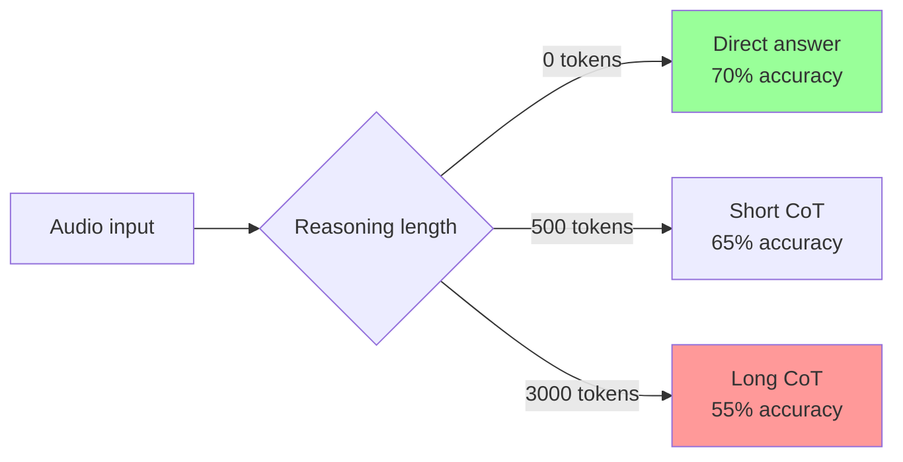
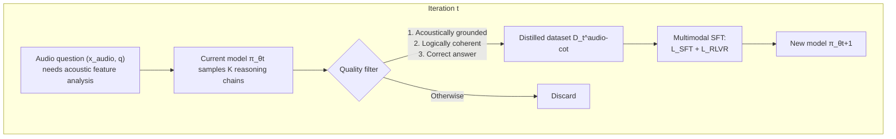
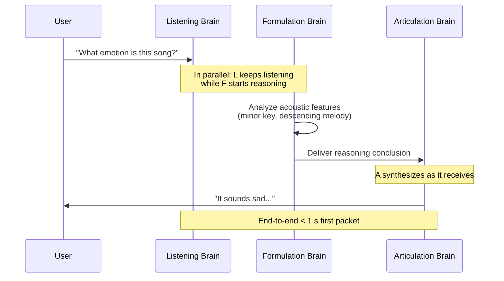
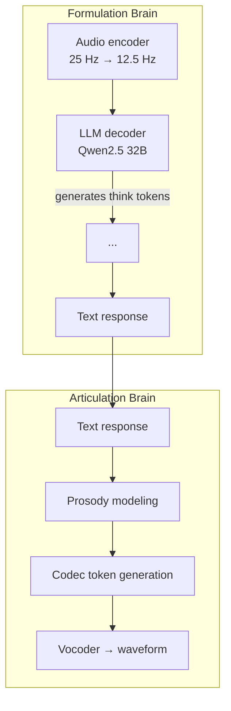

# Chapter 25 · Audio and Speech RL (Step-Audio MGRD)

> [Chapter 24, VLM RL](../chapter26_vlm/intro) extended reasoning RL from text to vision — Qwen3-VL learned to "glance at an image, reflect, then answer." Vision is only half of the modality story: the most natural medium for human interaction is **speech**. This chapter tackles two core problems in the audio domain: (1) when a model transcribes first and reasons second, why does "thinking more" make it worse (inverted scaling)? (2) why does an audio model trained with verifiable rewards turn into a "mechanical answering machine"? The answers come from **MGRD (Modality-Grounded Reasoning Distillation) in Step-Audio-R1** and **the RLHF paradigm shift in Step-Audio-R1.5**.

## 27.1 Audio Language Model Overview

Text language models operate on discrete token sequences. Audio is a continuous waveform sampled at 24 kHz — 24,000 floating-point samples every second. Before a Transformer can process audio, that waveform has to be turned into tokens. That is the job of the **neural audio codec**.

### Three Approaches to Audio Tokenization

| Codec                         | Frame rate | Codebooks                     | Info per token        | Typical use                  |
| ----------------------------- | ---------- | ----------------------------- | --------------------- | ---------------------------- |
| **SoundStream** (Google 2021) | 50 Hz      | 8 RVQ layers                  | Medium                | Speech synthesis, TTS        |
| **EnCodec** (Meta 2022)       | 75 Hz      | 8 RVQ layers                  | Medium                | General audio, music         |
| **SpeechTokenizer** (2023)    | 50 Hz      | 8 (1 semantic + 7 acoustic)   | High (semantic layer) | Semantic understanding       |
| **WavTokenizer** (ICLR 2025)  | 40-75 Hz   | 1 (VQ)                        | Very high             | Extreme compression, AudioLM |
| **Mimi** (Kyutai 2024)        | 12.5 Hz    | 8 (joint semantic + acoustic) | High                  | Real-time dialogue (Moshi)   |

RVQ (Residual Vector Quantization) is the core mechanism behind EnCodec and SoundStream. It encodes one audio frame into $K$ layers of codebook indices $c_1, c_2, \ldots, c_K$, with each layer quantizing the residual left over from the layer before it:

$$e^{(0)} = \text{Encoder}(x), \quad c_k = \arg\min_c \|e^{(k-1)} - \text{CB}_k[c]\|, \quad e^{(k)} = e^{(k-1)} - \text{CB}_k[c_k]$$

The reconstructed waveform is $\hat{x} = \text{Decoder}(c_1, \ldots, c_K)$. A larger $K$ gives better reconstruction quality, but every extra codebook layer adds another token stream, and the length of autoregressive generation grows with it. SpeechTokenizer's key insight is to **distill the first codebook layer into HuBERT semantic features**, so that $c_1$ encodes _what was said_ and $c_2 \ldots c_K$ encode _how it was said_ (prosody, timbre).

### How Speech Generation Differs from Text Generation

Once audio tokens are fed into an LLM, the generation mechanism looks the same as text — autoregressive next-token prediction. In practice the two are worlds apart:

| Dimension             | Text generation                | Speech generation                                     |
| --------------------- | ------------------------------ | ----------------------------------------------------- |
| Sequence length       | 1 token ≈ 0.5 words ≈ 0.3 s    | 1 token ≈ 0.013 s (75 Hz) → 1 s of speech = 75 tokens |
| Evaluation dimensions | Content correctness            | Content + prosody + emotion + timbre + rhythm         |
| Error tolerance       | 1 wrong word is still readable | 1 wrong frame → pops, static                          |
| Multiple codebooks    | Single stream                  | 8 RVQ layers must be generated in sync                |
| Real-time requirement | Streaming is enough            | First-packet latency < 1 s                            |

One second of speech requires generating 75 × 8 = 600 tokens; a 10-second turn of dialogue is 6,000 tokens — about 20 times longer than the equivalent text content. This is the **sequence-length explosion** problem in audio LLMs.

### Engineering Challenges of Real-Time Inference

Real-time spoken dialogue demands **full duplex** operation: the model listens, thinks, and speaks at the same time. Three engineering difficulties follow:

1. **First-packet latency**: the gap between the user finishing speaking and the model starting to speak. The industry target is under 500 ms.
2. **Streaming decoding**: the model cannot wait for a whole sentence to finish generating before synthesizing it — output has to happen chunk by chunk.
3. **Interruptibility**: the user can break in at any moment, and the model must stop generating immediately and switch back to listening mode.

GPT-4o Realtime, Gemini Live, and Moshi solve this with **chunked autoregressive generation** plus a **streaming vocoder**. Later in this chapter we'll see how Step-Audio-R1 Realtime achieves sub-second latency with a **dual-brain architecture** that listens while thinking and thinks while speaking.

## 27.2 The Step-Audio Series and a Distinctively Chinese Direction

StepFun (阶跃星辰) is a leading domestic audio LLM developer in China. The Step-Audio series evolved from Step-Audio 2 (a base conversational model) to **Step-Audio-R1** (a reasoning model, November 2025) and **Step-Audio-R1.5** (RLHF alignment, April 2026), covering the full pipeline of audio understanding, reasoning, and generation.

### 27.2.1 Step-Audio-R1 and Test-Time Compute Scaling

The central contribution of [Step-Audio-R1](https://arxiv.org/abs/2511.15848) is that it is **the first model to successfully unlock test-time compute scaling in the audio domain**.

#### The Inverted-Scaling Anomaly

Text and vision reasoning models generally follow the test-time compute scaling law: give the model more reasoning tokens and performance improves predictably (see [Chapter 11, Reasoning Models](../chapter19_reasoning/intro)). The audio domain breaks that pattern:



The more the model thinks, the worse it gets. Systematic case analysis by the Step-Audio-R1 team traced the root cause to **textual surrogate reasoning**.

#### The Root Cause: Textual Surrogate Reasoning

Most audio LLMs are initialized with SFT on text CoT data, inheriting reasoning ability from text models. The result is that the model's reasoning targets a text description of the audio, rather than the acoustic signal itself:

```text
❌ Textual surrogate reasoning:
"The lyrics mention sadness -> this song's emotion is sad"

✅ Acoustically grounded reasoning:
"Minor-key harmonic progression + descending melodic contour + slow tempo -> sad emotion"
```

The first path only looks at the lyric text, and sometimes hallucinates lyrics that were never sung. The second actually analyzes pitch, rhythm, and harmony. As the reasoning chain grows longer, a textual-surrogate model drifts further off course with every extra step — this is the root of inverted scaling.

#### Modality-Grounded Reasoning Distillation

**Modality-Grounded Reasoning Distillation (MGRD)** is Step-Audio-R1's core training framework. Over $T$ rounds of iteration, it gradually shifts the substrate of reasoning from text to acoustics:



Each MGRD round has three stages, with an overall loss of:

$$\mathcal{L}_{\text{MGRD}} = \sum_{t=1}^{T}\left(\mathcal{L}_{\text{SFT}}^{(t)} + \mathcal{L}_{\text{RLVR}}^{(t)}\right)$$

**Stage 1: Self-distillation sampling.** On data that requires acoustic analysis — timbre identification, rhythm judgment, emotion classification — $\pi_{\theta_t}$ samples $K$ candidates:

$$(r^{(i)}, a^{(i)}) \sim \pi_{\theta_t}(\cdot \mid x_{\text{audio}}, q), \quad i=1,\ldots,K$$

Filtering applies three criteria: (1) the reasoning must explicitly reference perceptual features (pitch, rhythm, timbre); (2) the reasoning steps must be logically coherent; (3) the final answer must be correct.

**Stage 2: Multimodal supervised refinement.** Joint SFT on the distilled data plus the original text reasoning data:

$$\mathcal{L}_{\text{SFT}}^{(t)} = \mathbb{E}_{\mathcal{D}_t^{\text{audio-cot}}}\left[\log \pi_\theta(r, a \mid x_{\text{audio}}, q)\right] + \mathbb{E}_{\mathcal{D}_{\text{task}}}\left[\log \pi_\theta(r, a \mid q)\right]$$

Mixing the two datasets guards against catastrophic forgetting: the model becomes acoustically grounded without losing its text reasoning ability.

**Stage 3: Multimodal RL.** Text tasks use a standard binary reward; audio tasks use a composite reward:

$$R_{\text{audio}}(r, a) = 0.8 \cdot \mathbb{1}[a = a^*] + 0.2 \cdot \mathbb{1}[\text{reasoning present in } r]$$

The 0.8/0.2 split is not arbitrary: **the 0.2 format reward exists to prevent reasoning collapse**. In an ablation, removing the format reward dropped reasoning length from 2,800 to 1,500 tokens and MMAU accuracy from 77.7 to 76.5. Left to its own devices, an RL optimizer gravitates toward the most token-efficient policy — answering directly — so the act of thinking has to be explicitly rewarded, or the reasoning chain disappears.

::: details MGRD's Data Filtering: pass@8 ∈ [3, 6]
The RL dataset has only 5,000 examples, but the quality bar is strict. The previous round's model samples $k=8$ times per question, and **only questions with pass@8 ∈ [3, 6] are kept**. That excludes questions that are too easy (pass@8 > 6 teaches the model nothing) and questions that are too hard (pass@8 < 3 usually means the question itself is ambiguous).

An experiment compares three data strategies:

| Data strategy                      | Final reward             | Reasoning-length stability  |
| ---------------------------------- | ------------------------ | --------------------------- |
| All-fail questions (pass@8 = 0)    | 0.45-0.70, high variance | Drops to 1,800 tokens       |
| Medium difficulty (pass@8 ∈ [3,6]) | 0.75-0.80, stable        | Stays at 2,300-2,800 tokens |
| 200K unfiltered (10x volume)       | No improvement           | —                           |

**Data quality matters far more than data quantity.** Scaling up audio RL data indiscriminately just injects ambiguity noise.
:::

#### Acoustic-Grounded Reasoning

What MGRD produces is **acoustic-grounded reasoning** — reasoning chains that explicitly cite acoustic properties. Here is how Step-Audio-R1 performs on MMAU (Massive Multi-Task Audio Understanding):

| Model             | Average  | Big Bench Audio | Spoken MQA | MMSU | MMAU     | Wild Speech |
| ----------------- | -------- | --------------- | ---------- | ---- | -------- | ----------- |
| Step-Audio 2      | 68.3     | 59.1            | 88.8       | 64.3 | 78.0     | 51.1        |
| Gemini 2.5 Pro    | 81.5     | 96.1            | 94.8       | 79.3 | 77.4     | 60.0        |
| Gemini 3 Pro      | 85.1     | 92.1            | 95.3       | 82.9 | 78.9     | 76.4        |
| **Step-Audio-R1** | **83.6** | **98.7**        | 95.2       | 75.9 | **77.7** | 70.6        |

An average score of 83.6 surpasses Gemini 2.5 Pro and comes close to Gemini 3 Pro. On Big Bench Audio (multi-step logical reasoning), it reaches 98.7 — the highest of any model in the comparison.

### 27.2.2 Mind-Paced Speaking

The bottleneck in real-time spoken dialogue is the **serial dependency between reasoning and generation**: the model has to finish thinking before it can open its mouth. Step-Audio-R1 Realtime borrows the **listen-while-thinking** and **think-while-speaking** architectures to implement **Mind-Paced Speaking**:



The key insight is that **human speech is streaming**: we think and speak at the same time, still composing the second half of a sentence while saying the first half. Mind-Paced Speaking gives the model this same ability — it does not have to wait for the entire reasoning pass to finish before it starts synthesizing speech.

On Big Bench Audio speech-to-speech, Step-Audio-R1 Realtime reaches **96.1** (reasoning performance) with **0.92 s first-packet latency**, comprehensively outperforming GPT Realtime 0825 (83 / 0.98 s) and Gemini 2.5 Flash Native Audio (92 / 0.63 s).

### 27.2.3 The Dual-Brain Architecture

The architecture that decouples thinking from speaking is called **Dual-Brain**:



- **Formulation Brain**: an audio encoder plus an LLM, producing `<think>...</think>` reasoning and a text response
- **Articulation Brain**: converts the text response into codec tokens carrying prosody, emotion, and timbre, then decodes them into a waveform

Decoupling the two brains means deep thinking and fast speaking no longer hold each other back: the Formulation Brain can run a long CoT while the Articulation Brain synthesizes speech in parallel. This is what lets Step-Audio-R1 Realtime keep its reasoning ability while staying under a second of latency.

## Section Summary

Step-Audio-R1 is an audio reasoning model released by StepWise in early 2026. Its core innovation is **MGRD (Modality-Grounded Reasoning Distillation)**, which distills text reasoning chains into the audio modality and solves the inverted-scaling problem where thinking more makes the model worse. Step-Audio-R1.5 goes further, shifting the training paradigm from RLVR to RLHF, turning the audio model into a genuine conversational voice assistant instead of a mechanical answering machine.

The next section, [27.2 From RLVR to RLHF: Audio Reward Design](./reward-design), takes a close look at what makes audio reward design different — why a text reward model cannot simply be dropped in for audio.
